# Entity Relationship  Model

- Entity.
  - Strong Entity
  - weak Entity
- Attributes.
  - key attributes
  - partial key attribute
  - multi valued attribute
  - derived
  - composite attributes
- Relationship.
  - one to one
  - one to many
  - many to one
  - many to many

## Entity

Entity: Distinguishable objects in the real world (e.g., student, car).

- entity is represented by a set of attributes
  - Student entity will have
    - Name attribute
    - age attribute
    - Roll_no attribute
    - etc

Entity Set: A set of entities with the same attributes (e.g., all students)

Relationship: A relationship is a assosication among several  entities.

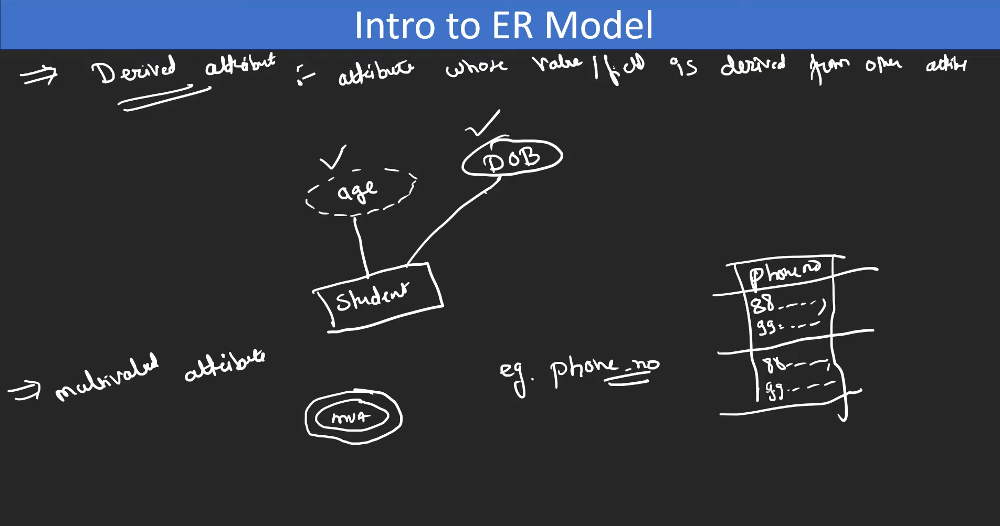

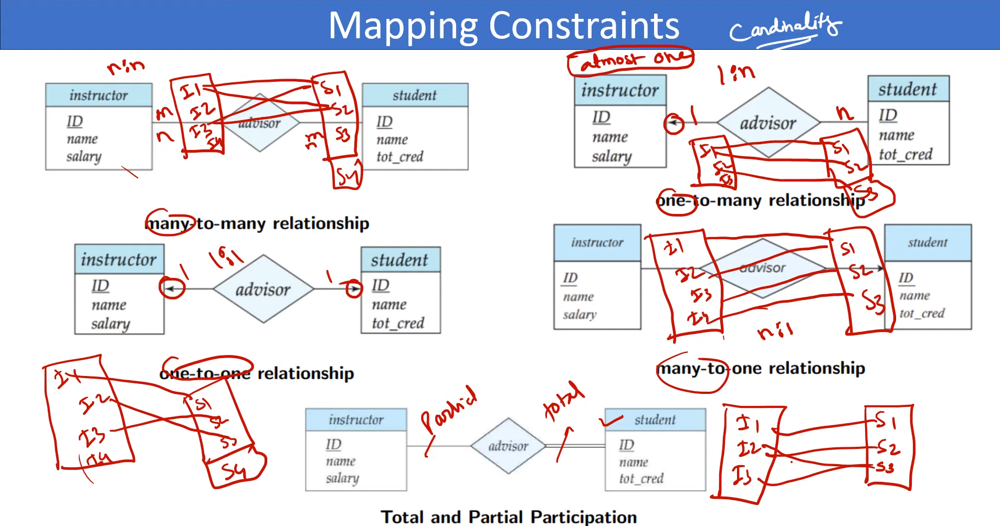

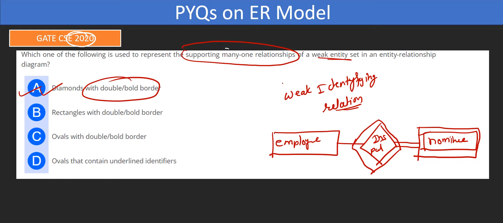

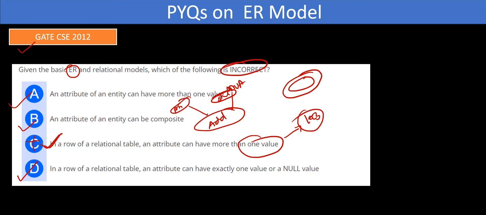

---

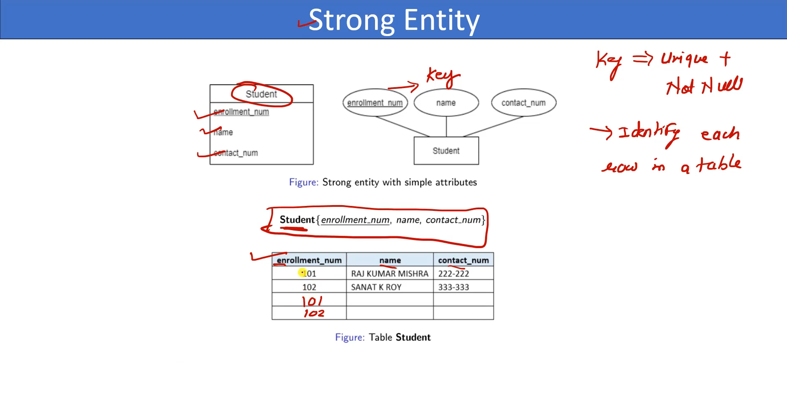

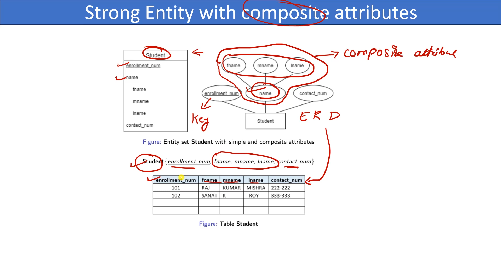

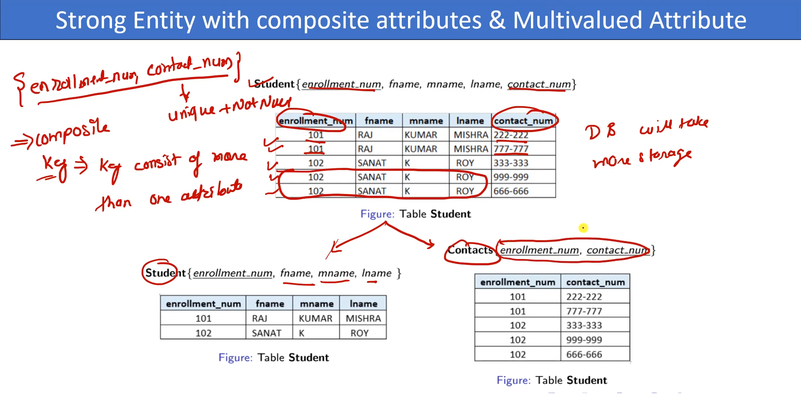

---

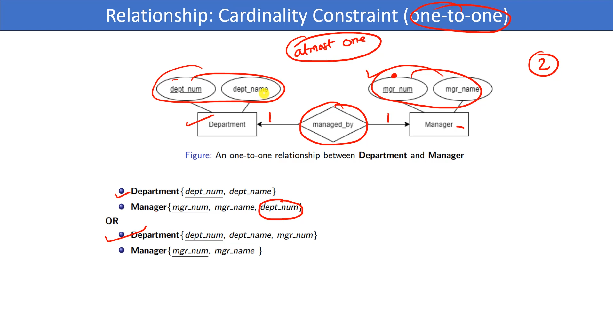

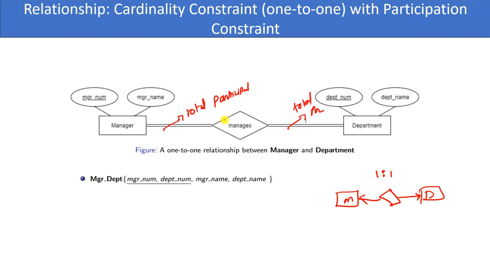

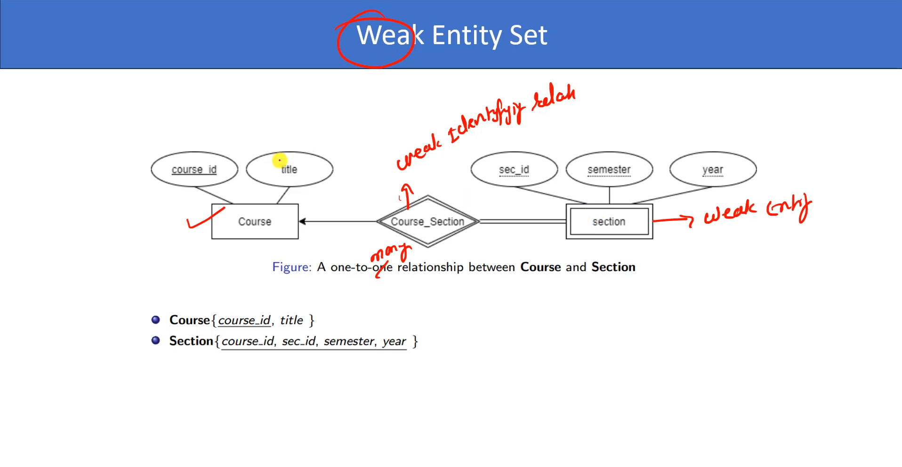

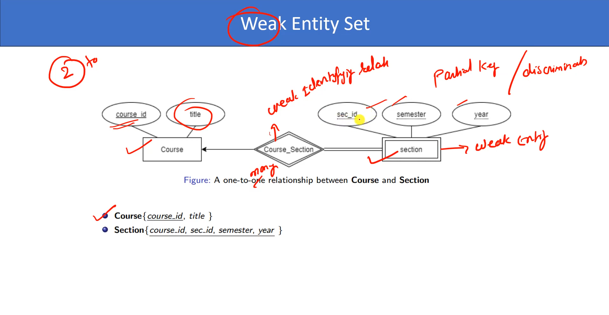

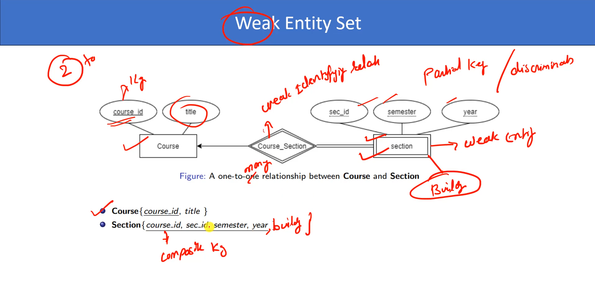

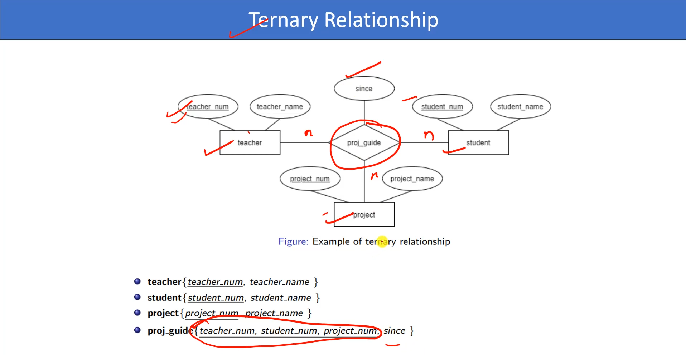
