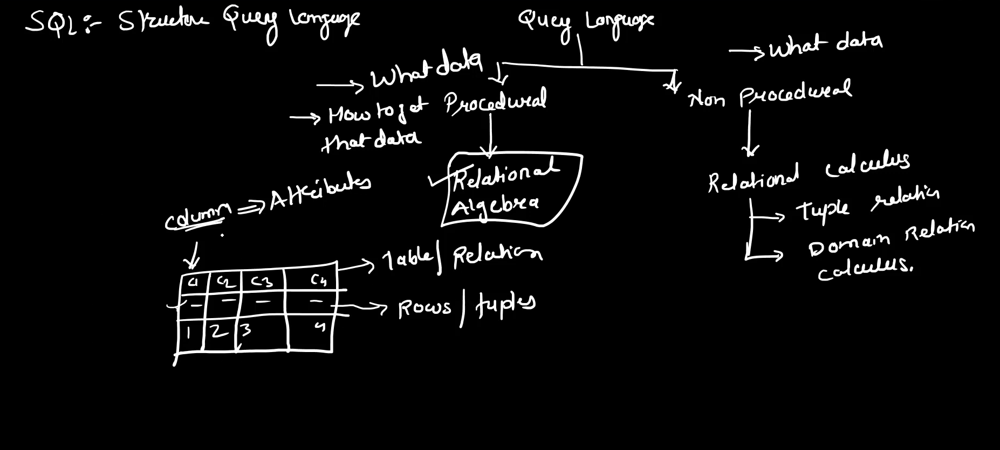

- **Introduction to Relational Algebra**: The lecture covers relational algebra, a key topic for GATE exam preparation in database management systems. It distinguishes between procedural (relational algebra) and non-procedural (relational calculus) query languages.
- **Query Language Basics**: SQL (Structured Query Language) is introduced, highlighting the difference between procedural (specifies how to get data) and non-procedural (specifies what data is needed) languages.

  
- **Key Operators in Relational Algebra**:

  - **Projection (π)**: Used to select specific columns from a table.
  - **Selection (σ)**: Applies conditions to filter rows.
  - **Rename (ρ)**: Renames relations and attributes.
- **Logical and Comparison Operators**: The lecture reviews logical (AND, OR, NOT) and comparison (>, <, =, !=, etc.) operators, essential for forming relational algebra expressions.
- **Examples and Application**: Fundamental operators (projection, selection, rename) are explained with examples. Future lectures will cover set operations and joins in more detail.
