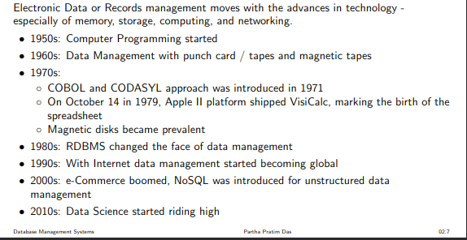
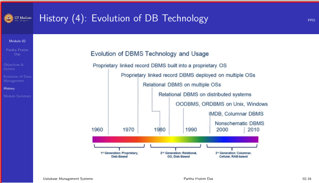

# Lecture 1.2 - Why DBMS1.pdf (PDF file)

**Summary**

Module 2 of the course focuses on the evolution of data management and the history of database management systems (DBMSs). It highlights the need for DBMSs from a historical perspective, tracing the evolution of data management practices.

The module covers the history of DBMSs, starting with physical data management (book keeping) using ledgers and journals. It discusses the significant advancement in 1886 when Henry Brown patented a device for storing and preserving papers. The invention of punch cards by Herman Hollerith in 1890 for use in tabulating machines further propelled electronic data management.

The module explores key parameters for electronic data management, including durability, scalability, security, ease of use, consistency, efficiency, cost, and others. It examines the limitations of traditional file systems in meeting growing data needs and discusses the transition to DBMSs.

The module reviews the history of DBMSs, starting with the use of magnetic tapes in the 1950s and early 1960s. It highlights the development of hard disks in the late 1960s and 1970s, enabling direct access to data. The introduction of the relational data model by Ted Codd and the development of commercial relational database systems in the 1980s are also mentioned. The module concludes with a summary of the evolution of data models, DB technology, and DB architecture.

Data Management

1. Storage
1. Retrieval
1. Transaction
1. Audit
1. Archival

for :

- individual
- Small/ big enterprise
- global

Major Approach:

1. Physical also know as Book keeping
1. Electronic

______________________________________________________________________

______________________________________________________________________

Electronic Data or Records management depends on various parameters including:
• Durability
• Scalability
• Security
• Retrieval
• Ease of Use
• Consistency
• Efficiency
• Cost

Problems with such an approach of book-keeping:
• Durability: Physical damage to these registers is a possibility due to rodents, humidity,
wear and tear
• Scalability: Very difficult to maintain for many years, some shops have numerous
registers spanning over years
• Security: Susceptible to tampering by outsiders
• Retrieval: Time consuming process to search for a previous entry
• Consistency: Prone to human errors

Spreadsheet files - a better solutionm to natural file creation

