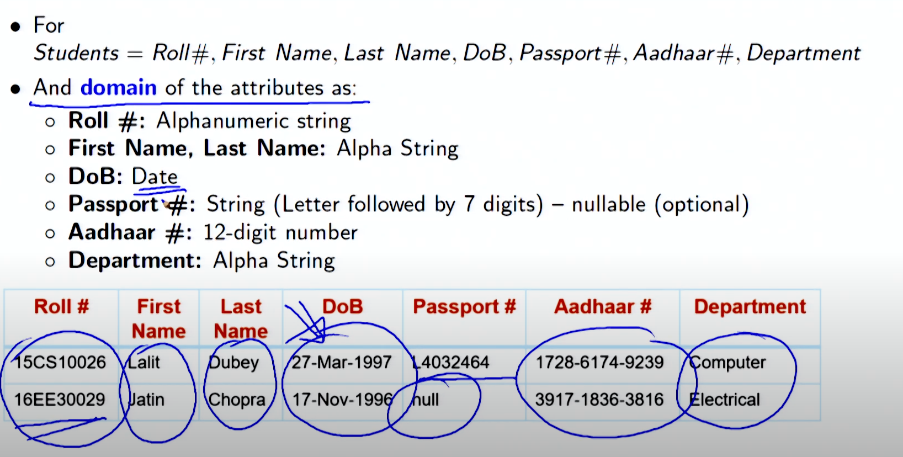
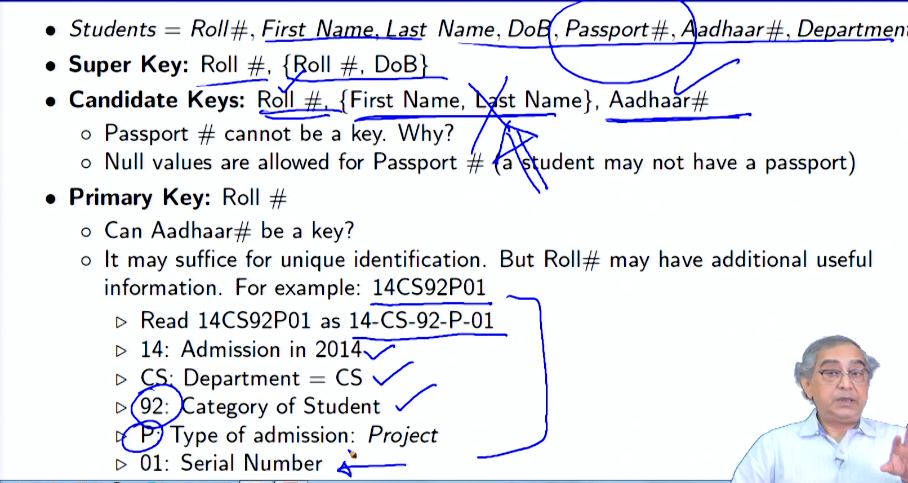
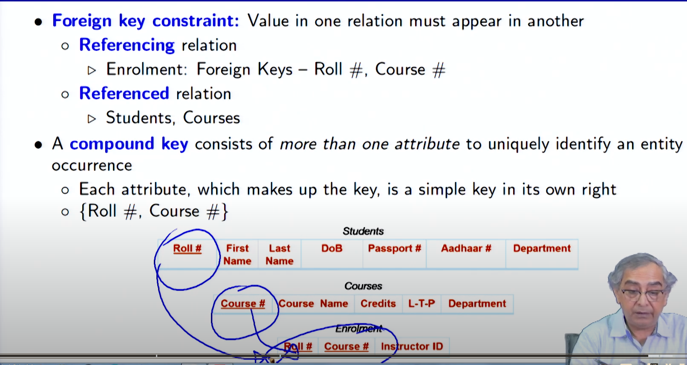

# Lecture 2.1 - Introduction to Relational Model1

**Summary**
This module introduces the relational model for database management systems. It covers:

**Attributes and Types:**

- Attributes represent data characteristics and have specific types, such as

  - alphanumeric strings
  - alpha strings
  - dates
  - numbers
  - alpha strings

- each attributes has to atomic - same datatype that is indivisble

- null - spl value for every domain indicates that value is unknown

  **domain is the allowed value for each attribute**

  

**Schema and Instance:**

- Schema defines the structure of a relation (table) specifying attributes and their types.
- Instance is the current state of a relation, represented as a table with rows (tuples).
- A1 , A2 , · · · , An are attributes
- R = (A1 , A2 , · · · , An ) is a relation schema
- Example: instructor = (ID, name, dept name, salary )
- Formally, given sets D1 , D2 , · · · , Dn a relation r is a subset of
  D 1 × D2 × · · · × Dn
- instructor ≡ (String (5) × String × String × Number +), where D ∈ String (5),
  name ∈ String , dept name ∈ String , and salary ∈ Number +

imp thing to note :

- Order of tuples / rows is irrelevant (tuples may be stored in an arbitrary order)
- No two tuples / rows may be identical

**Keys:**

- A superkey uniquely identifies tuples in a relation.
  - Example: {ID} and {ID, name} are both superkeys of instructor
- A candidate key is a minimal superkey.
  - Example: {ID} is a candidate key for instructor
- A primary key is the selected candidate key used for unique identification.
- A surrogate key (or synthetic key) in a database is a unique identifier for either an
  entity in the modeled world or an object in the database
  eg : transaction id of amazon the transaction id is only valid in the order life time .

- Secondary / Alternate Key: {First Name, Last Name}, Aadhaar #

- Simple Key: Consists of a single attribute

- Composite Key: {First Name, Last Name}

  - Consists of more than one attribute to uniquely identify an entity occurrence
  - One or more of the attributes, which make up the key, are not simple keys in their own right

  

**Relational Query Languages:**

- Relational algebra, a procedural language, is introduced as a tool for manipulating relations using basic operations.
- Other "pure" languages exist but are not covered here.
