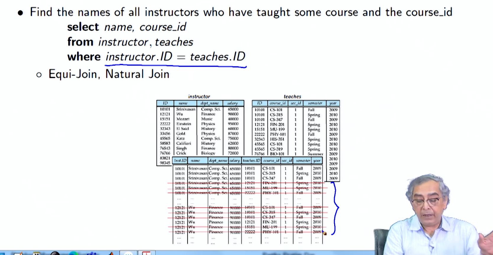
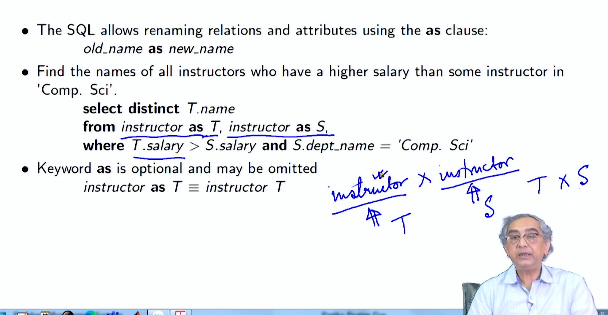
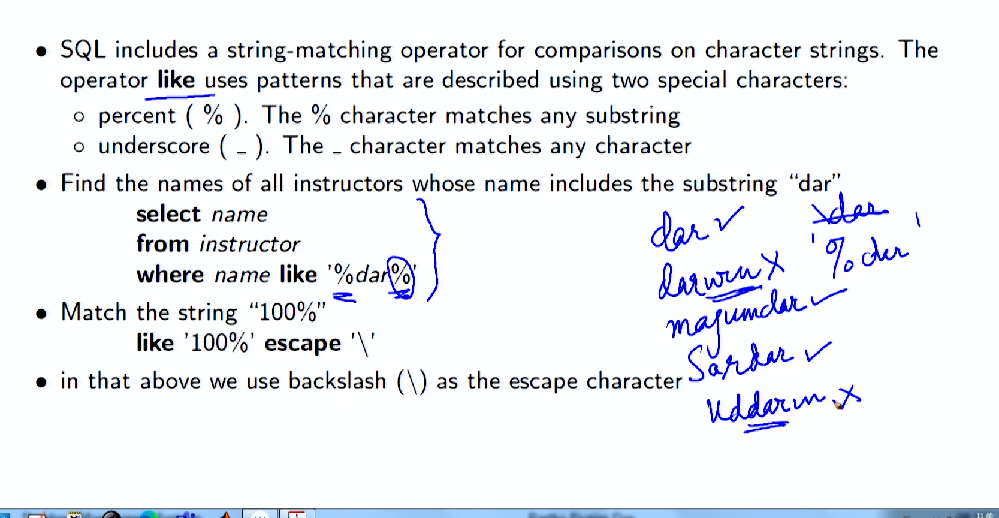
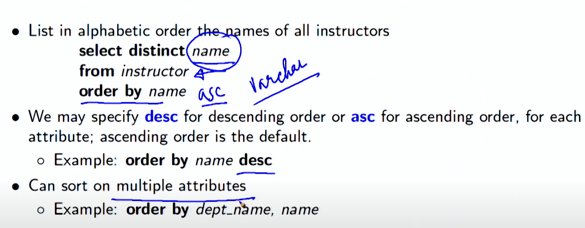

# Lecture 2.4 - Introduction to SQL2

**Summary**

## Additional Basic Operations

### Cartesian Product

- Finds all possible combinations of tuples from two or more relations.
- Useful when selecting data based on relationships between tables.
- Example: Select all possible instructor-course pairs using Cartesian product:

```sql
select *
from instructor, teaches
```




### Rename AS Operation

- Allows renaming of relations and attributes using the `as` clause:

```sql
old name as new name
```

- Optional keyword `as` may be omitted.

  

### String Values

- SQL includes a string-matching operator (`like`) for character string comparisons.
- Uses special characters:
  - Percent (%) matches any substring
  - Underscore (\_) matches any character
- Example: Find instructors with "dar" in their name:

```sql
select name
from instructor
where name like '%dar%'
```




• Patterns are case sensitive
• Pattern matching examples:
◦ ’Intro%’ matches any string beginning with “Intro”
◦ ’%Comp%’ matches any string containing “Comp” as a substring
◦ ’- - -_’ matches any string of exactly three characters
◦ ’_ _ \_%’ matches any string of at least two characters
• SQL supports a variety of string operations such as
◦ concatenation (using “||”)
◦ converting from upper to lower case (and vice versa)
◦ finding string length, extracting substrings, et

### Order By Clause

- Orders the display of tuples in ascending or descending order.
- By default, it is in ascending order.
- Can order by multiple attributes.
- Example: Order by name in descending order:

```sql
select distinct name
from instructor
order by name desc
```



### Select Top / Fetch Clause

- Limits the number of records returned in the output.
- Useful for large tables to avoid performance impact.
- Example: Select the top 10 distinct names from the instructor table:

```sql
select top 10 distinct name
from instructor
```

### Where Clause Predicates

- Allows selecting tuples that meet specified conditions.
- Uses comparison operators, logical operators, and functions.
- Between operator allows specifying a range of values.
- Example: Find instructors with salaries between $90,000 and $100,000:

```sql
select name
from instructor
where salary between 90000 and 100000
```

### In Operator

- Allows specifying multiple values in a where clause.
- Shorthand for multiple `or` conditions.
- Example: Find instructors in the 'Comp. Sci.' or 'Biology' departments:

```sql
select name
from instructor
where dept name in ('Comp. Sci.', 'Biology')
```

Tuple comparison

```pgsql
select name, course_id
from instructor , teaches
where (instructor.ID, dept name) = (teaches.ID, ’Biology’);
```

### Duplicates ????

- SQL handles duplicates based on multiset semantics.
- Number of copies of tuples in the result depends on the number of copies in the input relations.
- For example, if there are two copies of tuple (1, a) in r1 and three copies of tuple (2) in r2, then the expression:

```sql
ΠB (r1) x r2
```


would result in six copies of tuple (a, 2).
