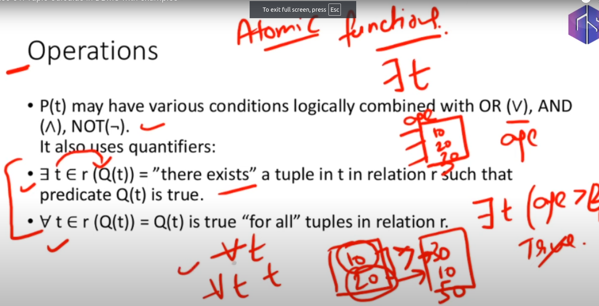
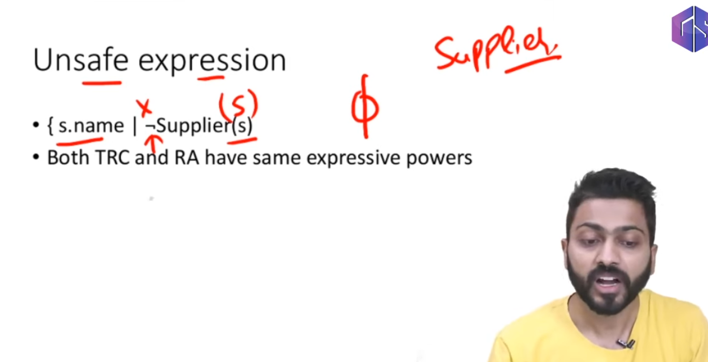

- Tuple Relational Calculus (TRC) is a non-procedural query language used in relational databases, focusing on tuples (rows) and utilizing first-order logic to express queries.
- TRC uses the format { T | P(T) }, where T represents the resulting tuple and P(T) is a predicate or condition that must be satisfied for T to be included in the result.
- Unlike relational algebra, which is procedural, TRC specifies what to retrieve without detailing how to retrieve it, making it non-procedural.
- TRC supports operations similar to relational algebra, such as conjunction (AND), disjunction (OR), and negation (NOT), and employs existential (∃) and universal (∀) quantifiers to form conditions.
- Both TRC and relational algebra have the same expressive power, allowing the same queries to be written in either language, although TRC requires careful handling of unsafe expressions to avoid infinite loops.

