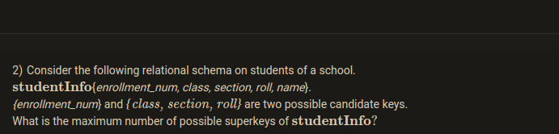

The provided relational schema `studentInfo` has the following attributes:

* enrollment_num
* class
* section
* roll|
* name

We are given that:

* `{enrollment_num}` is a candidate key.
* `{class, section, roll}` is another candidate key.

**Finding the Maximum Number of Superkeys:**

Since both `{enrollment_num}` and `{class, section, roll}` are candidate keys (minimal sets that uniquely identify a student), any superset of these sets will also be a superkey. 


how to find the maximum number of superkeys:

1. Identify the number of attributes in each candidate key:
    * `{enrollment_num}` has 1 attribute.
    * `{class, section, roll}` has 3 attributes.

2. Use the formula for the maximum number of superkeys in a relation with `n` attributes and `k` candidate keys (where each candidate key has `m` attributes):


Max Superkeys = $2^n - (2^k - k)$

In this case:

* `n` (total number of attributes) = 5 (enrollment_num, class, section, roll, name)
* `k` (number of candidate keys) = 2

$ 2^5 - (2^2 - 2) = 18 $ 

$ Max Superkey = 2^{5}-(2-1)$


```python

```
