# Lecture 3.1 - SQL Examples.pdf (PDF file)

**Summary**
**Introduction**

summary of the concepts covered in SQL Examples, a module in Database Management Systems. The focus is on providing a comprehensive overview of the material, including select statements, Cartesian products, the AS keyword, WHERE clauses with AND/OR operators, string operations, ORDER BY statements, the IN operator, set operations (UNION, INTERSECT, EXCEPT), and aggregation functions (AVG, MIN, MAX, COUNT, SUM).

**SELECT Statements**

The SELECT statement is used to retrieve data from one or more tables. The basic syntax is:

```
SELECT column_list
FROM table_name
WHERE conditions;
```

The column_list specifies the columns to be retrieved, table_name specifies the table(s) to be queried, and the WHERE clause specifies any conditions that must be met for the rows to be included in the result.

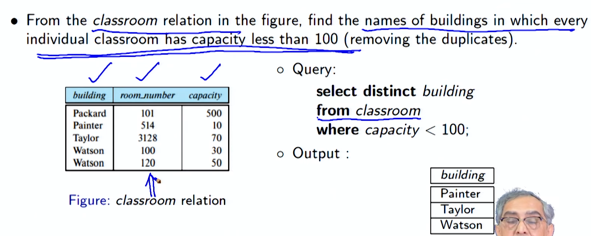

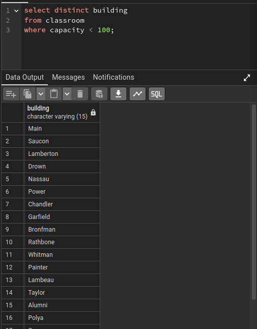

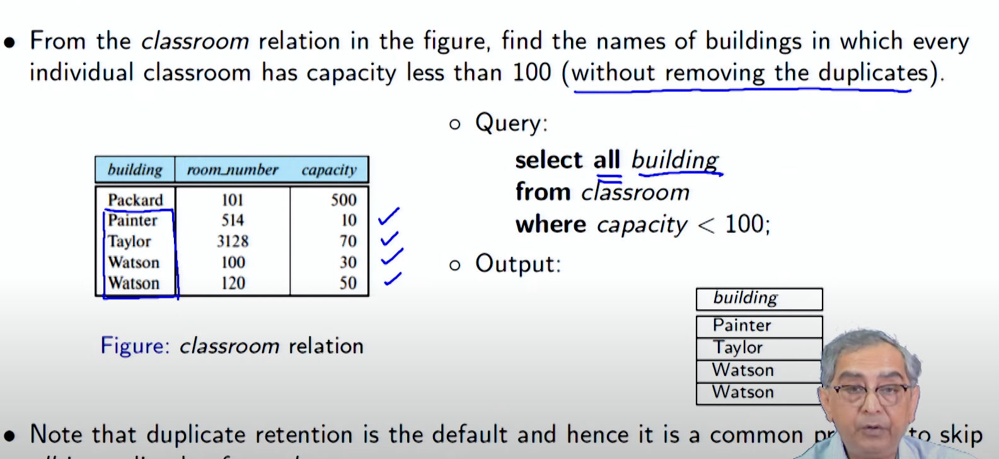

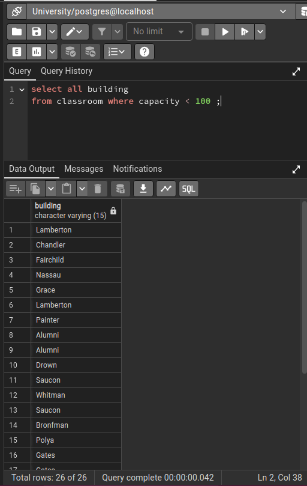

**Cartesian Products / AS Keyword**

A Cartesian product is a combination of all rows from one table with all rows from another table. The AS keyword is used to assign an alias to a column or table. The syntax for a Cartesian product is:

```
SELECT column_list
FROM table_name1, table_name2
[AS alias];
```

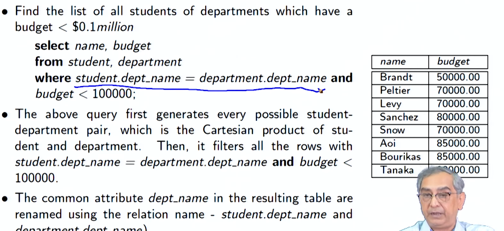

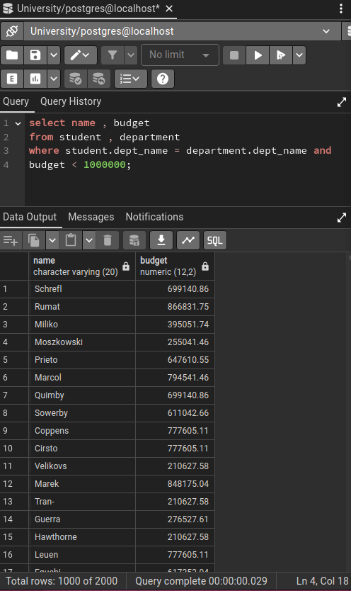

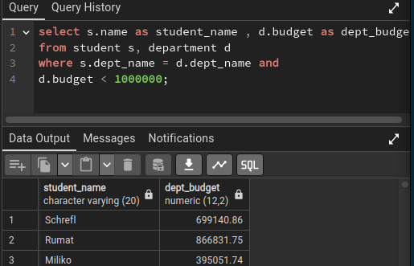

**WHERE Clauses with AND/OR Operators**

The WHERE clause is used to specify conditions that must be met for rows to be included in the result. The AND operator is used to combine multiple conditions that must all be true, and the OR operator is used to combine multiple conditions that only one must be true. The syntax is:

```
WHERE condition1 [AND/OR condition2]...;
```

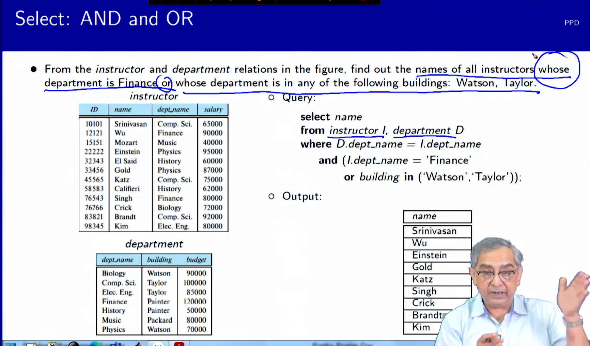


**String Operations**

String operations can be used to compare strings and extract substrings. The most common string operators are:

- **= and !=:** Equality and inequality
- **\< and >:** Less than and greater than
- **LIKE:** Pattern matching
- **SUBSTRING():** Extracts a substring

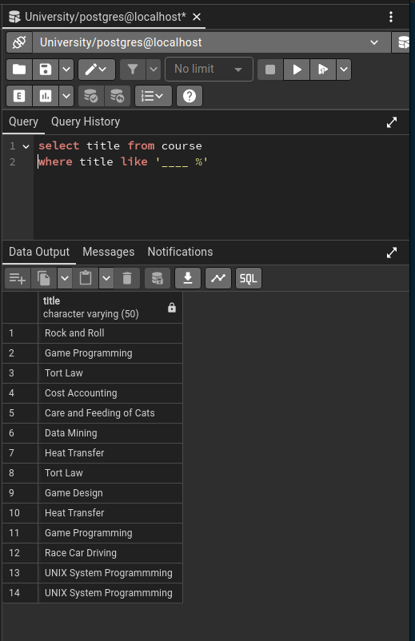

**ORDER BY Statements**

The ORDER BY statement is used to sort the results of a query. The syntax is:

```
ORDER BY column_name [ASC/DESC];
```

The ASC keyword specifies ascending order, and the DESC keyword specifies descending order.

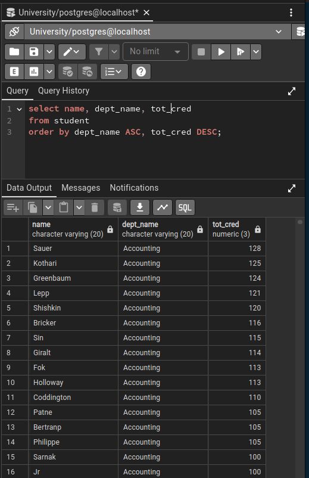

**IN Operator**

The IN operator is used to check if a value is contained in a set of values. The syntax is:

```
WHERE column_name IN (value1, value2, ...);
```

**Set Operations (UNION, INTERSECT, EXCEPT)**

Set operations are used to combine the results of multiple queries. The UNION operator combines the results of two or more queries, removing duplicate rows. The INTERSECT operator combines the results of two or more queries, keeping only the rows that are common to all queries. The EXCEPT operator combines the results of two or more queries, keeping only the rows that are not common to all queries. The syntax is:

```
SELECT column_list
FROM query1
[UNION/INTERSECT/EXCEPT]
SELECT column_list
FROM query2;
```

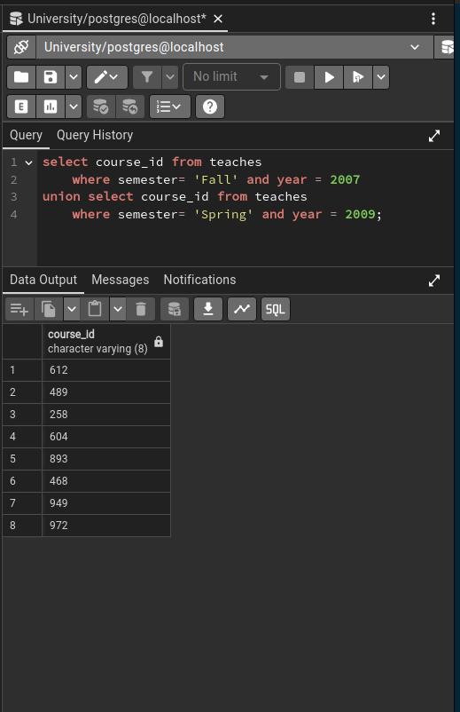

**Aggregation Functions (AVG, MIN, MAX, COUNT, SUM)**

Aggregation functions are used to perform calculations on groups of rows. The most common aggregation functions are:

- **AVG():** Average
- **MIN():** Minimum
- **MAX():** Maximum
- **COUNT():** Count
- **SUM():** Sum

The syntax is:

```
SELECT aggregate_function(column_name)
FROM table_name
GROUP BY group_by_column;
```

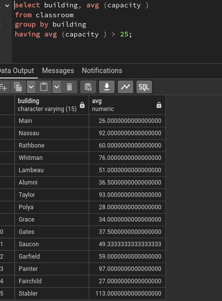

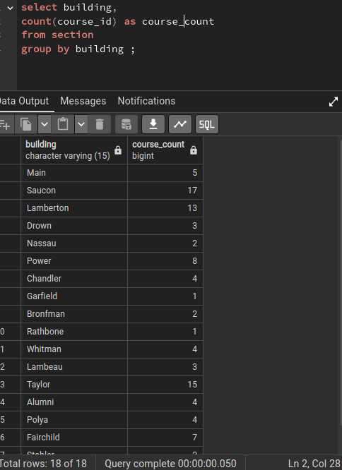

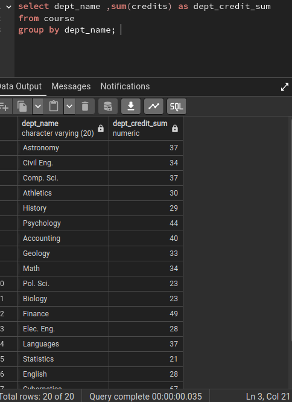

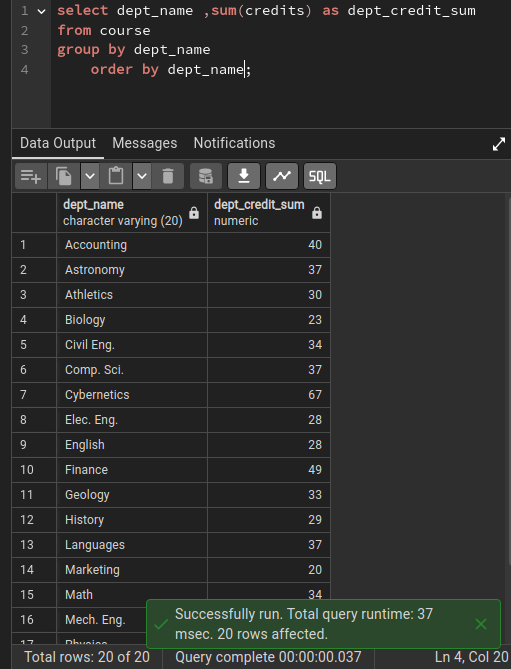

**Conclusion**

This summary has provided a comprehensive overview of the concepts covered in SQL Examples, a module in Database Management Systems. By understanding these concepts, you can effectively use SQL to retrieve, manipulate, and analyze data stored in relational databases.
