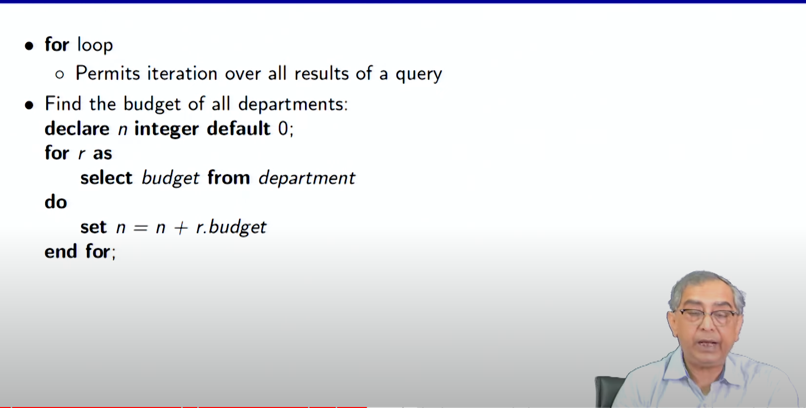

# Lecture 3.5 - Advanced SQL

**Summary**
**Functions and Procedural Constructs**

SQL:1999 added support for functions and procedures to SQL. These functions and procedures can be written in SQL itself or in an external programming language (such as C, Java, or Python). Functions written in an external language are particularly useful for working with specialized data types, such as images or geometric objects.

SQL:1999 also supports a rich set of imperative constructs, including loops, if-then-else statements, and assignment. Many databases have proprietary procedural extensions to SQL that differ from SQL:1999.

**Functions**

Functions are used to perform calculations or retrieve data from the database. They can be defined using the `CREATE FUNCTION` statement. The following example creates a function that returns the count of the number of instructors in a given department:

```pgsql
CREATE FUNCTION dept_count(dept_name VARCHAR(20))
RETURNS INTEGER
BEGIN
  DECLARE d_count INTEGER;
```

This function can then be used to find the department names and budgets of all departments with more than 12 instructors:

```pgsql
SELECT dept_name, budget
FROM department
WHERE dept_count(dept_name) > 12;
```


**Procedures**

Procedures are used to perform a series of actions, such as updating multiple rows in a table or inserting a new row into a table. They can be defined using the `CREATE PROCEDURE` statement. The following example creates a procedure that updates the salary of an employee:

```sql
CREATE PROCEDURE update_salary(emp_id INT, new_salary NUMERIC(8, 2))
BEGIN
  UPDATE employee
  SET salary = new_salary
  WHERE emp_id = emp_id;
END;
```

This procedure can then be called to update the salary of an employee:

```sql
CALL update_salary(1000, 50000);
```


**Language Constructs**

SQL:1999 supports a rich set of imperative constructs, including loops, if-then-else statements, and assignment. These constructs can be used to create complex procedures and functions.

The following table summarizes the most common language constructs:

| Construct                | Description                                  |
| ------------------------ | -------------------------------------------- |
| `BEGIN ... END`        | Compound statement                           |
| `DECLARE`              | Declare a local variable                     |
| `SET`                  | Assign a value to a local variable           |
| `IF ... THEN ... ELSE` | Conditional statement                        |
| `WHILE`                | Loop while a condition is true               |
| `REPEAT`               | Loop until a condition is true               |
| `FOR`                  | Loop through a set of values                 |
| `CASE`                 | Conditional statement with multiple branches |
| `SIGNAL`               | Signal an exception                          |
| `DECLARE HANDLER FOR`  | Declare a handler for an exception           |




**External Language Routines**

SQL:1999 allows the definition of functions and procedures in an imperative programming language (such as C, Java, or Python) that can be invoked from SQL queries. Such functions can be more efficient than functions defined in SQL, and computations that cannot be carried out in SQL can be executed by these functions.

To declare an external language function or procedure, use the `CREATE FUNCTION` or `CREATE PROCEDURE` statement and specify the language and the external name of the function or procedure. For example, the following statement creates a function that returns the count of the number of instructors in a given department:

```sql
CREATE FUNCTION dept_count(dept_name VARCHAR(20))
RETURNS INTEGER
LANGUAGE C
EXTERNAL NAME '/usr/avi/bin/dept_count';
```

**Triggers**

Triggers are database objects that are used to automatically perform actions when certain events occur in the database. For example, a trigger can be used to automatically update a table when a row is inserted into another table.

Triggers are defined using the `CREATE TRIGGER` statement. The following example creates a trigger that updates the `total_credits` column in the `student` table when a row is inserted into the `takes` table:

```sql
CREATE TRIGGER update_total_credits
AFTER INSERT ON takes
FOR EACH ROW
BEGIN
  UPDATE student
  SET total_credits = total_credits + (
    SELECT credits
    FROM course
    WHERE course.course_id = NEW.course_id
  )
  WHERE student.id = NEW.student_id;
END;
```

**Functionality vs. Performance**

Triggers can be a powerful tool for automating database operations, but they can also have a negative impact on performance. The following are some factors that can affect the performance of triggers:

- **The number of triggers:** The more triggers that are defined on a table, the greater the impact on performance.
- **The complexity of the triggers:** Complex triggers that perform multiple operations can be more time-consuming to execute than simple triggers.
- **The frequency of the triggering events:** Triggers that are activated by frequent events can have a significant impact on performance.

It is important to carefully consider the impact of triggers on performance before creating them. If a trigger is not necessary, it should not be created. If a trigger is necessary, it should be designed to be as efficient as possible.

**How to Use Triggers**

Triggers can be used for a variety of purposes, including:

- **Maintaining data integrity:** Triggers can be used to enforce business rules and ensure that data is consistent.
- **Automating tasks:** Triggers can be used to automate tasks that would otherwise need to be performed manually.
- **Improving performance:** Triggers can be used to improve performance by performing operations
