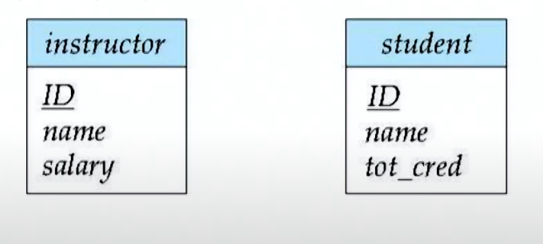
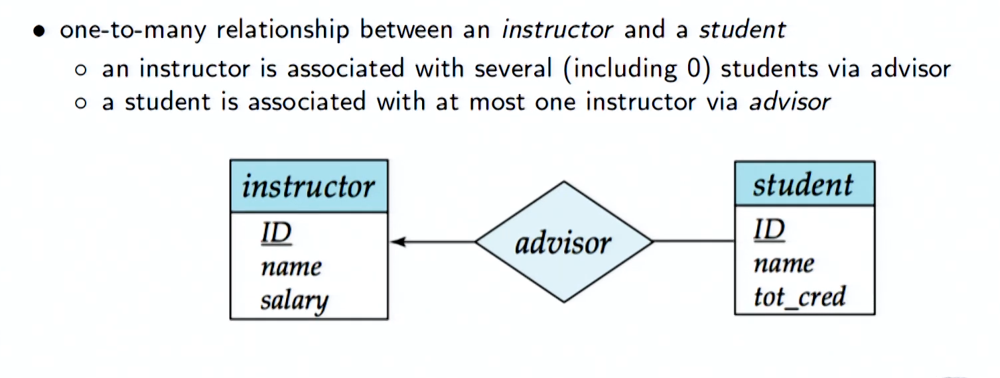
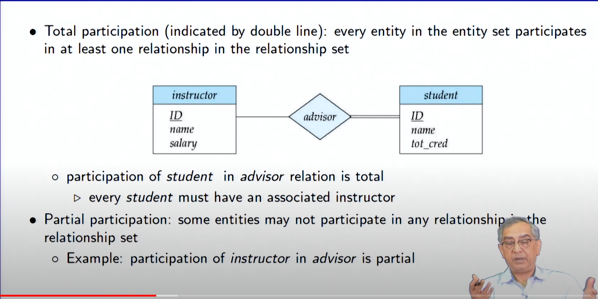
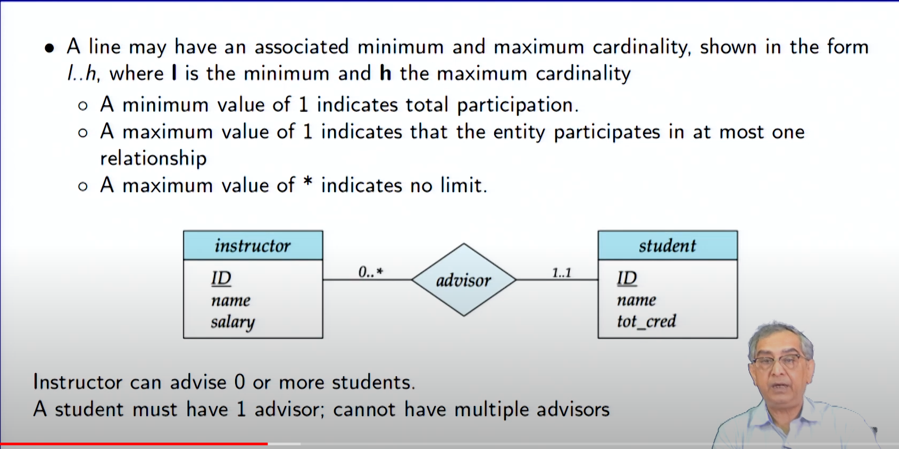
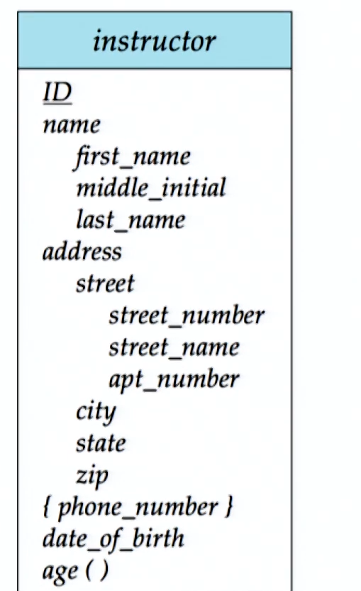
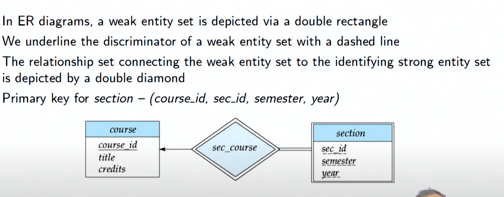

# Entity-Relationship (ER) Model/2

### Overview

An Entity-Relationship (ER) model is a graphical representation of a database schema. It uses entity sets, relationship sets, and attributes to describe the structure of a database.

### ER Diagram Notation

**Entity Sets:**

* Represented as rectangles.
* Attributes are listed inside the rectangle.
* Primary key attributes are underlined.

**Relationship Sets:**

* Represented as diamonds.

_ _ _ means a attribute of the relationship

### Cardinality Constraints

* Express the number of entities in one set that can relate to a single entity in another set.
* Represented using directed lines (→) for "one" and undirected lines (—) for "many."
* Examples:
  * A student can have at most one advisor (one-to-one relationship).
  * A course can have many students (one-to-many relationship).
  * A student can take many courses (many-to-many relationship).

### Constraints

* **Participation:**

  * Total: Every entity in an entity set participates in at least one relationship in the relationship set.
  * Partial: Some entities may not participate in any relationship.

  
* **Bounds:**

  * Minimum and maximum number of relationships an entity can participate in.
  * Represented using the notation l..h, where l is the minimum and h is the maximum.

- {} -> multivalue attribute
- ()  -> function

### Weak Entity set

### ER Model to Relational Schema

**Entity Sets:**

* Each entity set becomes a table with columns for each attribute.

**Relationship Sets:**

* Many-to-many relationships become separate tables with columns for the primary keys of the participating entities.
* One-to-many and many-to-one relationships can be represented by adding an extra attribute to the "many" side with the primary key of the "one" side.

### Complex Attributes

**Composite Attributes:**

* Attributes that consist of multiple components.
* Components are flattened out into separate attributes in the relational schema.

**Multivalued Attributes:**

* Attributes that can have multiple values for a single entity.
* Represented by a separate table with columns for the primary key of the entity and an attribute for each value of the multivalued attribute.

### Redundancy

* Schemas derived from relationship sets that are total on the "many" side may contain redundant data.
* This redundancy can be reduced by adding an extra attribute to the "many" side.
* Schemas for weak entity sets are redundant and can be eliminated.

### Module Summary

* Explored the use of ER diagrams to model database structures.
* Discussed the translation of ER models into relational schemas.
* Analyzed the various constraints and attributes used in ER models.
* Explained how to handle complex attributes and redundancy in relational schemas derived from ER models.
