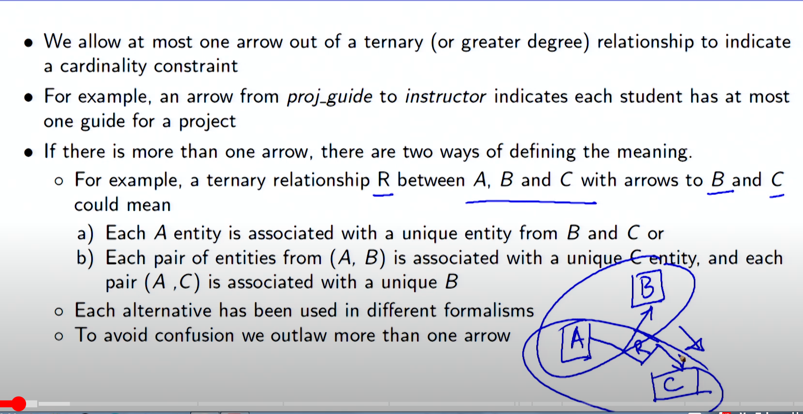
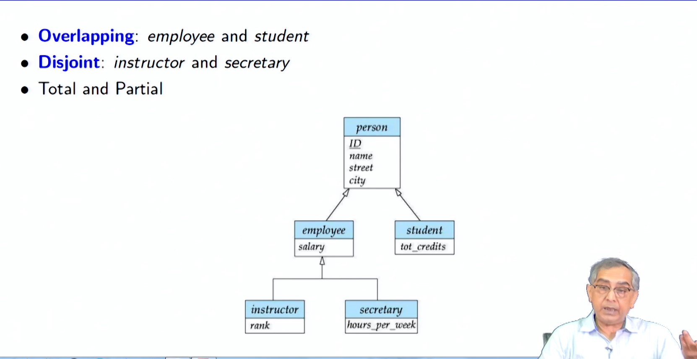
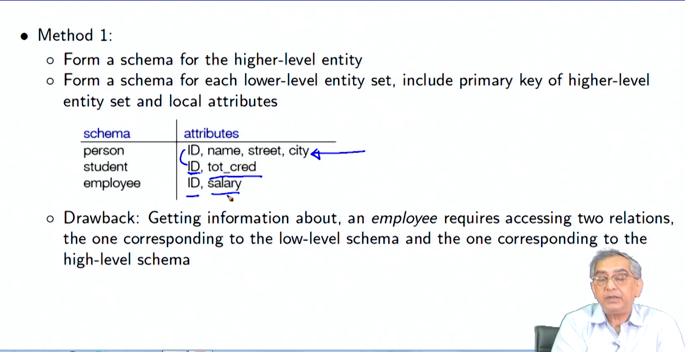
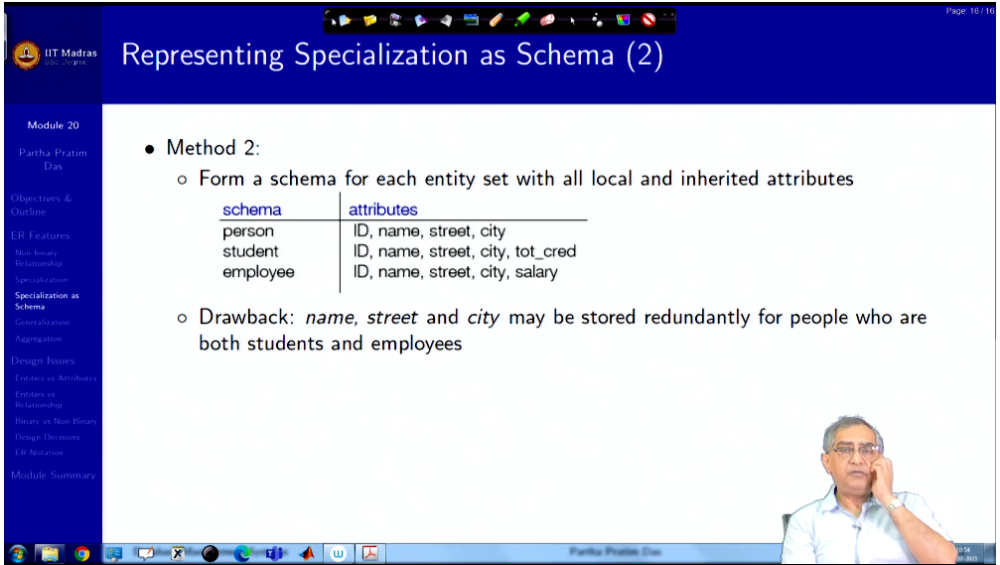
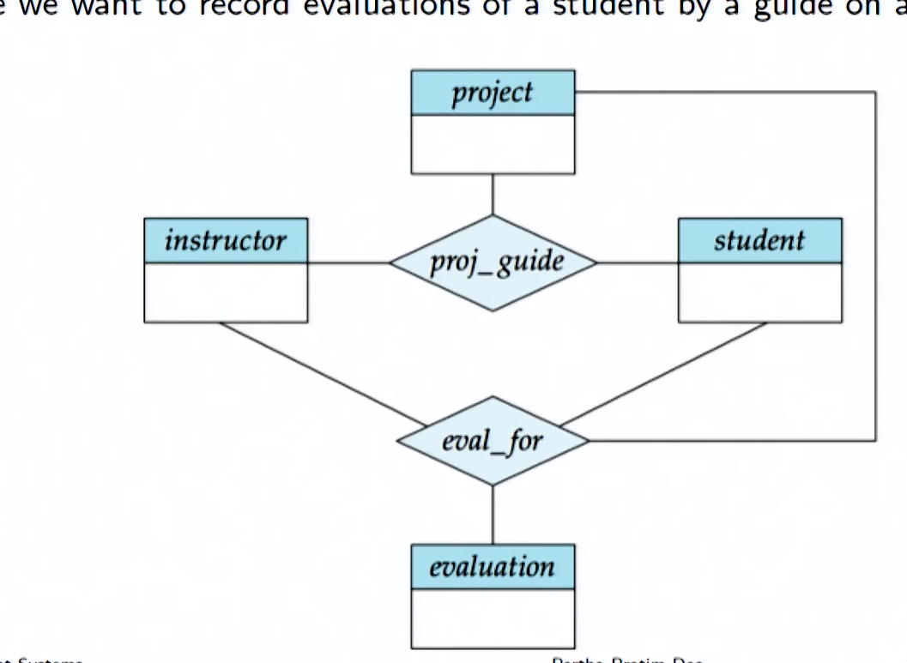
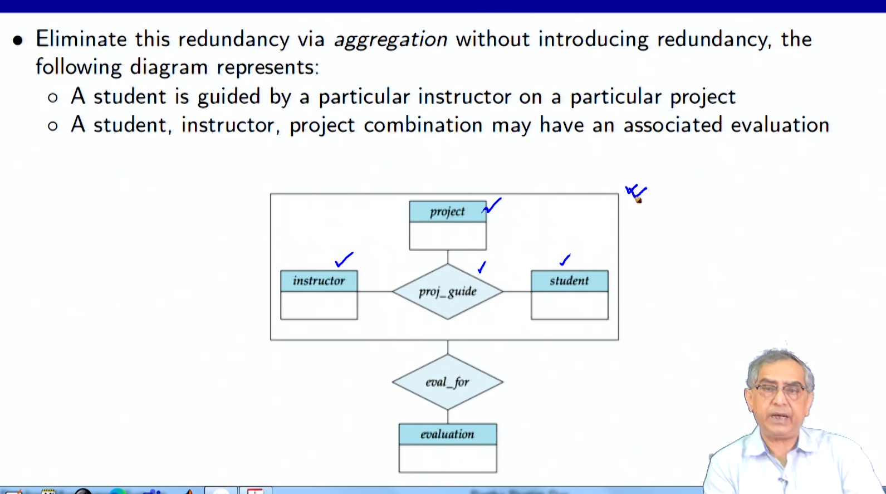
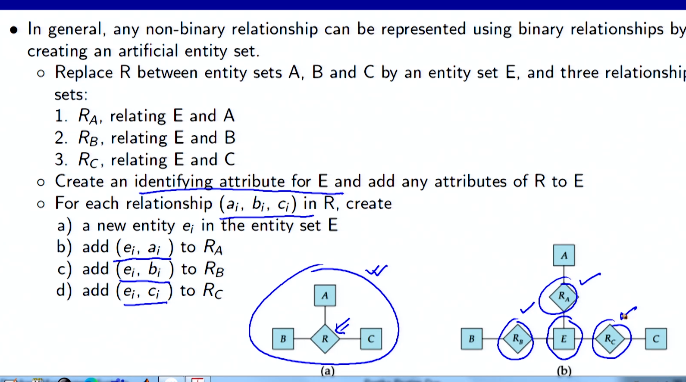

# Entity-Relationship Model 

**Summary**
**Entity-Relationship Model (ER Model): Extended Features and Design Issues**

**Introduction**

The Entity-Relationship Model (ER Model) is a data modeling technique used to represent the structure and relationships of data in a database. ER Model provides a conceptual representation of data, making it easier to understand and manipulate. In this module, we will explore the extended features of the ER Model that enhance its representational capabilities and discuss various design issues involved in designing ER diagrams.

**Extended ER Features**

**Non-Binary Relationships:**

* Most ER relationships are binary, involving two entity sets.
* Non-binary relationships involve three or more entity sets.
* They can be represented with a ternary relationship construct, where three entity sets are connected by a diamond-shaped box.

**Specialization and Generalization:**

* Specialization (ISA): Subdivide an entity set into smaller, more specific sub-entity sets (lower-level entity sets).
* Generalization: Combine multiple entity sets into a higher-level entity set that captures their common characteristics.
* Represented by a triangle component labeled ISA, indicating that a lower-level entity set inherits attributes and relationships from the higher-level entity set.

**Aggregation:**

* Allows entities to have complex relationships by treating a relationship as an abstract entity.
* Associates attributes with the relationship itself, rather than with individual entities.

**Design Issues**

**Entities vs. Attributes:**

* Entities represent real-world objects or concepts.
* Attributes are characteristics of entities.
* Consider whether a real-world concept is best represented as an entity or an attribute.

**Entities vs. Relationship Sets:**

* Entities represent objects, while relationship sets represent associations between objects.
* Use relationship sets to describe actions or interactions between entities.

**Binary vs. Non-Binary Relationships:**

* Non-binary relationships represent complex associations involving multiple entities.
* Binary relationships are simpler and easier to implement.
* Consider whether a relationship is naturally binary or non-binary based on the underlying real-world scenario.

**Design Decisions:**

* The use of an attribute or entity set to represent an object.
* Whether a real-world concept should be represented by an entity set or a relationship set.
* The use of ternary relationships versus pairs of binary relationships.
* The use of strong or weak entity sets.
* The use of specialization/generalization for modularity in design.
* The use of aggregation to treat complex relationships as single units.

**ER Notation**

**Symbols Used in ER Notation:**

| Symbol      | Meaning                                              |
| ----------- | ---------------------------------------------------- |
| Rectangle   | Entity set                                           |
| Diamond     | Relationship set                                     |
| Line        | Connection between entity sets and relationship sets |
| Ellipsis    | Weak entity set                                      |
| Double line | Total specialization                                 |
| Dashed line | Partial specialization                               |

**Alternate Notations:**

* Chen notation
* IDE1FX notation
* Crow's feet notation

**Module Summary**

In this module, we explored the extended features of the ER Model, including non-binary relationships, specialization/generalization, and aggregation. We also discussed various design issues that arise when creating ER diagrams and the symbols used in ER notation. Understanding these concepts and techniques is essential for effectively designing and implementing databases.
