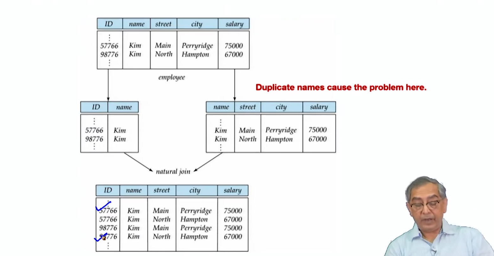

# Lecture 5.1 - Relational Database Design1

**Summary**
This module focuses on principles of relational database design. It emphasizes:

**Features of Good Design:**

* Reflects real-world structure
* Accommodates future data additions
* Avoids redundancy
* Provides efficient data access
* Maintains data integrity

---

---

**Redundancy and Anomaly:**

* Redundancy (duplicate data) leads to anomalies:
  * Insertion: Can't add data if unknown data is required
  * Deletion: Losing unrelated information when deleting records
  * Update: Inaccurate changes due to multiple occurrences of data

**Decomposition:**

* Decomposing relations into smaller ones removes redundancy and minimizes dependencies among attributes.
* Good decomposition ensures data preservation and integrity.

**functional dependency** : dept name → building, budget
In inst_dept, because dept_name is not a candidate key, the building and budget of a department may have to be repeated.
◦ This indicates the need to decompose inst dept

---

**Lossy Decomposition**

Lossless Join Decomposition is a decomposition of a relation R into relations R1 , R2 such that if we perform natural join of two smaller relations it will return the original relation

**Atomic Domains and First Normal Form (1NF):**

* Atomic domains consist of indivisible elements.
* 1NF requires relations with atomic domains and each attribute holding a single value.
* Non-atomic values complicate storage and encourage redundancy.

**Atomic Domains**

An atomic domain refers to the indivisibility of data within a domain. In the context of databases, it means that the value in a particular field is indivisible and represents the smallest unit of data. Each attribute in a table should contain atomic (indivisible) values.

- **Example of Atomic Values**:
  - `123 Main St`, `John Doe`, `01/01/2020`
- **Example of Non-Atomic Values**:
  - `123 Main St, Apt 4` (multiple pieces of information in one field)
  - `John and Jane Doe` (multiple names in one field)

#### First Normal Form (1NF)

A relation (table) is said to be in the First Normal Form (1NF) if it satisfies the following conditions:

1. **Atomicity**: All the values in the database are atomic (indivisible).
2. **Uniqueness of Rows**: Each row in the table must be unique, meaning no two rows can be identical.
3. **Uniqueness of Column Names**: Each column should have a unique name.
4. **No Repeating Groups**: Each table should contain only one value per cell (intersection of a row and a column), and columns should not contain sets or lists of values.

#### Examples of 1NF

**Non-1NF Table:**

| StudentID | Name       | Courses                |
| --------- | ---------- | ---------------------- |
| 1         | John Doe   | Math, Science          |
| 2         | Jane Smith | English, History, Math |

In the above table:

- The `Courses` column contains multiple values, which violates the atomicity rule.

**1NF Table:**

| StudentID | Name       | Course  |
| --------- | ---------- | ------- |
| 1         | John Doe   | Math    |
| 1         | John Doe   | Science |
| 2         | Jane Smith | English |
| 2         | Jane Smith | History |
| 2         | Jane Smith | Math    |

In this 1NF table:

- Each cell contains only one value, adhering to the atomicity requirement.
- Each row is unique, and there are no repeating groups within any cell.

#### Achieving 1NF

To transform a table into 1NF:

1. **Remove Repeating Groups**: Ensure that each column contains only a single value.
2. **Create Separate Tables for Multivalued Attributes**: If necessary, split the multivalued attributes into separate rows or tables.
3. **Ensure Primary Keys**: Define primary keys to uniquely identify each row in the table.

By adhering to these principles, a database can be designed to comply with the First Normal Form, thus ensuring data integrity and facilitating easier querying and maintenance.
