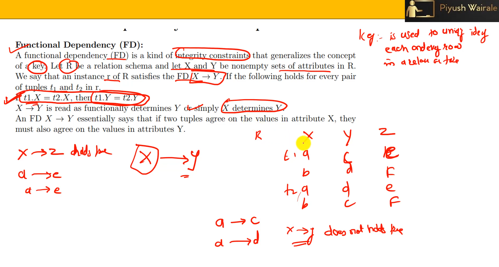
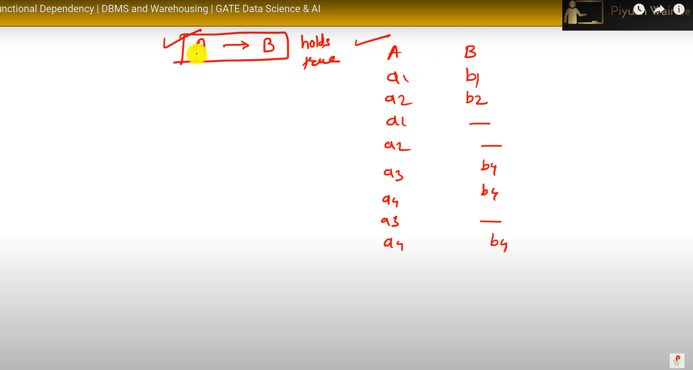
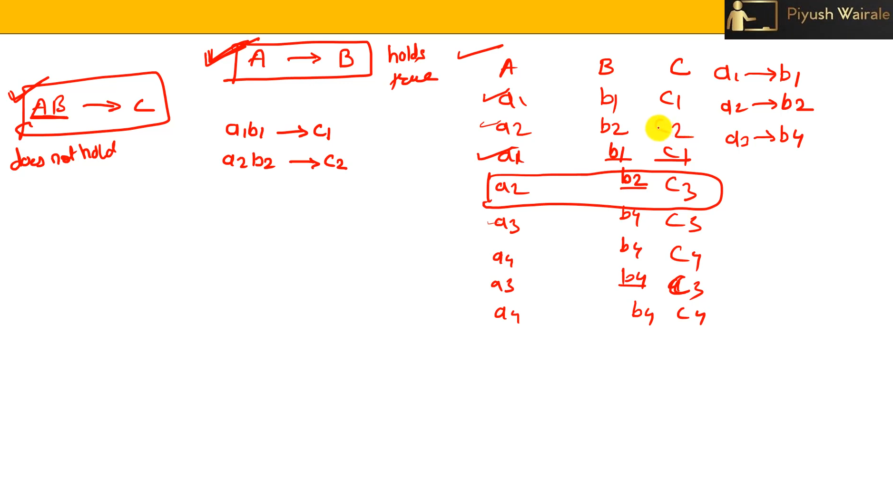
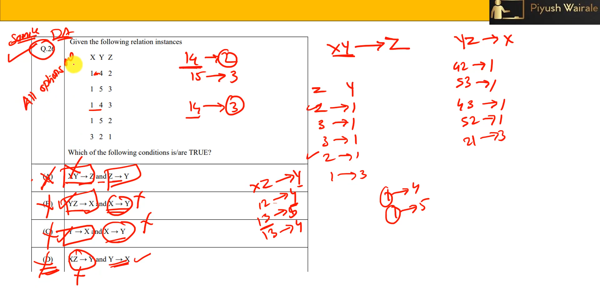

# Relational Database Design-2 - Functional Dependencies

**Summary**
**Objectives**

* To introduce functional dependencies, a fundamental concept for designing relational databases.

**Outline**

1. Functional Dependencies
2. Armstrong's Axioms
3. Closure of Functional Dependencies

**Functional Dependencies**

* Constraints on the set of legal relations.
* Require that the value for a certain set of attributes determines uniquely the value for another set of attributes.
* Formal definition: Let R be a relation schema, α ⊆ R, and β ⊆ R. The functional dependency (FD) α → β holds on R if and only if for any legal relations r(R), whenever any two tuples t1 and t2 of r agree on the attributes α, they also agree on the attributes β.

**primary key** 

**Armstrong's Axioms**

* A set of rules that allow us to infer new FDs from a given set of FDs.
* Reflexivity: if β ⊆ α, then α → β
* Augmentation: if α → β, then γα → γβ
* Transitivity: if α → β and β → γ, then α → γ

**Closure of Functional Dependencies**

* The set of all FDs that can be logically inferred from a given set of FDs F using Armstrong's Axioms.
* Denoted by F+.

**Applications of Functional Dependencies**

* Testing relations to determine if they satisfy a given set of FDs.
* Specifying constraints on the set of legal relations.
* Expressing constraints that cannot be expressed using superkeys.

**Properties of Armstrong's Axioms**

* Soundness: Generate only FDs that actually hold.
* Completeness: Eventually generate all FDs that hold.

**Properties of Functional Dependencies**

* A functional dependency is trivial if it is satisfied by all instances of a relation.
* Example: ID, name → ID; name → name
* In general, α → β is trivial if β ⊆ α.

**Examples of Functional Dependencies**

* studentID → semester
* studentID, lecture → TA
* {studentID, lecture} → {TA, semester}
* employeeID → employeeName
* employeeID → departmentID
* departmentID → departmentName

**Conclusion**

Functional dependencies are a powerful tool for designing relational databases, allowing us to express data constraints and enforce referential integrity. Armstrong's Axioms provide a formal framework for manipulating and reasoning about FDs, while the closure of FDs helps us identify all possible constraints that can be derived from a given set of FDs.
