# Summary of Lecture 5.3 - Relational Database Design3.pdf

**Summary**

## Functional Dependency Theory

### Armstrong's Axioms

Armstrong's Axioms provide a set of rules for inferring new functional dependencies from existing ones. These axioms are:

- **Reflexivity:** If β ⊆ α, then α → β
- **Augmentation:** If α → β, then γα → γβ
- **Transitivity:** If α → β and β → γ, then α → γ

These axioms allow us to generate new FDs by applying them repeatedly to existing FDs. The result is the closure of the set of FDs, denoted as F+.

### Closure of FDs

The closure of a set of FDs F is the set of all FDs that can be logically implied by F. F+ is computed by repeatedly applying Armstrong's axioms to F until no new FDs can be generated.

### Closure of Attributes

The closure of an attribute set α under F, denoted as α+, is the set of all attributes that are functionally determined by α under F. To compute α+, we start with α and repeatedly apply the following rule until no new attributes can be added:

for each β → γ in F do
    if β ⊆ result then result ← result ∪ γ

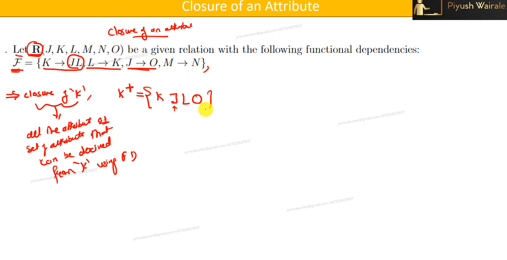

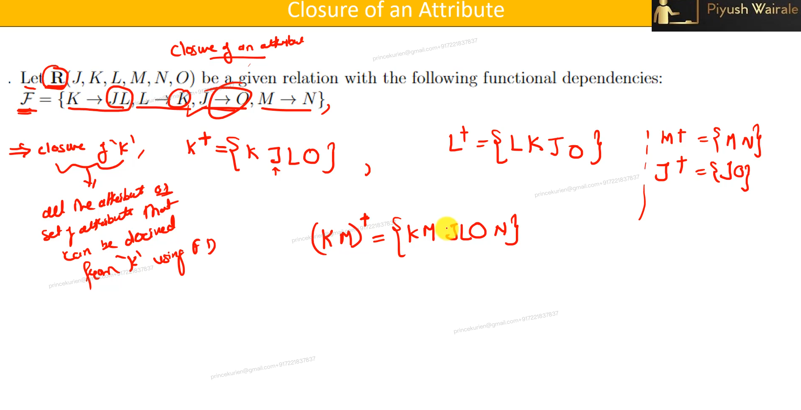

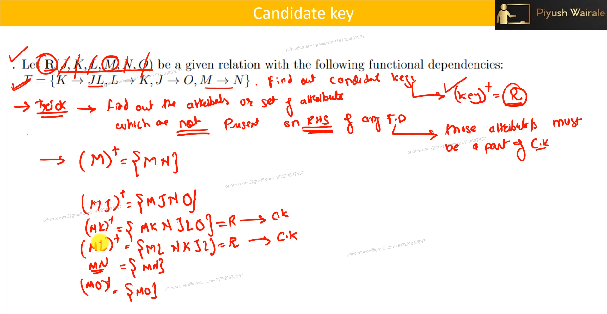

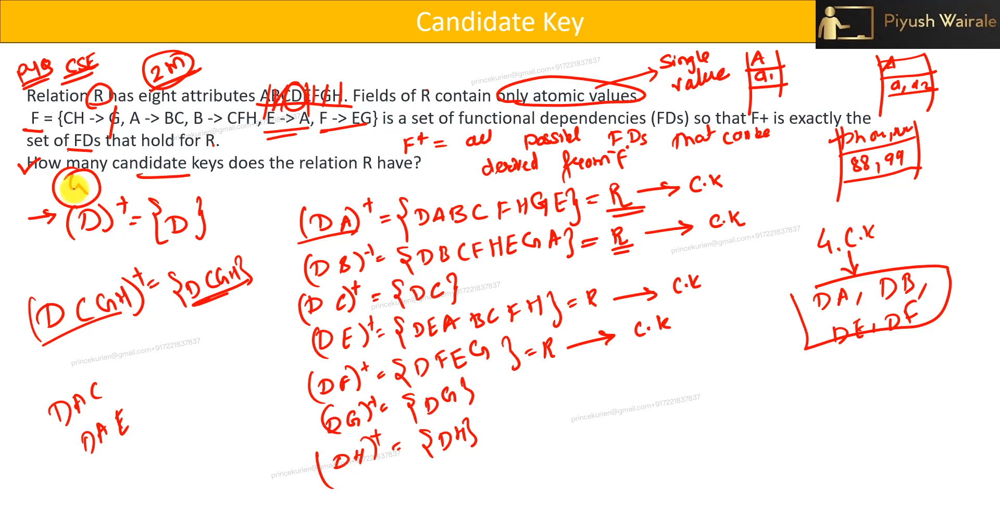

### Decomposition Using Functional Dependencies

Decomposition is the process of dividing a relation into smaller relations that are easier to maintain and query. To decompose a relation using FDs, we must ensure that:

- **Lossless Join:** The decomposition is lossless if we can reconstruct the original relation by joining the decomposed relations.
- **Dependency Preservation:** The decomposition is dependency preserving if all FDs hold on the decomposed relations.

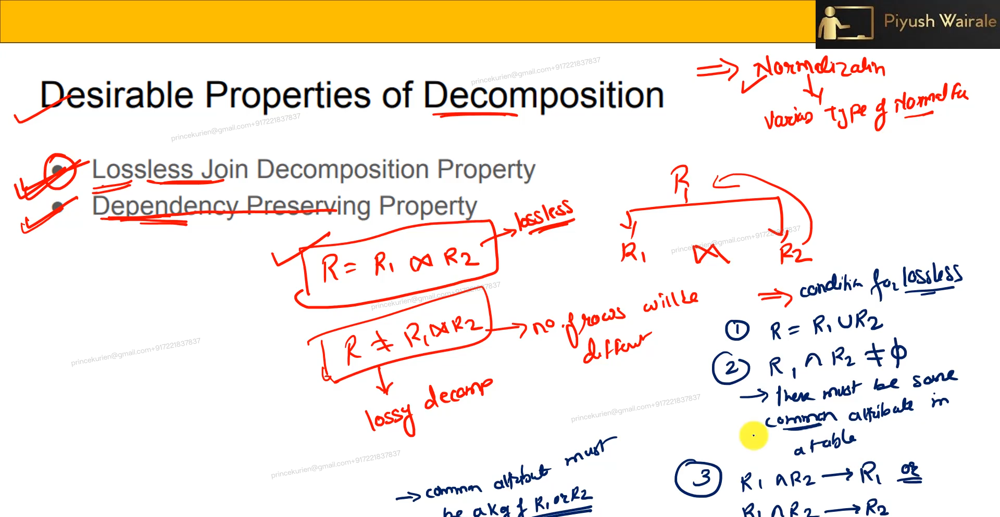

### 2NF Second Normal Form

- Realation R is in 2NF
  - R is 1NF means not multivariable dependency
  - R contains no partial arttibutes

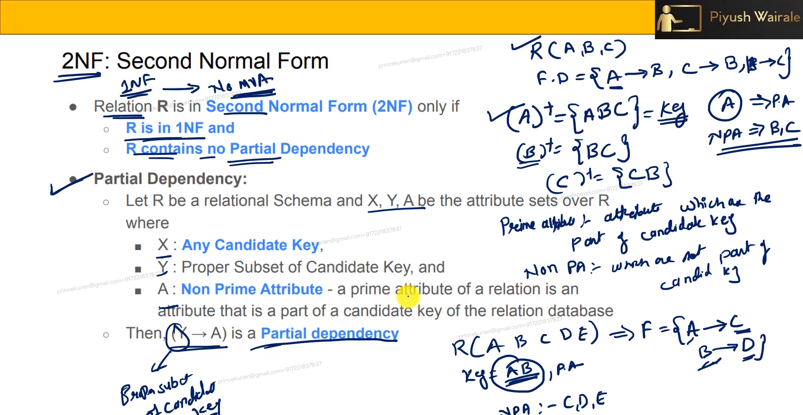

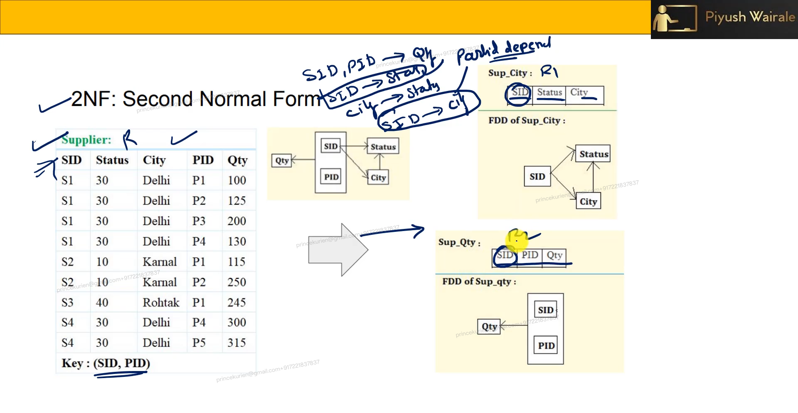

### Third Normal Form (3NF)

A relation schema R is in 3NF if for every FD α → β ∈ F+, either:

- α → β is trivial (i.e., β ⊆ α)
- α is a superkey for R
- Each attribute A in β − α is contained in a candidate key for R
- no prime attributes shouldnt determine no prime attribute
- means all funtional dependecy will have the PRIME attribute in LHS
- **or** if LHS is no prime arrtibute then RHS has to be **PRIME attribute**

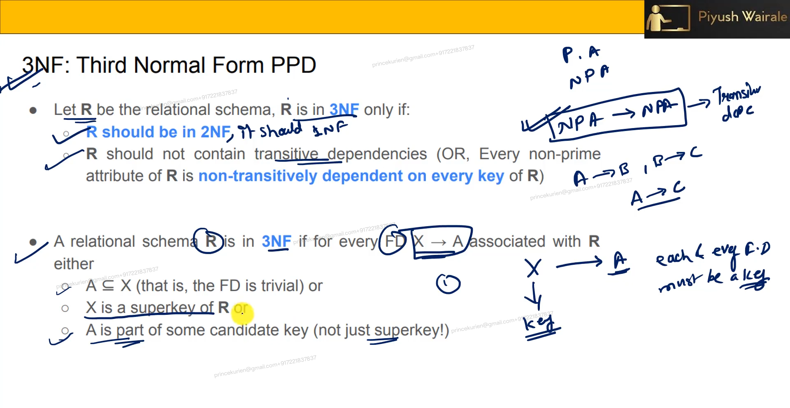

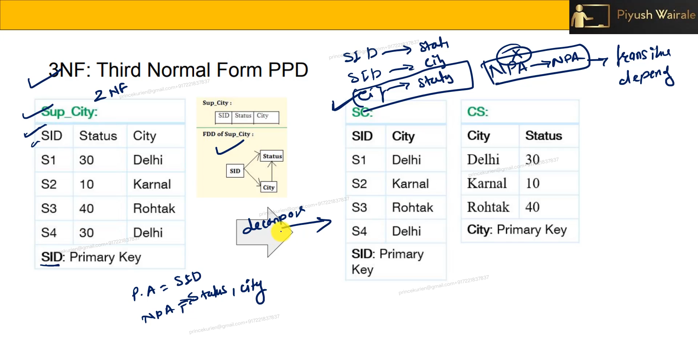

### Boyce-Codd Normal Form (BCNF)

A relation schema R is in BCNF if for every FD α → β ∈ F+, either:

- α → β is trivial (i.e., β ⊆ α)
- α is a superkey for R

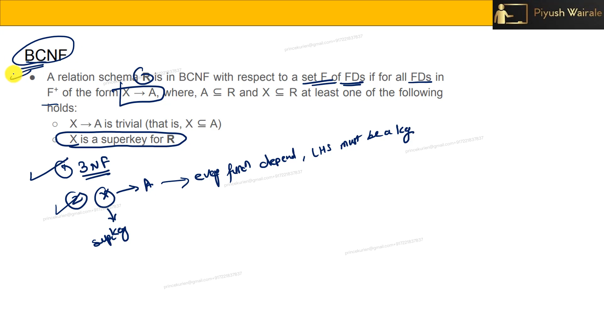

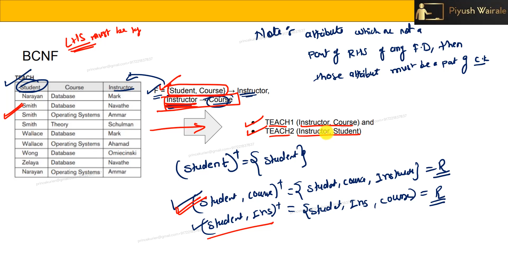

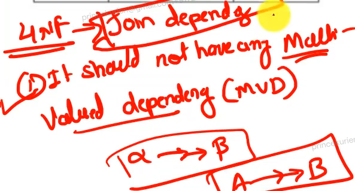

## Normalization

Normalization is the process of converting a relation schema into a "good" form, such as BCNF or 3NF. The goals of normalization are to:

- Eliminate data redundancy
- Ensure data integrity
- Improve query performance

### Problems with Decomposition

Decomposition may introduce some problems, such as:

- **Lossiness:** It may be impossible to reconstruct the original relation from the decomposed relations.
- **Dependency Checking:** Checking dependencies may require joins, which can be expensive.
- **Query Performance:** Some queries may become more expensive after decomposition.

## How Good is BCNF?

BCNF is a strong normal form, but it is not always sufficient to eliminate all anomalies. For example, inst info can be decomposed into inst child and inst phone, but this decomposition does not eliminate insertion anomalies.

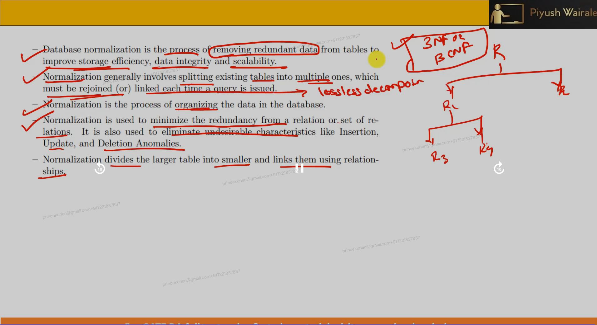

## Module Summary

In this module, we introduced the theory of functional dependencies and discussed issues in "good" design in the context of functional dependencies. We also discussed different normal forms, such as BCNF and 3NF, and the goals of normalization.
