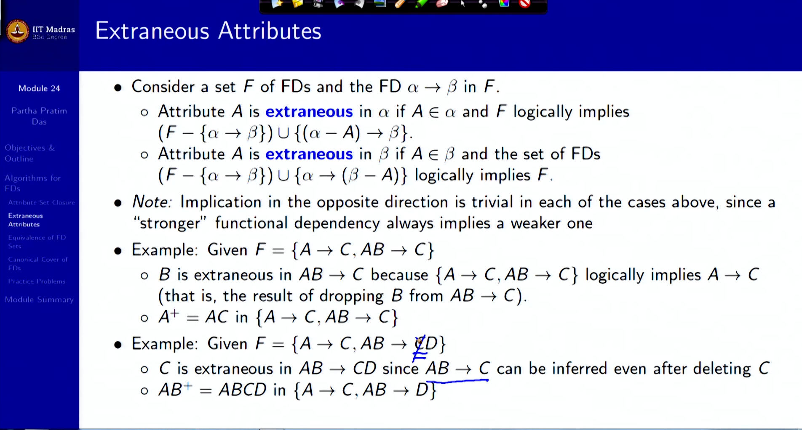

# Summary of Lecture 5.4 - Relational Database Design4.pdf

**Summary**
**Module 24: Relational Database Design/4**

**Objectives**

* Learn Algorithms for Properties of Functional Dependencies

**Outline**

* Algorithms for Functional Dependencies
* Attribute Set Closure
* Extraneous Attributes
* Equivalence of FD Sets
* Canonical Cover of FDs
* Practice Problems

**Algorithms for Functional Dependencies**

Functional dependencies (FDs) are used to represent relationships between attributes in a database table. The following algorithms can be used to test for various properties of FDs:

* **Attribute Set Closure**: Calculates the closure of an attribute set under a set of FDs, which is the set of all attributes that are functionally dependent on the given attribute set.
* **Extraneous Attributes**: Determines if an attribute in a functional dependency is extraneous, meaning it can be removed without affecting the set of FDs.
* **Equivalence of FD Sets**: Checks if two sets of FDs are equivalent, meaning they imply the same relationships between attributes.

**Attribute Set Closure**

To calculate the attribute set closure, we start with a set of attributes and repeatedly apply the following rules:

1. If an attribute A is in the set, then add all attributes that are functionally dependent on A.
2. If an attribute B is in the set and B → C is a functional dependency, then add C.

Example:

* Given F = {A → B, A → C, CG → H, CG → I, B → H}
* (AG)+
  * (AG) = AG
  * (AG) = ABCG (A → C and A → B)
  * (AG) = ABCGH (CG → H and CG ⊆ AGBC)
  * (AG) = ABCGHI (CG → I and CG ⊆ AGBCH)

**Extraneous Attributes**

An attribute A is extraneous in a functional dependency α → β if:

* A ∈ α and F logically implies (F − {α → β}) ∪ {(α − A) → β}
* A ∈ β and the set of FDs (F − {α → β}) ∪ {α → (β − A)} logically implies F

Example:

* Given F = {A → C, AB → C}
  * B is extraneous in AB → C because {A → C, AB → C} logically implies A → C.
  * A is extraneous in AB → C because A → C can be inferred from {AB → C} and {A → B}.

**Equivalence of FD Sets**

Two sets of functional dependencies F and G are equivalent if F+ = G+. That is:

* (F+ = G+) ⇔ (F+ ⇒ G and G+ ⇒ F)

Equivalence means that every functional dependency in F can be inferred from G, and every functional dependency in G can be inferred from F.

**Canonical Cover**

A canonical cover for a set of FDs is a set of dependencies Fc such that:

* F+ = Fc+
* No functional dependency in Fc contains an extraneous attribute.
* Each left side of functional dependency in Fc is unique.

Intuitively, a canonical cover is a minimal set of FDs that is logically equivalent to the original set of FDs.

**Practice Problems**

1. Find if the given functional dependency is implied from the set of Functional Dependencies:
   a) A → BC, CD → E, E → C, D → AEH, ABH → BD, DH → BC
   i) Check: BCD → H
   ii) Check: AED → C
2. Find Super Key using Functional Dependencies:
   a) Relational Schema R(ABCDE). Functional dependencies:
   AB → C, DE → B, CD → E
3. Find Candidate Key using Functional Dependencies:
   a) Relational Schema R(ABCDE). Functional dependencies:
   AB → C, DE → B, CD → E
4. Find Prime and Non Prime Attributes using Functional Dependencies:
   a) R(ABCDEF) having FDs {AB → C, C → D, D → E, F → B, E → F}
5. Check the Equivalence of a Pair of Sets of Functional Dependencies:
   a) Consider the two sets F and G with their FDs as below :
   i) F : A → C, AC → D, E → AD, E → H
   ii) G : A → CD, E → AH
6. Find the Minimal Cover or Irreducible Sets or Canonical Cover of a Set of
   Functional Dependencies:
   a) AB → CD, BC → D
   b) ABCD → E, E → D, AC → D, A → B
