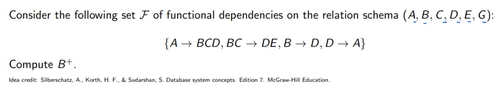
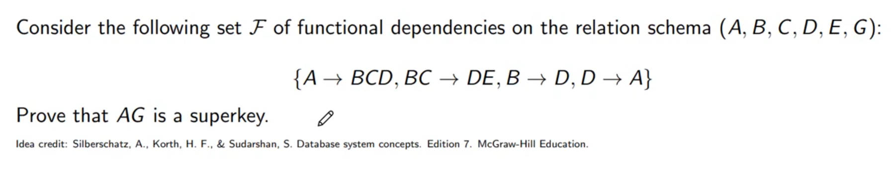
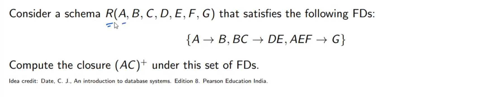
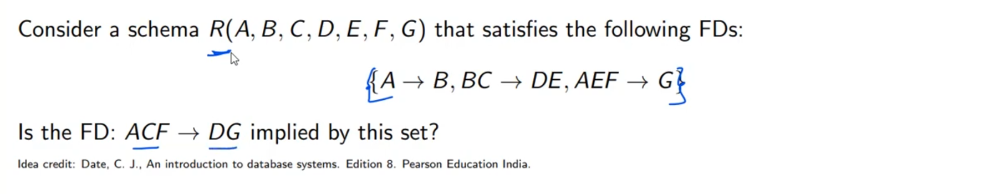

______________________________________________________________________

______________________________________________________________________

(AC)^plus =

1. as A-> B (AC)^+ = ACB
1. as BC -> DE (AC)^+ = ACBDE
1. AEF -> G and F not in (AC)^+
1. (AC)^+ = **"ACBDE"**

______________________________________________________________________

1. closure if ACF as A -> B ACF + =  ACFB
1. BC -> DE  ACF + =  ACFBDE
1. AEF -> G  ACF + =  **ACFBDEG**
