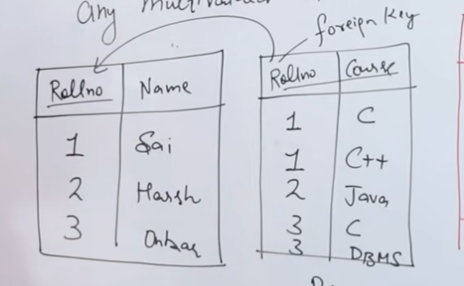
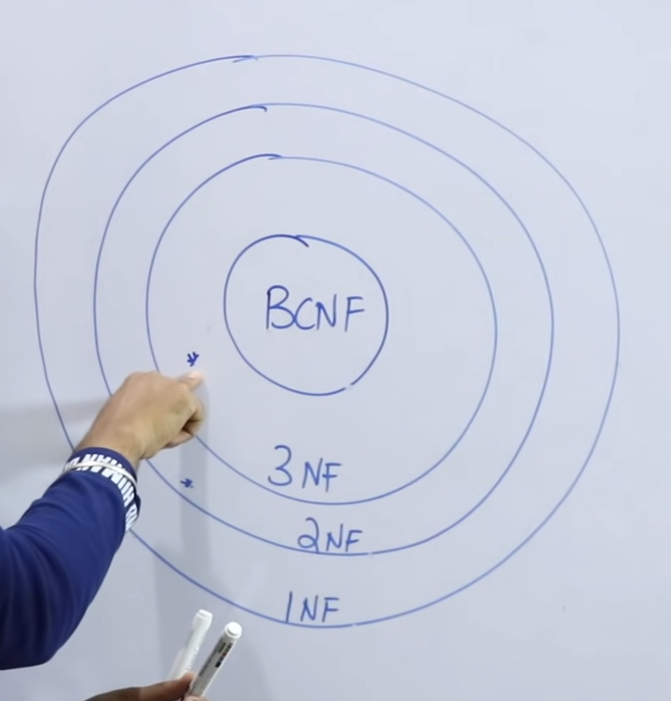

# Normalization

## Anomaly

- Insertion Anomaly
- Deletion Anomaly
- Updation Anomaly

### First Normal Form (1NF) - EF Codd

**Definition:**

1. A table should not contain any multivalued attribute.
2. This ensures that each column contains atomic (indivisible) values, and each entry in a column has a single value.

### Example Table

| Rollno | Name | Course  |
| ------ | ---- | ------- |
| 1      | Sai  | C, Java |
| 2      | Aish | C, DBMS |

**Explanation of the Example:**

- The table has three columns: Rollno, Name, and Course.
- The `Course` column contains multiple values for some entries, which means it is not in 1NF.
- For instance, for Rollno 1, the courses are "C" and "Java," and for Rollno 2, the courses are "C" and "DBMS."

### Not in 1NF

- The table violates 1NF because it contains multivalued attributes in the `Course` column.
- To convert this table to 1NF, each value in the `Course` column should be atomic. This would typically be done by creating separate rows for each course.

### Conversion to 1NF:

| Rollno | Name | Course |
| ------ | ---- | ------ |
| 1      | Sai  | C      |
| 1      | Sai  | Java   |
| 2      | Aish | C      |
| 2      | Aish | DBMS   |

In this converted table:

- Each entry in the `Course` column is now atomic.
- There are no multivalued attributes.
- Primary key {Rollno , Course} -> Composite Key

By following this process, the table adheres to the rules of the First Normal Form (1NF), ensuring that each column contains only indivisible values and each row represents a unique entity.

list of properties related to functional dependencies in the context of database theory. **Reflexivity**:

1. - If \( Y \) is a subset of \( X \), then \( X $\rightarrow$ Y \).
   - This means that if \( Y \) is contained within \( X \), then \( X \) functionally determines \( Y \).
2. **Augmentation**:

   - If \( X $\rightarrow$ Y \), then \( XZ $\rightarrow$ YZ \).
   - This means that if \( X \) functionally determines \( Y \), then adding the same set \( Z \) to both sides preserves the functional dependency.

3. **Transitivity**:

   - If \( X $\rightarrow$ Y \) and \( Y $\rightarrow$ Z \), then \( X $\rightarrow$ Z \).
   - This means that if \( X \) functionally determines \( Y \) and \( Y \) functionally determines \( Z \), then \( X \) functionally determines \( Z \).

4. **Union**:

   - If \( X $\rightarrow$ Y \) and \( X $\rightarrow$ Z \), then \( X $\rightarrow$ YZ \).
   - This means that if \( X \) functionally determines \( Y \) and \( X \) also functionally determines \( Z \), then \( X \) functionally determines the combination of \( Y \) and \( Z \).

5. **Decomposition**:

   - If \( X $\rightarrow$ YZ \), then \( X $\rightarrow$ Y \) and \( X $\rightarrow$ Z \).
   - This means that if \( X \) functionally determines the combination of \( Y \) and \( Z \), then \( X \) functionally determines \( Y \) and \( X \) functionally determines \( Z \) separately.

6. **Pseudotransitivity**:

   - If \( X $\rightarrow$ Y \) and \( WY $\rightarrow$ Z \), then \( WX $\rightarrow$ Z \).
   - This means that if \( X \) functionally determines \( Y \) and \( WY \) functionally determines \( Z \), then \( WX \) functionally determines \( Z \).

7. **Composition**:

   - If \( X $\rightarrow$ Y \) and \( Z $\rightarrow$ W \), then \( XZ $\rightarrow$ YW \).
   - This means that if \( X \) functionally determines \( Y \) and \( Z \) functionally determines \( W \), then the combination \( XZ \) functionally determines the combination \( YW \).

These properties are fundamental in understanding and working with functional dependencies in relational database design, particularly in the normalization process.

### Explanation of Second Normal Form (2NF) with Example Table

#### Second Normal Form (2NF)

To achieve Second Normal Form, a table must satisfy the following conditions:

1. **First Normal Form (1NF)**:

   - The table must already be in First Normal Form. This means that the table should have no repeating groups or arrays. Each column should contain atomic (indivisible) values, and each record should be unique.

2. **Full Functional Dependency**:

   - All non-prime attributes (attributes that are not part of any candidate key) must be fully functionally dependent on the candidate key. This means that each non-prime attribute should depend on the whole candidate key, not just a part of it.

#### Example Table

Consider the following table:

| Customer ID | Store ID | Location  |
| ----------- | -------- | --------- |
| 1           | 1        | Delhi     |
| 1           | 3        | Mumbai    |
| 2           | 1        | Delhi     |
| 3           | 2        | Bangalore |
| 4           | 3        | Mumbai    |

- **Customer ID** and **Store ID** together form a composite key.
- **Location** is a non-prime attribute.

#### Analysis of the Example Table

1. **First Normal Form (1NF)**:

   - The table is in 1NF as all values are atomic and each record is unique.

2. **Full Functional Dependency**:

   - The non-prime attribute **Location** should be fully functionally dependent on the entire composite key (Customer ID, Store ID). However, in this table, **Location** depends only on **Store ID** and not on the combination of **Customer ID** and **Store ID**. This indicates a partial dependency, which violates the 2NF rule.

#### Converting to Second Normal Form (2NF)

To convert this table to 2NF, we need to remove the partial dependency by creating separate tables. For example:

1. **Stores Table**:

   - Columns: **Store ID**, **Location**
   - This table will store the location of each store.

   | Store ID | Location  |
   | -------- | --------- |
   | 1        | Delhi     |
   | 2        | Bangalore |
   | 3        | Mumbai    |

2. **Customer_Store Table**:

   - Columns: **Customer ID**, **Store ID**
   - This table will store the relationship between customers and stores.

   | Customer ID | Store ID |
   | ----------- | -------- |
   | 1           | 1        |
   | 1           | 3        |
   | 2           | 1        |
   | 3           | 2        |
   | 4           | 3        |

By splitting the original table into these two tables, we ensure that the non-prime attribute (Location) is fully functionally dependent on the candidate key in its respective table, satisfying the 2NF requirements.

To determine the 2nd Normal Form (2NF) for a given relation, we need to ensure that the relation is in 1st Normal Form (1NF) and that all non-prime attributes are fully functionally dependent on the primary key.

From the image, we have the following information:

- Relation \( R(ABCDEF) \)
- Functional Dependencies (FDs):

  - \( FD: C $\rightarrow $F \)
  - \( E $\rightarrow $A \)
  - \( EC $\rightarrow $D \)
  - \( A $\rightarrow $B \)

- Candidate Key (CK): \( EC \)
- Prime Attributes: \( E, C \)
- Non-Prime Attributes: \( A, B, D, F \)

To be in 2NF, the relation must be in 1NF and all non-prime attributes must be fully functionally dependent on the entire candidate key, not just part of it.

### Steps to achieve 2NF:

1. **Identify Partial Dependencies**:

   - \( C $\rightarrow $F \) (Partial dependency since \( C \) is part of the candidate key \( EC \))
   - \( E $\rightarrow $A \) (Partial dependency since \( E \) is part of the candidate key \( EC \))
   - \( EC $\rightarrow $D \) (Full dependency since \( D \) depends on the entire candidate key \( EC \))
   - \( A $\rightarrow $B \) (Not a partial dependency since \( A \) is not part of the candidate key)

2. **Remove Partial Dependencies**:

   - Create new relations to remove partial dependencies:
     - \( R1(CE, D) \) with \( CE $\rightarrow $D \)
     - \( R2(C, F) \) with \( C $\rightarrow $F \)
     - \( R3(E, A) \) with \( E $\rightarrow $A \)
     - \( R4(A, B) \) with \( A $\rightarrow $B \)

### Resulting Relations in 2NF:

- \( R1(CE, D) \)
- \( R2(C, F) \)
- \( R3(E, A , B) \)

These relations are now in 2NF because all non-prime attributes are fully functionally dependent on the entire candidate key of their respective relations.

#### Explanation of Third Normal Form (3NF)

1. **Prerequisite: Second Normal Form (2NF)**

   - A table must already be in the Second Normal Form (2NF) before it can be considered for 3NF.
   - 2NF requires that the table is in the First Normal Form (1NF) and that all non-key attributes are fully functionally dependent on the primary key.

2. **No Transitive Dependency**

   - For a table to be in 3NF, it should not have any transitive dependencies.
   - A transitive dependency occurs when a non-key attribute depends on another non-key attribute rather than depending directly on the primary key.

### Example

Consider the table shown in the image:

| Rollno | State   | City   |
| ------ | ------- | ------ |
| 1      | Punjab  | Mohali |
| 2      | Haryana | Ambala |
| 3      | Punjab  | Mohali |
| 4      | Haryana | Ambala |
| 5      | Bihar   | Patna  |

In this table:

- `Rollno` is the primary key.
- `State` and `City` are non-key attributes.

#### Step-by-Step Normalization to 3NF

1. **First Normal Form (1NF)**

   - The table is already in 1NF because all columns contain atomic values, and each column contains values of a single type.

2. **Second Normal Form (2NF)**

   - The table is in 2NF because there are no partial dependencies; all non-key attributes (`State` and `City`) depend on the whole primary key (`Rollno`).

3. **Third Normal Form (3NF)**

   - To check for 3NF, we need to ensure there are no transitive dependencies.
   - In the given table, `City` depends on `State`, and `State` depends on `Rollno`. This is a transitive dependency because `City` indirectly depends on `Rollno` through `State`.

To remove the transitive dependency, we can decompose the table into two tables:

**Table 1: Rollno_State**

| Rollno | State   |
| ------ | ------- |
| 1      | Punjab  |
| 2      | Haryana |
| 3      | Punjab  |
| 4      | Haryana |
| 5      | Bihar   |

**Table 2: State_City**

| State   | City   |
| ------- | ------ |
| Punjab  | Mohali |
| Haryana | Ambala |
| Bihar   | Patna  |

Now, both tables are in 3NF:

- In `Rollno_State`, `State` depends directly on `Rollno`.
- In `State_City`, `City` depends directly on `State`.

By decomposing the original table, we have removed the transitive dependency, thus achieving the Third Normal Form (3NF).

## concept of Boyce-Codd Normal Form (BCNF) using a table named "Student." Here is a detailed explanation:

### Table Structure

The table "Student" has the following columns:

- **Rollno**: Unique identifier for each student.
- **Name**: Name of the student.
- **Voteid**: Voter ID of the student.
- **Age**: Age of the student.

### Data in the Table

| Rollno | Name  | Voteid | Age |
| ------ | ----- | ------ | --- |
| 1      | Ravi  | K0123  | 20  |
| 2      | Varun | M034   | 21  |
| 3      | Ravi  | K786   | 23  |
| 4      | Rahul | D286   | 21  |

### Candidate Keys (CK)

The candidate keys for this table are:

- Rollno
- Voteid

### Functional Dependencies (FD)

The functional dependencies in the table are:

1. Rollno → Name
2. Rollno → Voteid
3. Voteid → Age
4. Voteid → Rollno

### Explanation of BCNF

BCNF is a higher version of the Third Normal Form (3NF). A table is in BCNF if, for every one of its non-trivial functional dependencies X → Y, X is a super key. In other words, for every functional dependency, the left-hand side should be a candidate key.

### Analysis of the Table

- **Rollno → Name**: Rollno is a candidate key, so this dependency is fine.
- **Rollno → Voteid**: Rollno is a candidate key, so this dependency is fine.
- **Voteid → Age**: Voteid is a candidate key, so this dependency is fine.
- **Voteid → Rollno**: Voteid is a candidate key, so this dependency is fine.

Since all the functional dependencies have candidate keys on the left-hand side, the table is already in BCNF.

### Conclusion

The table "Student" is in Boyce-Codd Normal Form (BCNF) because all the functional dependencies have candidate keys on the left-hand side. This ensures that the table is free from redundancy and update anomalies.

**Dependency Preserving Decomposition**:

1. - **Third Normal Form (3NF)**: Always ensures that the decomposition of a database schema is dependency preserving. This means that after decomposing a relation into smaller relations, all functional dependencies are preserved in the resulting relations. This is crucial for maintaining the integrity and consistency of the database.
   - **Boyce-Codd Normal Form (BCNF)**: Does not always ensure dependency preserving decomposition. While BCNF is a stricter form of normalization compared to 3NF, it may sometimes result in a loss of some functional dependencies when decomposing a relation.
2. **Lossless Decomposition**:

   - Both **3NF and BCNF** ensure lossless decomposition. This means that when a relation is decomposed into two or more relations, it is possible to reconstruct the original relation without any loss of information. Lossless decomposition is essential to ensure that no data is lost during the normalization process.

3. **Example**:

   - The relation \( R(ABCD) \) is given with the functional dependencies \( \{A \rightarrow B, C \rightarrow D, D \rightarrow A\} \). This example illustrates a scenario where the concepts of dependency preservation and lossless decomposition are applied.

In summary, while both 3NF and BCNF ensure that the decomposition of a relation is lossless, only 3NF guarantees that all functional dependencies are preserved in the decomposed relations. BCNF, being a stricter form of normalization, may sometimes sacrifice dependency preservation to achieve a higher level of normalization.

| 1st Normal Form             | 2nd Normal Form                       | 3rd Normal Form                                             | BCNF                      | 4th Normal Form              | 5th Normal Form           |
| --------------------------- | ------------------------------------- | ----------------------------------------------------------- | ------------------------- | ---------------------------- | ------------------------- |
| \* No Multivalued attribute | \* In 1st NF +                        | \* In 2nd NF +                                              | \* In 3rd NF +            | \* In BCNF +                 | \* In 4th NF +            |
| \* Only Single valued       | \* No Partial Dependency              | \* No Transitive Dependency                                 | \* L.H.S must be CK or SK | \* No Multivalued Dependency | \* Lossless Decomposition |
| Rollno                      | \* Only Full Dependency               | \* No Non-prime should determine non-prime                  | X -> Y                    | X -> -> Y                    |                           |
| 1 C, C++                    | if AB is the primary key AB -> C | if x is the prime and y and z are no prime X -> Y -> Z |                           |                              |                           |
| 2 C++, Java                 | B -> C not possible                   | PK -> Non-prime                                             |                           |                              |                           |
|                             | A -> C not possible                   | CK - > Prime                                                |                           |                              |                           |
|                             |                                       | This condition vilote Non-prime -> Non- prime          |                           |                              |                           |
