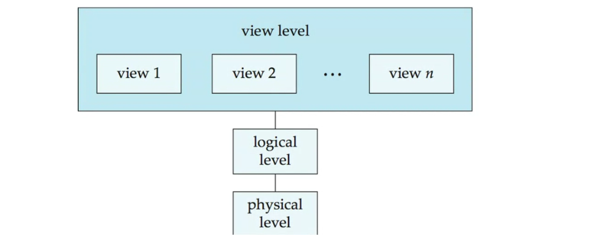
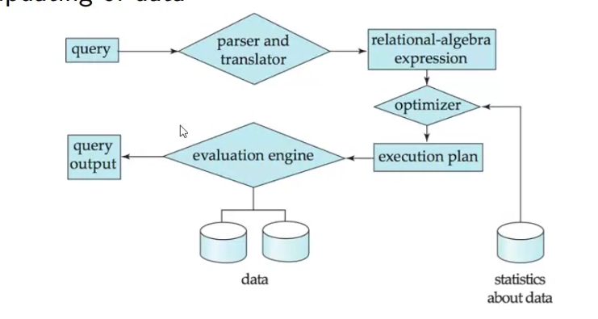

### Week 1: Database Management Systems (DBMS) vs. File Handling via Python

A comparison between file handling via Python and Database Management Systems (DBMS) across various parameters.

1. Scalability:

   - Python: Struggles with handling large amounts of data and structural changes.
   - DBMS: Offers built-in features for high scalability and easy structural modifications.
2. Performance:

   - Python: Executes operations in seconds.
   - DBMS: Operates in milliseconds.
3. Data Persistence:

   - Python: Requires manual updating of temporary data structures.
   - DBMS: Ensures automatic data persistence.
4. Robustness:

   - Python: Requires manual effort to ensure data robustness.
   - DBMS: Provides automated backup, recovery, and restore features.
5. Security:

   - Python: Difficult to implement (relies on OS-level security).
   - DBMS: Offers user-specific access control at the database level.
6. Programmer Productivity:

   - Python: Requires extensive coding for basic operations.
   - DBMS: Provides standard queries, increasing programmer efficiency.
7. Arithmetic Operations:

   - Python: Easy to perform computations.
   - DBMS: Limited set of arithmetic operations available.
8. Costs:

   - Python: Lower costs for hardware, software, and human resources.
   - DBMS: Higher costs across all resources.

Overall, DBMS appears to offer more robust, efficient, and scalable data management solutions, while Python file handling is simpler and less costly but with significant limitations for large-scale data operations.

The Levels of Abstraction in database systems.  key points:

1. Physical Level:

   - Describes how a record is physically stored
   - Examples include blocks of storage
2. Logical Level:

   - Describes the data stored in a database
   - Includes information about the relationships among data fields
   - Covers attributes and data types of attributes
3. View Level:

   - Refers to application programs that hide details of data types
   - Also hides information for security purposes
   - Typically involves user interfaces

The image includes a diagram illustrating the hierarchy of these levels:

- At the top is the View Level, which contains multiple views (view 1, view 2, ..., view n)
- Below the View Level is the Logical Level

This abstraction model allows for separation of concerns in database design and management:

- The Physical Level deals with the actual storage mechanics
- The Logical Level focuses on data structure and relationships
- The View Level provides a user-friendly interface while maintaining security

This layered approach enables efficient data management, security, and user interaction in database systems.

The levels of abstraction shown in the image and general database knowledge:

1. Physical Level Independence:

   - This refers to the ability to change the physical storage structure or device without affecting the logical schema or application programs.
   - It allows database administrators to optimize physical storage for performance without impacting how programmers or users interact with the database.
   - For example, changing from one type of storage device to another, or reorganizing the file structures, should not require changes to the logical schema or application programs.
2. Logical Level Independence:

   - This refers to the ability to change the logical schema without affecting the external schemas or application programs.
   - It allows database designers to modify the conceptual schema (add a table, add or delete attributes, etc.) without having to change the external views or rewrite application programs.
   - For example, adding a new field to a table should not require changes to applications that don't use that field.

The levels of abstraction shown in the image support these independences:

- The Physical Level deals with how data is actually stored. Physical independence means changes at this level don't affect the Logical Level above it.
- The Logical Level describes the structure and relationships of the data. Logical independence means changes at this level don't affect the View Level above it.
- The View Level, which includes multiple views, represents how different applications or users see the data. This level remains stable even when logical or physical levels change, thanks to data independence.

These independences are crucial for database flexibility, maintenance, and evolution. They allow different aspects of the database to be modified without causing a ripple effect of changes throughout the entire system, thus saving time and reducing the risk of errors when updates are needed.

Two key components of a database management system: the Storage Manager and Query Processing.

1. Storage Manager:

   - Acts as an interface between low-level data stored in the database and application programs/queries submitted to the system.
   - Interacts with the operating system's file manager.
   - Responsible for efficient storing, retrieving, and updating of data.
2. Query Processing:

   - Involves several steps: Parsing and translation, Optimization, and Evaluation.
   - The process flow is illustrated in the diagram:
     a. Query is input
     b. Parser and translator convert it to a relational-algebra expression
     c. Optimizer creates an execution plan
     d. Evaluation engine processes the query using the execution plan
     e. Query output is produced

The diagram also shows that the evaluation engine interacts with the data storage and uses statistics for optimization.

This structure allows for efficient handling of database operations, separating the concerns of data storage from query processing and optimization. It enables the system to manage data effectively while providing fast and accurate responses to user queries.

The different components shown in the diagram:

1. Query:
   This is the starting point of the process. It represents the user's input, typically in the form of a SQL statement or another query language.
2. Parser and Translator:
   This component takes the input query and converts it into a relational-algebra expression. It checks the syntax of the query, verifies that the referenced relations and attributes exist, and translates the query into an internal representation that the database system can work with.
3. Relational-Algebra Expression:
   This is the output of the parser and translator. It's an internal representation of the query using relational algebra operations.
4. Optimizer:
   The optimizer takes the relational-algebra expression and generates an efficient execution plan. It considers various factors like the size of relations, available indexes, and statistics about the data to determine the most efficient way to execute the query.
5. Execution Plan:
   This is the output of the optimizer. It's a detailed step-by-step plan for how the query should be executed.
6. Evaluation Engine:
   This component carries out the execution plan. It interacts with the data storage to retrieve, process, and manipulate the data as specified in the execution plan.
7. Query Output:
   This is the final result of the query, which is returned to the user or application that initiated the query.
8. Data:
   These are the actual data stored in the database, represented by cylinder shapes in the diagram. The evaluation engine interacts with this data to process the query.
9. Statistics about Data:
   This component, represented by a cylinder, contains statistical information about the data in the database. The optimizer uses these statistics to make informed decisions about the best execution plan.

The diagram shows how these components interact:

- The query flows through the parser and translator, optimizer, and evaluation engine.
- The optimizer uses statistics about the data to create the execution plan.
- The evaluation engine interacts with the actual data storage to process the query.
- The process results in the query output.

This structure allows for efficient query processing by separating the stages of parsing, optimization, and execution, enabling each component to specialize in its task and contribute to overall system performance.

Analyzing DocumentsAnalyzing DocumentsCertainly! Here is a detailed summary of the key concepts covered in the "Week 1 - 4 summary slides.pdf" document to help you prepare for your exam:

### Week 2: Database Schema and Keys

#### Attribute Types:

- **Domain:** Set of allowed values for each attribute (e.g., alphanumeric string, date, number).

#### Schema and Instances:

- **Schema:** Defines the structure of a relation (e.g., R = (A1, A2, ..., An)).
- **Instance:** Collection of information stored in the database at a particular moment.

#### Keys:

1. **Super Key:** A set of attributes that uniquely identifies a tuple.
2. **Candidate Key:** A minimal super key.
3. **Primary Key:** A selected candidate key.
4. **Surrogate Key:** A unique identifier for an entity or object.
5. **Secondary/Alternate Key:** Candidate keys other than the primary key.
6. **Simple Key:** Consists of a single attribute.
7. **Composite Key:** Consists of multiple attributes.
8. **Foreign Key:** An attribute in one relation that appears in another.

#### Relational Query Languages:

- **Procedural Programming:** Specifies how to get the output.
- **Declarative Programming:** Describes relationships between entities.

### Week 3: SQL and Relational Algebra

#### Basic SQL Operations:

1. **Select Operation:** Selection of rows (e.g., σD>5(r)).
2. **Project Operation:** Selection of columns (e.g., πA,C(r)).
3. **Union:** Union of two relations (e.g., r ∪ s).
4. **Difference:** Set difference of two relations (e.g., r − s).
5. **Intersection:** Set intersection of two relations (e.g., r ∩ s).
6. **Cartesian Product:** Joining two relations (e.g., r × s).
7. **Natural Join:** Matches tuples with the same values on common attributes (e.g., r ▷◁ s).

#### SQL Structure:

1. **Select Clause:** Lists desired attributes.
2. **Where Clause:** Specifies conditions.
3. **From Clause:** Lists involved relations.

#### Additional SQL Features:

1. **String Operations:** Using `LIKE` with `%` and `_`.
2. **Order By:** Specifies sorting order.
3. **Set Operations:** Union, intersect, except.
4. **Aggregate Functions:** avg, min, max, sum, count.
5. **Group By and Having:** Grouping and filtering groups.

#### Nested Subqueries:

- Used in where, from, and select clauses for set membership and comparisons.

#### Join Expressions:

1. **Cross Join:** Cartesian product.
2. **Inner Join:** Joins based on a condition.
3. **Equi-Join:** Condition with equality.
4. **Natural Join:** Based on common attributes.
5. **Outer Join:** Includes non-matching tuples with null values.
6. **Self-Join:** A table joined with itself.

#### Views:

- Virtual relations defined using `CREATE VIEW`.
- Can hide certain data and be materialized.

#### Integrity Constraints:

1. **Not Null, Primary Key, Unique, Check:** Constraints on single relations.
2. **Referential Integrity:** Ensures consistency across relations.
3. **Cascading Actions:** `ON DELETE CASCADE`, `ON UPDATE CASCADE`.

#### Built-in Data Types and User-Defined Types:

- SQL supports various data types and allows creating custom types and domains.

#### Authorization and Roles:

- Using `GRANT` and `REVOKE` statements to manage permissions.
- Creating roles for user groups.

#### SQL Functions and Procedures:

- Creating functions and procedures with control structures like loops and conditionals.
- Triggers for actions in response to data modifications.

### Week 4: Tuple and Domain Relational Calculus

#### Tuple Relational Calculus (TRC):

- Nonprocedural query language with queries of the form `{t | P(t)}`.
- Uses logical conditions combined with OR (∨), AND (∧), NOT(¬), and quantifiers (∃, ∀).

#### Domain Relational Calculus (DRC):

- Queries of the form `{< x1, x2, ..., xn > | P(x1, x2, ..., xn)}`.
- Uses domain variables and logical conditions.

#### Example Queries:

1. **RA, TRC, DRC for students with age > 25 or enrolled in Maths:**

   - **RA:** `ΠName(σage>25∨subject="Maths"(Students))`
   - **TRC:** `{t | ∃s ∈students(s.age > 25 ∨ s.subject = "Maths" ∧ t.name = s.name)}`
   - **DRC:** `{< a >| ∃b, c, d(< a, b, c, d >∈students ∧ b > 25 ∨ d = "Maths")}`
2. **RA, TRC, DRC for students < 25 years old with marks > 75:**

   - **RA:** `ΠName,Sports,(σage<25∧Marks>75(Students ⋊⋉Activity))`
   - **TRC:** `{t | ∃s ∈students ∃a ∈activity(s.name = a.name ∧ s.age < 25 ∧ s.marks > 75 ∧ t.name = s.name ∧ t.sports = a.sports)}`
   - **DRC:** `{< a, f >| ∃b, c, d(< a, b, c, d >∈students ∧ b < 25 ∧ c > 75) ∧ ∃e, g, h(< e, f, g, h >∈activity ∧ a = e)}`
3. **RA, TRC, DRC for students < 25 years old with > 3 awards:**

   - **RA:** `ΠName,Sports,(σage<25∧awards>3(Students ⋊⋉Activity))`
   - **TRC:** `{t | ∃s ∈students ∃a ∈activity(s.name = a.name ∧ s.age < 25 ∧ a.awards > 3 ∧ t.name = s.name ∧ t.sports = a.sports)}`
   - **DRC:** `{< a, f >| ∃b, c, d(< a, b, c, d >∈students ∧ b < 25) ∧ ∃e, g, h(< e, f, g, h >∈activity ∧ g > 3 ∧ a = e)}`

#### E-R Diagrams:

- **Mapping Constraints:** One-to-many, many-to-many, many-to-one, one-to-one relationships.
- **Participation:** Total and partial participation.

This comprehensive summary should help you cover the essential topics for your exam preparation. Good luck!
