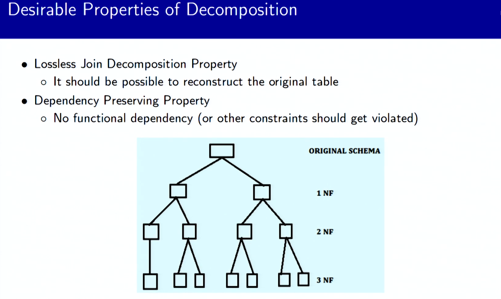
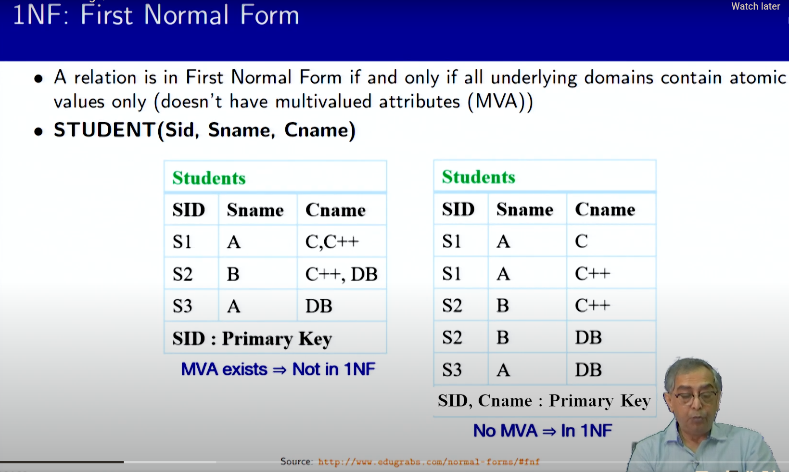
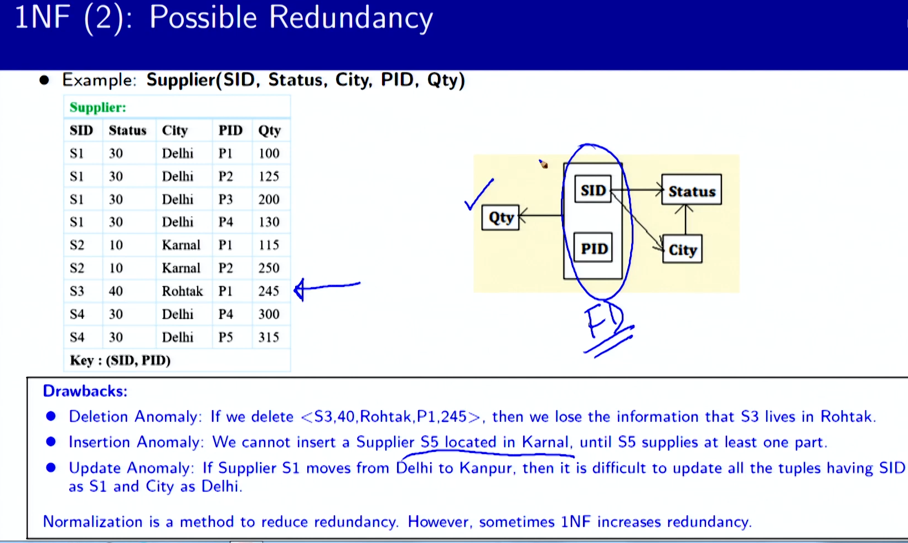
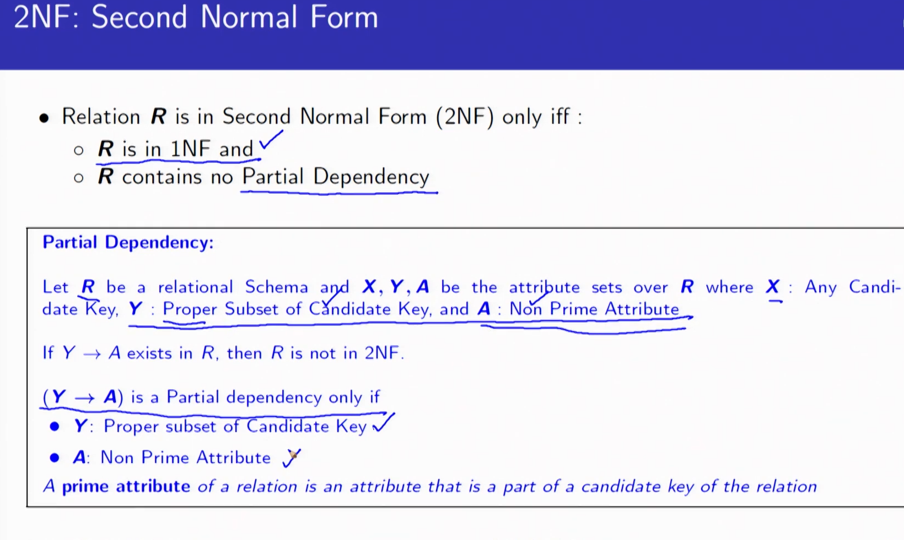
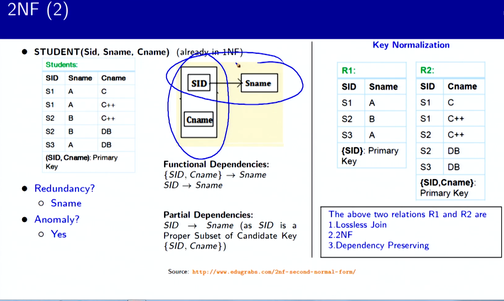
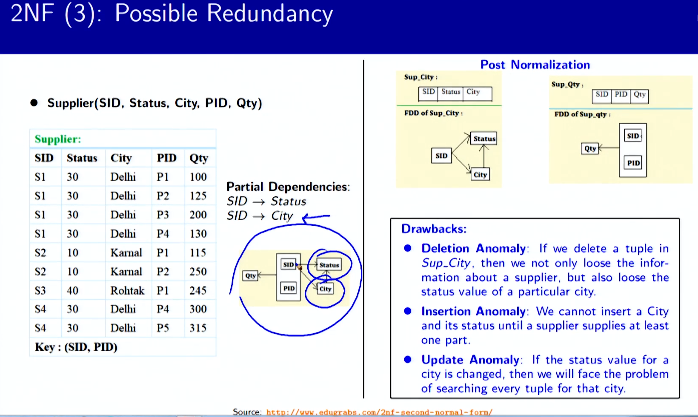
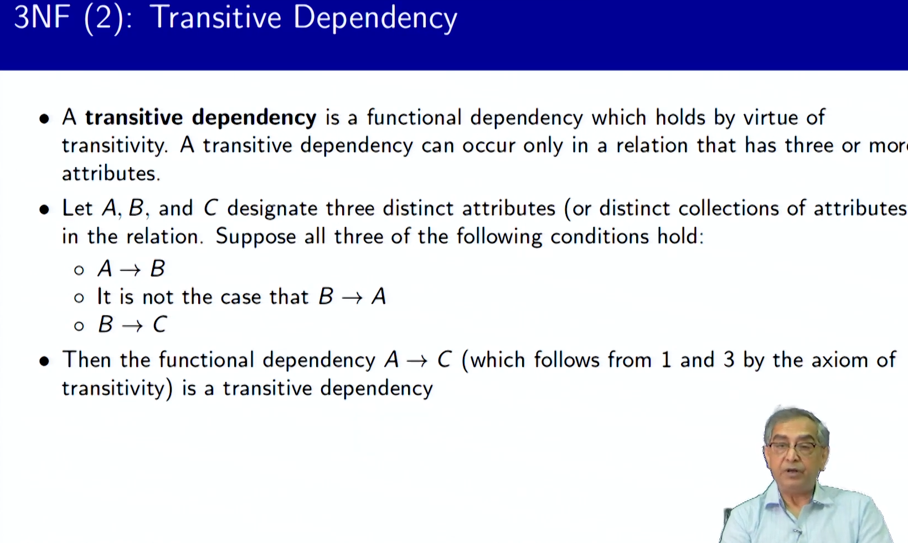
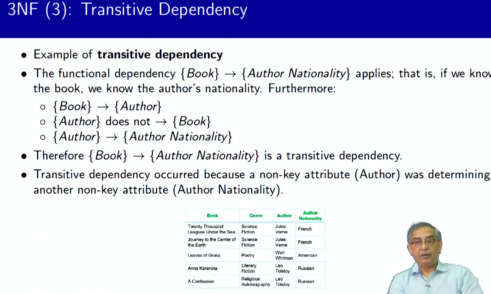

# Summary of Lecture 6.1 - Relational Database Design6.pdf

**Summary**
**Objectives and Outline**

**Objectives:**

* Understand the significance of normal forms in relational design.

**Outline:**

* Overview of normalization
* Normal forms
  * First Normal Form (1NF)
  * Second Normal Form (2NF)
  * Third Normal Form (3NF)

**Normalization: An Overview**

Normalization is a technique used to decompose tables into smaller, more efficient ones to eliminate redundancy and undesirable characteristics, such as:

* Insertion Anomaly: Unable to add new records due to missing required data.
* Update Anomaly: Updating multiple records to maintain data consistency.
* Deletion Anomaly: Losing related data when deleting records.

**Normal Forms**

Normal forms specify constraints on relational schemas to ensure data integrity and reduce redundancy.

**First Normal Form (1NF)**

A relation is in 1NF if all attributes contain atomic values (no multivalued attributes).

**Second Normal Form (2NF)**

A relation is in 2NF if it is in 1NF and contains no partial dependency, where a non-prime attribute is functionally dependent on a proper subset of the candidate key.

**Third Normal Form (3NF)**

A relation is in 3NF if it is in 2NF and contains no transitive dependencies, where a non-prime attribute is functionally dependent on a non-key attribute, which in turn is functionally dependent on the candidate key.

**Additional Normal Forms**

Beyond 3NF, there are additional normal forms that offer higher levels of data integrity and efficiency, including:

* Elementary Key Normal Form (EKNF)
* Boyce-Codd Normal Form (BCNF)
* Fourth Normal Form (4NF)
* Essential Tuple Normal Form (ETNF)
* Join Dependencies and Fifth Normal Form (5NF)
* Sixth Normal Form (6NF)
* Domain/Key Normal Form (DKNF)

**Importance of Normalization**

Normalization helps to:

* Eliminate redundant data
* Ensure logical data storage
* Prevent data anomalies
* Improve data consistency and integrity
* Enhance database performance by reducing unnecessary joins and updates
