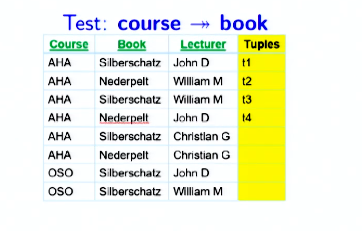

# Summary of Lecture 6.4 - Relational Database Design9.pdf

## Summary

**Module 29: Multivalued Dependency (MVD) and Decomposition to 4NF**

### Objectives

- Understand multi-valued dependencies arising from attributes that can have multiple values
- Define Fourth Normal Form and learn the decomposition algorithm to 4NF

### Multivalued Dependency

#### Definition

A multivalued dependency (MVD) α ⟶ β holds on a relation schema R if, for any two tuples t1 and t2 in R such that t1[α] = t2[α], there exist tuples t3 and t4 in R such that:

- t1[α] = t2[α] = t3[α] = t4[α]
- t3[β] = t1[β]
- t3[R – β] = t2[R – β]
- t4[β] = t2[β]
- t4[R – β] = t1[R – β]

#### Example

Consider a relation schema for a university course with the following attributes:

- ID
- Course
- Book
- Lecturer

The following MVDs hold on this relation:

- ID ⟶ Book
- ID ⟶ Lecturer

#### Use

MVDs are used to:

- Test relations to determine if they are legal under a given set of functional and multivalued dependencies
- Specify constraints on the set of legal relations

### Theory

- If α → β, then α ⟶ β
- **C-Complementation**: If X ⟶ Y, then X ⟶ (R − (X ∪ Y)).
- **A-Augmentation**: If X ⟶ Y and W ⊇ Z, then WX ⟶ YZ.
- **T-Transitivity**: If X ⟶ Y and Y ⟶ Z, then X ⟶ (Z − Y).
- **Replication**: If X → Y, then X ⟶ Y but the reverse is not true.
- **Coalescence**: If X ⟶ Y and there is a W such that W ∩ Y is empty, W → Z, and Y ⊇ Z, then X → Z.

### Decomposition to 4NF

#### Fourth Normal Form

A relation schema R is in 4NF with respect to a set D of functional and multivalued dependencies if, for all multivalued dependencies in D+ of the form α ⟶ β, where α ⊆ R and β ⊆ R, at least one of the following hold:

- α ⟶ β is trivial (that is, β ⊆ α or α ∪ β = R)
- α is a superkey for schema R

#### Decomposition Algorithm

To decompose a relation schema R to 4NF:

1. For all dependencies A ⟶ B in D+, check if A is a superkey.
2. If not, choose a dependency in F+ that breaks the 4NF rules, say A ⟶ B.
3. Create R1 = A B.
4. Create R2 = (R – (B – A)).
5. Note that: R1 ∩ R2 = A and A ⟶ AB (= R1), so this is a lossless decomposition.
6. Repeat for R1 and R2.
