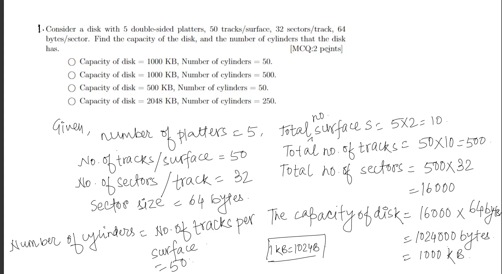
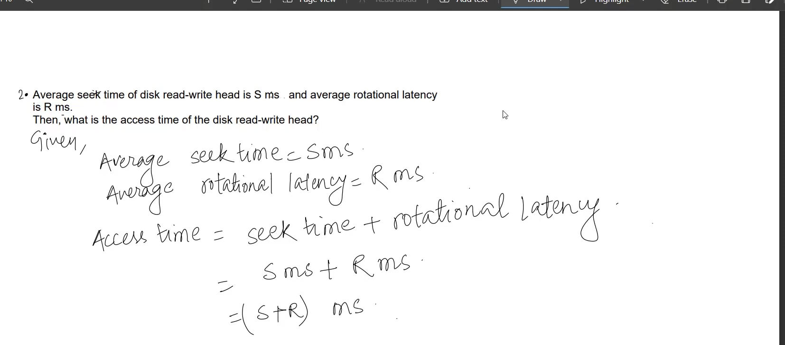
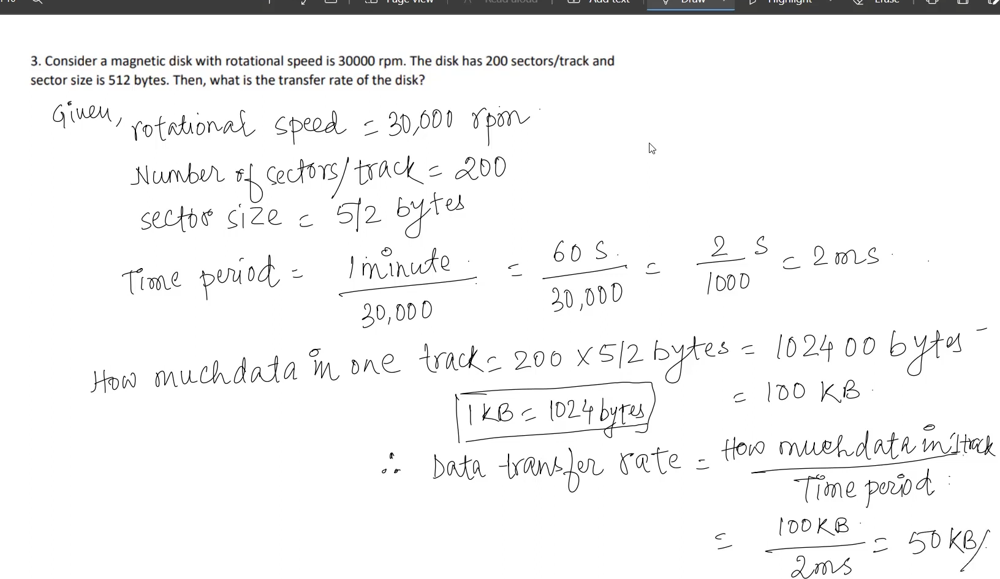

# Summary of Lecture 8.5 - Storage and File Structure2.pdf

**Summary**
**File Organization**

A database is essentially a collection of files, where each file is a sequence of records, and each record is a sequence of fields. The traditional approach assumes that each file contains records of only one type, and uses different files for different relations. This approach is simple to implement, but can be inefficient for certain types of queries.

**Fixed-Length Records**

In a fixed-length record, the size of each record is fixed. This simplifies record storage and access, but can lead to wasted space if records contain variable-length attributes.

**Free Lists**

A free list is a data structure that keeps track of the addresses of deleted records. When a record is deleted, its address is added to the free list. When a new record is created, the system can reuse an address from the free list, reducing the need for compaction.

**Variable-Length Records**

Variable-length records are used when the length of a record is not known in advance. This can arise due to the storage of multiple record types in a file, variable-length attributes, or repeating fields.

**Organization of Records in Files**

There are several ways to organize records in files:

* **Heap:** Records can be placed anywhere in the file where there is space.
* **Sequential:** Records are stored in sequential order, based on the value of the search key of each record. This is suitable for applications that require sequential processing of the entire file.
* **Hashing:** Records are assigned to blocks based on a hash function computed on some attribute of each record. This allows for efficient retrieval of records based on the hash value.
* **Multitable Clustering:** Records of several different relations can be stored in the same file. This can be beneficial for queries involving related records, but can be inefficient for queries involving only a single relation.

**Data Dictionary Storage**

The data dictionary stores metadata about the database, including:

* Information about relations, including names, attributes, and integrity constraints
* User and accounting information
* Statistical and descriptive data
* Physical file organization information
* Information about indices

**Storage Access**

To access data from a database file, the system uses a buffer manager. The buffer manager keeps a portion of the file in memory, and handles the transfer of data between memory and disk.

**Buffer Replacement Policy**

When the buffer is full and a new block needs to be loaded, the buffer manager must decide which block to replace. Common buffer replacement policies include:

* **Least Recently Used (LRU):** Replace the block that has not been used for the longest period of time.
* **Most Recently Used (MRU):** Replace the block that has been used most recently.
* **Toss-Immediate:** Free the space occupied by a block as soon as the final tuple of that block has been processed.
* **Pinned Block:** Do not allow a block to be replaced, even if it has not been used recently.

The choice of buffer replacement policy depends on the access patterns of the database.

