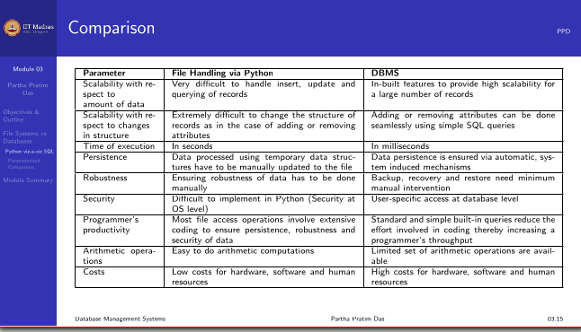

# Lecture 1.3 - Why DBMS2.pdf (PDF file)

**Summary**
This module introduces file systems and database management systems (DBMSs) and compares their features.

**File Systems vs. Databases**

File systems are less efficient for data management, especially with increasing data volume and structural changes. DBMSs are scalable and provide built-in mechanisms for data handling.

**Python vs. SQL**

Python is easier to implement for file handling, while SQL provides faster execution in milliseconds even for large datasets.

**Parameterized Comparison**

* **Scalability:** DBMSs are more scalable in terms of both data volume and structural changes.
* **Time and Efficiency:** DBMSs provide faster data processing through built-in mechanisms like indexing. However, for small datasets, the setup time of a DBMS may outweigh its advantages.
* **Persistence, Robustness, and Security:** DBMSs ensure automatic data persistence, provide mechanisms for backup and recovery, and offer user-specific security.
* **Programmer's Productivity:** DBMSs reduce coding effort by providing built-in mechanisms for data consistency and relationship maintenance.
* **Arithmetic Operations:** Python offers extensive arithmetic and logical operations, while SQL has limited support for these.
* **Costs and Complexity:** File systems are less expensive to implement and maintain, while DBMSs require specialized hardware, software, and personnel, leading to higher costs.
