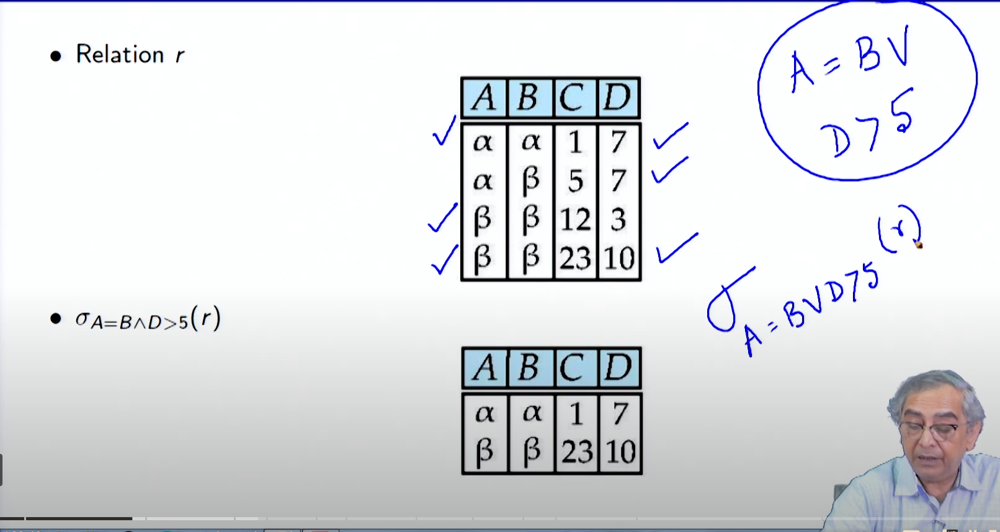

# Lecture 2.2 - Introduction to Relational Model2

**Summary**
**Introduction to Relational Model**

**Module Objectives**

- To understand relational algebra
- To familiarize with the operators of relational algebra

**Module Outline**

- Operations
  - Select
  - Project
  - Union
  - Difference
  - Intersection
  - Cartesian Product
  - Natural Join
- Aggregate Operations

**Relational Operators**

#### **Select Operation:** Selects rows (tuples) that meet a specified condition.

```
• Relation r
• σA=B∧D>5(r)
∧ means and 
```




student =

| Roll | Name | Age |
| ---- | ---- | --- |
| 1    | A    | 20  |
| 2    | B    | 21  |
| 3    | C    | 19  |

$$
\sigma_{roll=2}(student)
$$

| ROLL | Name | Age |
| ---- | ---- | --- |
| 2    | B    | 21  |


$$
\pi_{name} \sigma_{roll=2}(student)
$$

| Name |
| ---- |
| B    |


**first condition to select and then projection** 

#### **Project Operation:** Selects columns (Attributes) of a relation.

```
• Relation r
• πA,C (r)
```


student =

| Roll | Name | Age |
| ---- | ---- | --- |
| 1    | A    | 20  |
| 2    | B    | 21  |
| 3    | C    | 19  |

$$
\pi_{Roll}(student) =
$$

| Roll |
| ---- |
| 1    |
| 2    |
| 3    |

$$
\pi_{Roll, Name}(student) =
$$

| Roll | Name |
| ---- | ---- |
| 1    | A    |
| 2    | B    |
| 3    | C    |

**The projection will always give distinct rows**

#### **Union of two relations:** Combines the rows of two relations, eliminating duplicates.

```
Relation r,s r ∪ s
```


**Union Operation Basics**: The union operator in relational algebra functions similarly to set theory, combining elements from two sets and eliminating duplicates, ensuring each element appears only once.

- **Requirements for Union**: To perform a union on two tables in a database, they must have the same number of columns, and the data types (domains) of these columns must match.
- **Order and Matching**: The order of columns is crucial when performing a union. If the order is mismatched between the tables (e.g., numeric first in one and character first in the other), the union will fail, resulting in null values. Maintaining the correct order ensures the union operates correctly.


#### **Set difference of two relations:** Removes rows from the first relation that are also in the second relation.

```
Relation r,s (r − s)
```

- No of col or attriubutes have to same


# **Set intersection of two relations:** Returns rows that are common to both relations.

```
• Relation r,s r ∩ s
```

#### **Joining two relations – Cartesian-product:** Combines all rows from the first relation with all rows from the second relation.

```
• Relation r,s
• r × s
```


**when you have two atrributes with same name we remane the atrributes in cartseian product**


$$
R_1 =
$$

| A | B | C |
| - | - | - |
| 1 | 2 | 3 |
| 2 | 1 | 4 |


$$
R_2 =
$$

| C | D | E |
| - | - | - |
| 3 | 4 | 5 |
| 2 | 1 | 2 |


$$
R_1 \ X \ R_2 = 
$$


| A | B | $R_1.C$ | $R_2.C$ | D | E |
| - | - | --------- | --------- | - | - |
| 1 | 2 | 3         | 3         | 4 | 5 |
| 1 | 2 | 3         | 2         | 1 | 2 |
| 2 | 1 | 4         | 3         | 4 | 5 |
| 2 | 1 | 4         | 2         | 1 | 2 |


- **Natural Join:** Joins two relations on the common attributes, eliminating duplicate columns.

```markdown
• Let r and s be relations on schemas R and S respectively. Then, the “natural join” of relations R and S is a relation on schema R ∪ S obtained as follows:
◦ Consider each pair of tuples tr from r and ts from s.
◦ If tr and ts have the same value on each of the attributes in R ∩ S, add a tuple t to the result, where
. t has the same value as tr on r
. t has the same value as ts on s
```


**Aggregation Operators**

- **Aggregate Operators:** Perform calculations on groups of rows.
- **SUM:** Computes the sum of a specified column.
- **AVG:** Computes the average of a specified column.
- **MAX:** Computes the maximum value of a specified column.
- **MIN:** Computes the minimum value of a specified column.

**Notes about Relational Languages**

- Each query input is a table (or set of tables).
- Each query output is a table.
- All data in the output table appears in one of the input tables.
- Relational Algebra is not Turing complete.

**Summary of Relational Algebra Operators**

| Operator    | Description                                      |
| ----------- | ------------------------------------------------ |
| σ          | Select                                           |
| π          | Project                                          |
| ∪          | Union                                            |
| −          | Difference                                       |
| ∩          | Intersection                                     |
| ×          | Cartesian Product                                |
| $ \rho$   | Rename                                           |
| $\bowtie$ | Natural Join                                     |
| SUM         | Computes the sum of a specified column           |
| AVG         | Computes the average of a specified column       |
| MAX         | Computes the maximum value of a specified column |
| MIN         | Computes the minimum value of a specified column |

**Module Summary**

- Introduced relational algebra
- Familiarized with the operators of relational algebra
