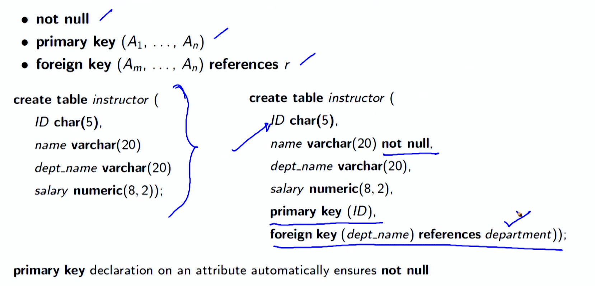
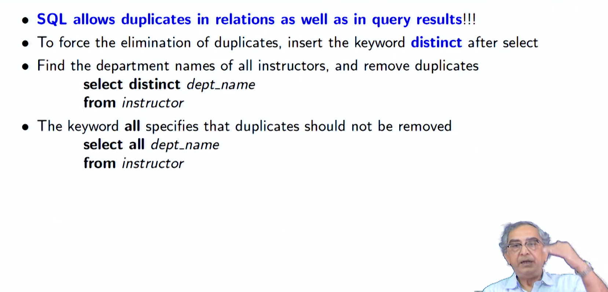
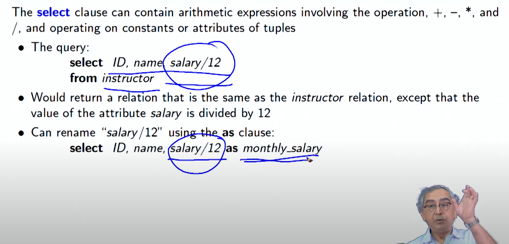
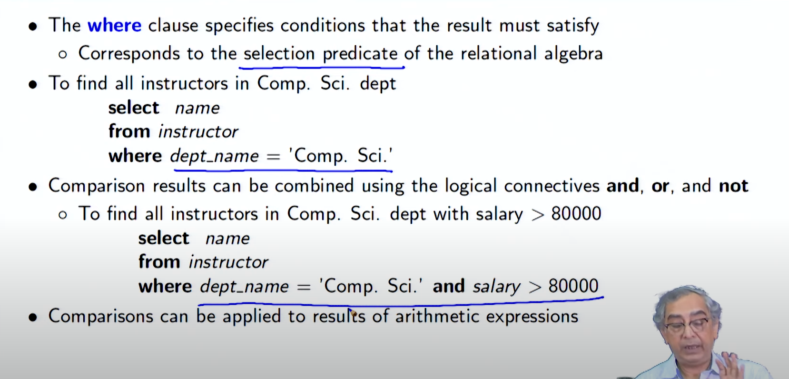

# Lecture 2.3 - Introduction to SQL1

**Summary**
**Module 08: Introduction to SQL**

**Objectives**

- Understand relational query language
- Understand data definition and basic query structure

**Outline**

- History of SQL
- Data Definition Language (DDL)
- Create Table
- Integrity Constraints
- Update Table
- Data Manipulation Language (DML): Query Structure
- Select Clause
- Where Clause
- From Clause

**History of SQL**

- IBM developed Structured English Query Language (SEQUEL) as part of System R project. Renamed Structured Query Language (SQL: pronounced still as SEQUEL)
- ANSI and ISO standard SQL:

  - SQL-86 First formalized by ANSI
  - SQL-89 + Integrity Constraints
  - **SQL-92 Major revision (ISO/IEC 9075 standard), De-facto Industry Standard**
  - **SQL:1999 + Regular Expression Matching, Recursive Queries, Triggers, Support for Procedural and
    Control Flow Statements, Nonscalar types (Arrays), and Some OO features (structured
    types), Embedding SQL in Java (SQL/OLB), and Embedding Java in SQL (SQL/JRT)**
  - **SQL:2003 + XML features (SQL/XML), Window Functions, Standardized Sequences, and Columns
    with Auto-generated Values (identity columns)**
  - **SQL:2006 + Ways of importing and storing XML data in an SQL database, manipulating it within
    the database, and publishing both XML and conventional SQL-data in XML form**
  - SQL:2008 Legalizes ORDER BY outside Cursor Definitions

  + INSTEAD OF Triggers, TRUNCATE Statement, and FETCH Clause

  - SQL:2011 + Temporal Data (PERIOD FOR)
    Enhancements for Window Functions and FETCH Clause
  - SQL:2016 + Row Pattern Matching, Polymorphic Table Functions, and JSON
  - SQL:2019 + Multidimensional Arrays (MDarray type and operators)

**History of Query Language: Compliance**

- SQL is the de facto industry standard today for relational or structred data systems (that is, SQL
  as a protocol), but there are many alternatives to writing SQL in the applications
- These alternatives have been implemented in the form of frontends for working with
  relational databases. Some examples of a frontend include (for a section of languages):
  ◦ SchemeQL and CLSQL, which are probably the most flexible, owing to their Lisp
  heritage, but they also look like a lot more like SQL than other frontends
  ◦ LINQ (in .Net)
  ◦ ScalaQL and ScalaQuery (in Scala)
  ◦ SqlStatement, ActiveRecord and many others in Ruby
  ◦ HaskellDB
  ◦ ...the list goes on for many other languages.

**History of Query Language: Alternatives**

- There aren’t any alternatives to SQL for speaking to relational databases (that is, SQL
  as a protocol), but there are many alternatives to writing SQL in the applications
- These alternatives have been implemented in the form of frontends for working with
  relational databases. Some examples of a frontend include (for a section of languages):
  ◦ SchemeQL and CLSQL, which are probably the most flexible, owing to their Lisp
  heritage, but they also look like a lot more like SQL than other frontends
  ◦ LINQ (in .Net)
  ◦ ScalaQL and ScalaQuery (in Scala)
  ◦ SqlStatement, ActiveRecord and many others in Ruby
  ◦ HaskellDB
  ◦ ...the list goes on for many other languages.
  Source: What are good alternatives to SQL (the language)?

**History of Query Language: Derivatives**

- There are several query languages that are derived from or inspired by SQL. Of these,
  the most popular and effective is SPARQL.
  ◦ SPARQL (pronounced sparkle, a recursive acronym for SPARQL Protocol and RDF
  Query Language) is an RDF query language
  . A semantic query language for databases - able to retrieve and manipulate data
  stored in Resource Description Framework (RDF) format.
  . It has been standardized by the W3C Consortium as key technology of the
  semantic web
  . Versions:
  − SPARQL 1.0 (January 2008)
  − SPARQL 1.1 (March, 2013)
  . Used as the query languages for several NoSQL systems - particularly the Graph
  Databases that use RDF as store

**Data Definition Language (DDL)**

- The SQL data-definition language (DDL) allows the specification of information about
  relations, including:
  - The Schema for each Relation
  - The Domain of values associated with each Attribute
  - Integrity Constraints
  - And, as we will see later, also other information such as
    ◦ The set of Indices to be maintained for each relations
    ◦ Security and Authorization information for each relation
    ◦ The Physical Storage Structure of each relation on disk

**Domain Types in SQL**

- **char(n). Fixed length character string, with user-specified length n**
- **varchar(n). Variable length character strings, with user-specified maximum length n**
- **int. Integer (a finite subset of the integers that is machine-dependent)**
- **smallint(n). Small integer (a machine-dependent subset of the integer domain type)**
- **numeric(p, d). Fixed point number, with user-specified precision of p digits, with d
  digits to the right of decimal point. (ex., numeric(3, 1), allows 44.5 to be stores
  exactly, but not 444.5 or 0.32)**
- **real, double precision. Floating point and double-precision floating point numbers,
  with machine-dependent precision**
- **float(n). Floating point number, with user-specified precision of at least n digits**
- **More are covered in Chapter 4**

**Create Table Construct**

- An SQL relation is defined using the create table command:
  create table r (A1D1, A2D2, . . . , AnDn),
  (integrity-constraint1),
  . . .
  (integrity-constraintk ));
  ◦ r is the name of the relation
  ◦ each Ai
  is an attribute name in the schema of relation r
  ◦ Di
  is the data type of values in the domain of attribute Ai

**Create Table Construct (2)**

create table instructor (
ID char(5),
name varchar(20)
dept name varchar(20)
salary numeric(8, 2));

**Create Table Construct (3): Integrity Constraints**

- not null
- primary key (A1, . . . , An)
- foreign key (Am, . . . , An) references r
  create table instructor (ID char(5),name varchar(20) not null,dept name varchar(20),salary numeric(8, 2),primary key (ID),foreign key (dept name) references department));
  primary key declaration on an attribute automatically ensures not null

**University Schema**

**Create Table Construct (4): More Relations**

create table student (
ID varchar(5),
name varchar(20) not null,
dept name varchar(20),
tot cred numeric(3, 0),
primary key (ID),
foreign key (dept name)
references department);

create table course (
course id varchar(8),
title varchar(50),
dept name varchar(20),
credits numeric(2, 0),
primary key (course id),
foreign key (dept name)
references department);

create table takes (
ID varchar(5),
course id varchar(8), sec id varchar(8),
semester varchar(6), year numeric(4, 0),
grade varchar(2),
primary key (ID, course id, sec id, semester, year ),
foreign key (ID) references student
foreign key (course id, sec id, semester, year )
references section);

• Note: sec id can be dropped from primary key above,
to ensure a student cannot be registered for two
sections of the same course in the same semester

**Update Tables**

- Insert (DML command)
  ◦ insert into instructor values (‘10211’, ‘Smith’, ‘Biology’, 66000);
- Delete (DML command)
  ◦ Remove all tuples from the student relation
  delete from student
- Drop Table (DDL command)
  ◦ drop table r
- Alter (DDL command)
  ◦ alter table r add A D
  . Where A is the name of the attribute to be added to relation r and D is the domain of A
  . All existing tuples in the relation are assigned null as the value for the new attribute
  ◦ alter table r drop A
  . Where A is the name of an attribute of relation r
  . Dropping of attributes not supported by many databases

**Data Manipulation Language (DML): Query Structure**

- A typical SQL query has the form:
  select A1, A2, . . . , An,from r1,r2, ...,rmwhere P
  ◦ Ai represents an attribute from ri
  ’s
  ◦ ri represents a relation
  ◦ P is a predicate
- The result of an SQL query is a relation

**Basic Query Structure**

- The select clause lists the attributes desired in the result of a query
  ◦ Corresponds to the projection operation of the relational algebra
