columns - attribute

rows - tuple

Primary keys:

- not null
- uniquie

Table will have one **Primary key multiple candiates key**

##### Domain

set of allowed values for each attribute is called domain

primary key is not nullable

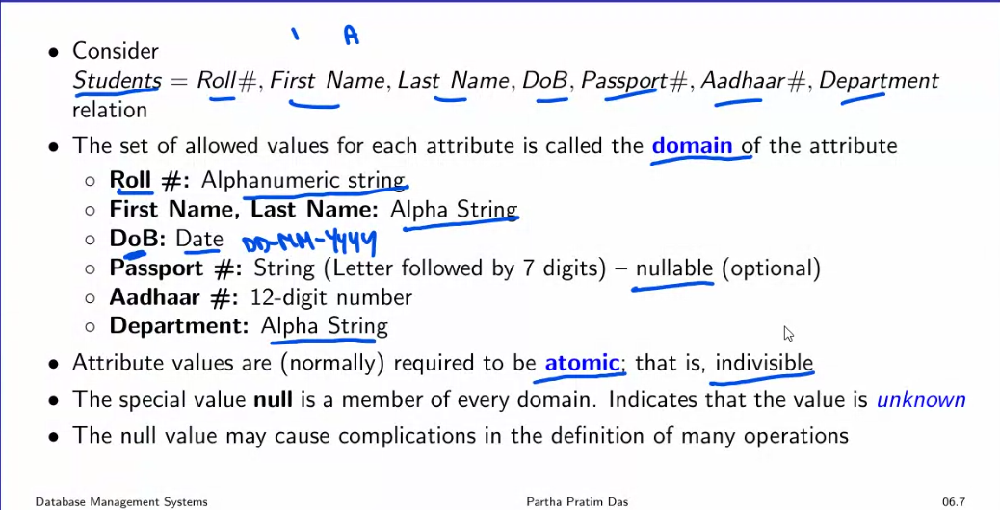

Atomic values - it cant mean broken down into smaller junks eg :

Schema

$$
R = (A_1, A_2, ..... A_n) \\ \\ \\\\

Domain\\ D = (D_1 , D_2, ....D_n)
$$

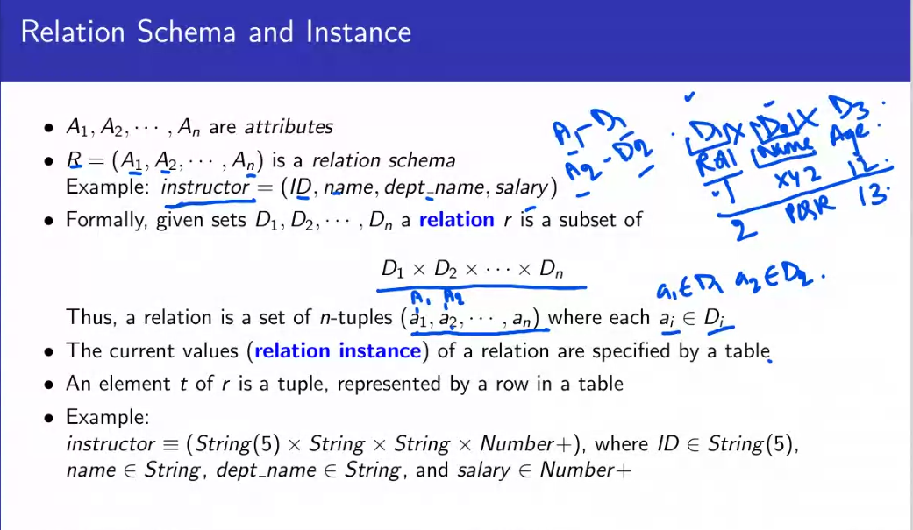

- order of rows or tuple is irrelevant
- no two tuple or row may be identical

##### Keys

- A **superkey** uniquely identifies tuples in a relation.

* - Example: {ID} and {ID, name} are both superkeys of instructor
* A **candidate key is a minimal superkey.**
  - **min no of super key to indentify a tuple.**
  - Example: {ID} is a candidate key for instructor
* **A primary key is the selected candidate key used for unique identification.**
* A **surrogate key (or synthetic key)** in a database is a unique identifier for either an entity in the modeled world or an object in the database
  eg : **transaction id of amazon the transaction id is only valid in the order life time .**

- **Super key.**
- **Candidate key.**
- **Primary key.**
- **Surrogate key.**

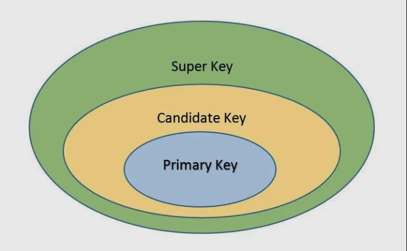

- Secondary / Alternate Key: **{First Name, Last Name}, Aadhaar #**
- Simple Key: Consists of a single attribute **Aadhaar #**
- Composite Key: **{First Name, Last Name}**

**Foreign key constrain** : Value in a relation must appear in another

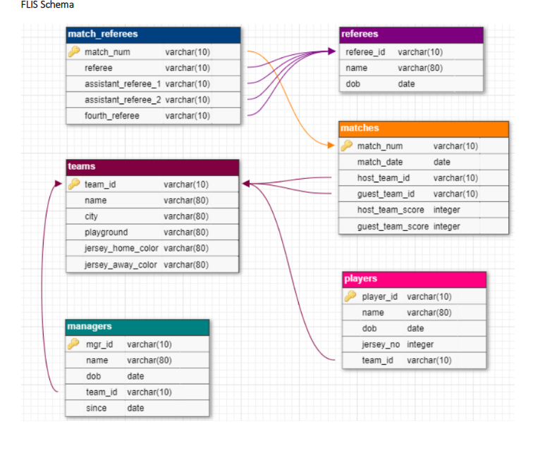

he **matches** becomes the referencing relationship and **host_team_id , guest_team_id is foreign key.**

**Match_num is primary key in match_referees and matches.**

**Compound key** = two foreign key + simple key to used to identify an entity occurrence .

##### Procedural and Non Procedural Language

##### Operations

- Select
- Project
- Union
- Difference
- Intersection
- Cartesian Product
- Natural Join

A relation is set.

###### Selection

• Relation r
$σ\_{A=B∧D>5(r)}$
**∧ means and**

(A = B) intersect D > 5

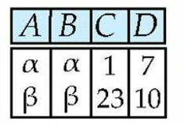

###### Projection

• Relation r
• $π\_{A,C}$ (r)

1. fetch the columns
1. no dulipcates

###### **Union**

• Relation r,s
• $r ∪ s$

1. same nuumber of attributes or degree
1. domains of the attributes has to be same

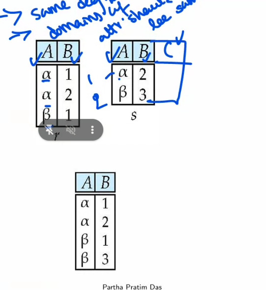

###### Difference

$$
r-s
$$

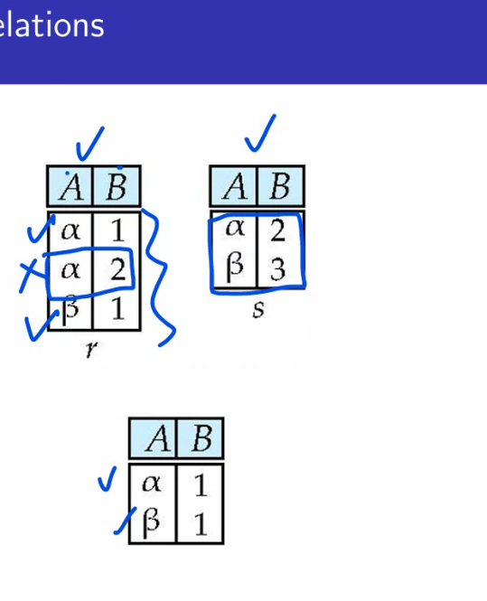

###### Intersection

$$
r ∩ s = r- (r-s)
$$

rows that are common to both relations.

###### Cartesian Product

$$
R \\bowtie S
$$

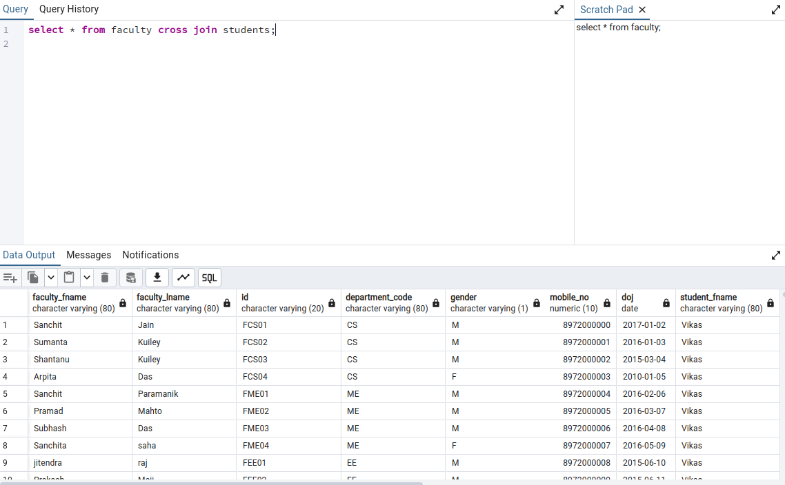

when you have two atrributes with same name we remane the atrributes in cartseian product.

we rename the table using

$$
P_s(r)
$$

renaming the table or relationship r to s

$$
r \\bowtie p_s(r)
$$

self join and rename r to s  = $ r\\bowtie s$

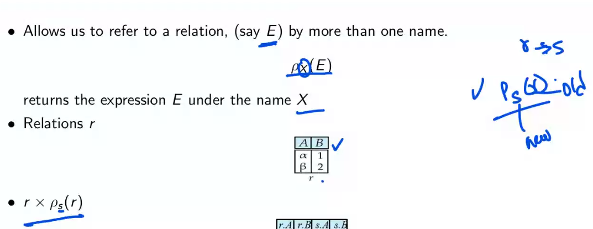

$$
\\sigma\_{A=C}(r \\bowtie s)
$$

do a cross join of r and s and the find A = C

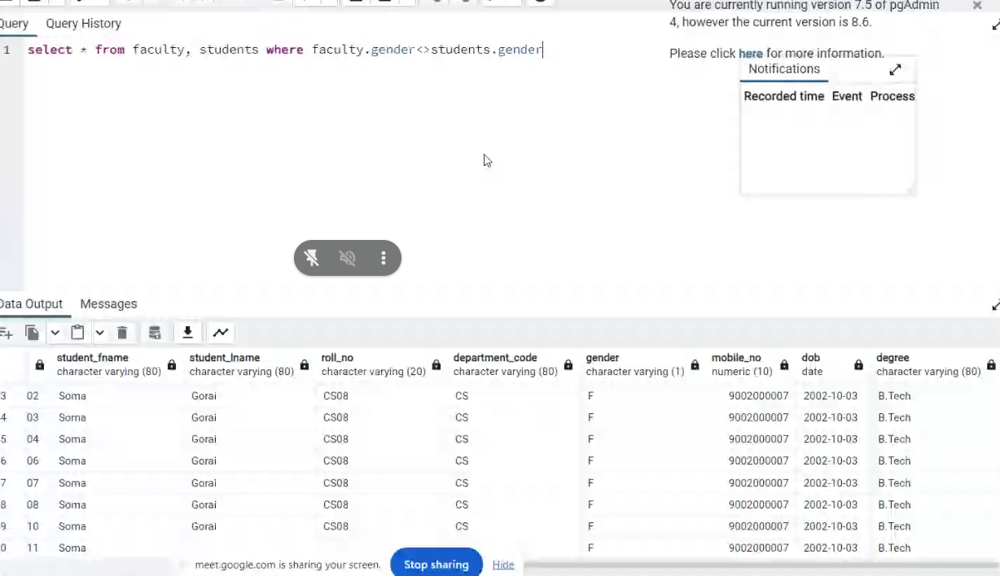

not equal $\<>$

###### Inner Join

###### Natural Join

$$
r∩s
$$

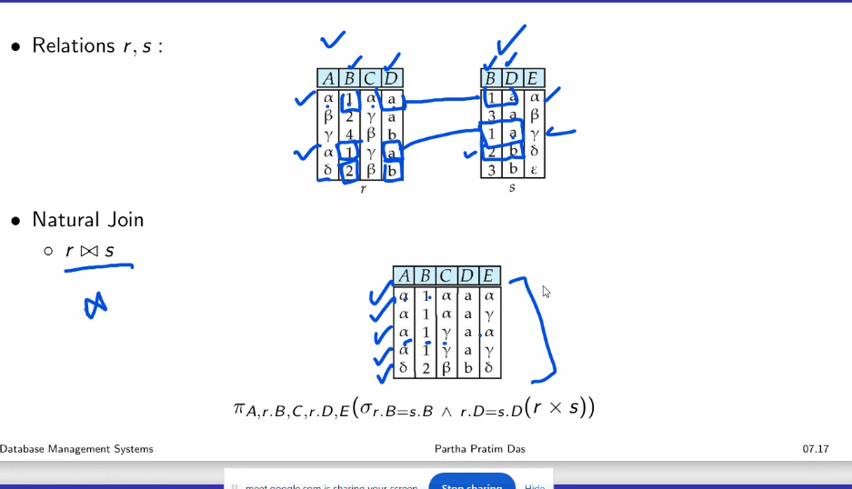
