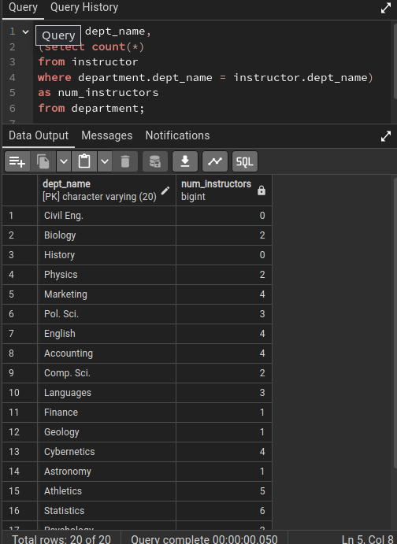
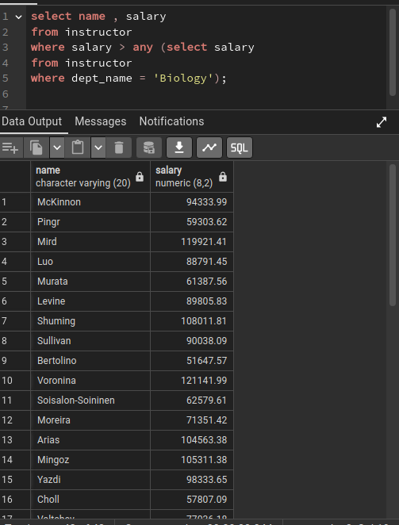
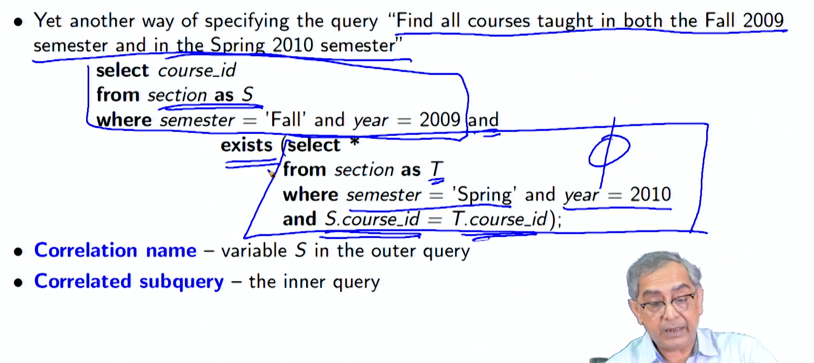
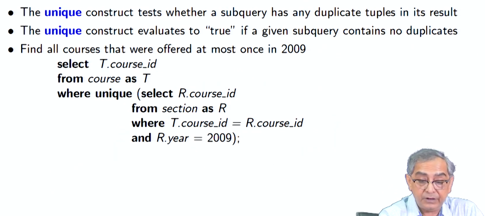
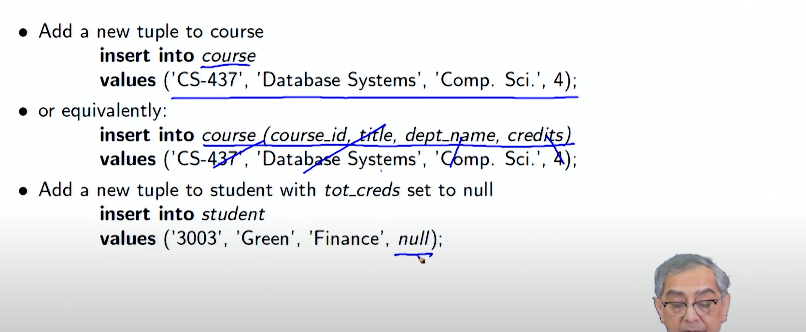
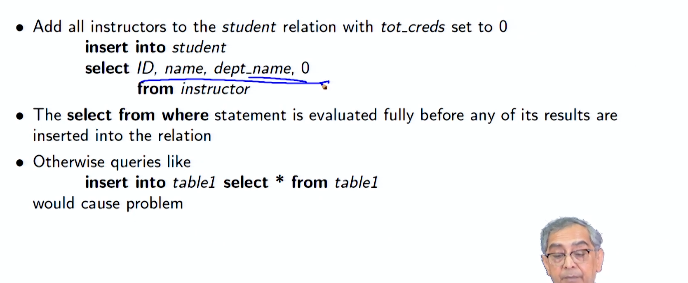
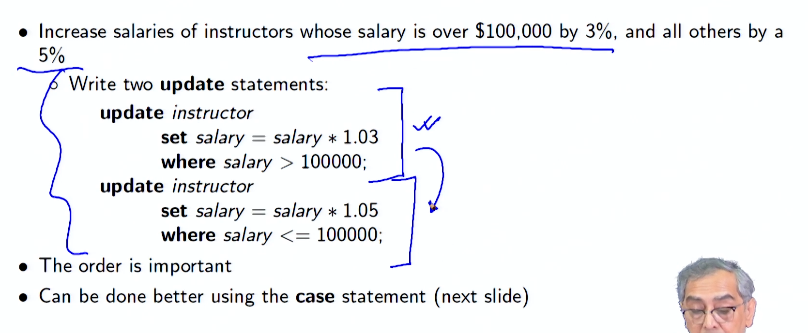
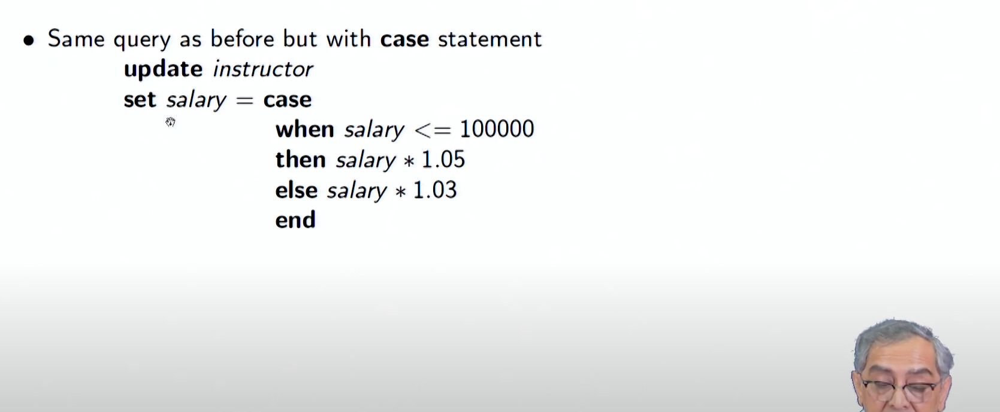

# Lecture 3.2 - Intermediate SQL1

**Summary**
**Nested Subqueries**

In SQL, a subquery is a select-from-where expression that is nested within another query. SQL provides mechanisms for nesting subqueries in the following ways:

- As a condition in the WHERE clause
- As a table in the FROM clause
- As a value in the SELECT clause

**Subqueries in the WHERE Clause**

Subqueries in the WHERE clause are used to test conditions on the results of another query. For example, to find courses offered in both Fall 2009 and Spring 2010, you could use the following query:

```sql
select distinct course_id
from section
where semester = 'Fall' and year = 2009 and
course_id in (select course_id
from section
where semester = 'Spring' and year = 2010);
```

Subqueries in the WHERE clause can also be used to perform set membership, set comparisons, and test for empty relations.

**Subqueries in the FROM Clause**

Subqueries in the FROM clause are used to create temporary tables that can be used in the main query. For example, to find the average salary of instructors in each department, you could use the following query:

```sql
select dept name, avg salary
from (select dept name, avg(salary) as avg salary
from instructor
group by dept name)
where avg salary > 42000;
```


The subquery in the FROM clause is used to create a temporary table that contains the average salary for each department. This temporary table can then be used in the main query to find the departments with the highest average salaries.

**Subqueries in the SELECT Clause**

Subqueries in the SELECT clause are used to return a single value or a set of values as a column in the result set. For example, to list all departments along with the number of instructors in each department, you could use the following query:

```sql
select dept name,
(select count(*)
from instructor
where department.dept name = instructor.dept name)
as num instructors
from department;
```



The subquery in the SELECT clause is used to return the number of instructors in each department. This value is then included as a column in the result set.










**Modifications of the Database**

In addition to performing queries, SQL can also be used to modify the data in a database. The following are the three main types of database modifications:

- Deletion: Deleting tuples from a relation
- Insertion: Inserting new tuples into a relation
- Updating: Updating the values in some tuples in a relation

For example, to delete all instructors whose salary is less than the average salary, you could use the following query:

```sql
delete from instructor
where salary < (select avg(salary)
from instructor);
```












**Module Summary**

In this module, we have introduced nested subqueries in SQL and discussed how they can be used to perform complex queries and modify data in a database.

**Database Management Systems: Intermediate SQL/1 Outline**

- Nested Subqueries
- Subqueries in the WHERE Clause
- Subqueries in the FROM Clause
- Subqueries in the SELECT Clause
- Modifications of the Database
