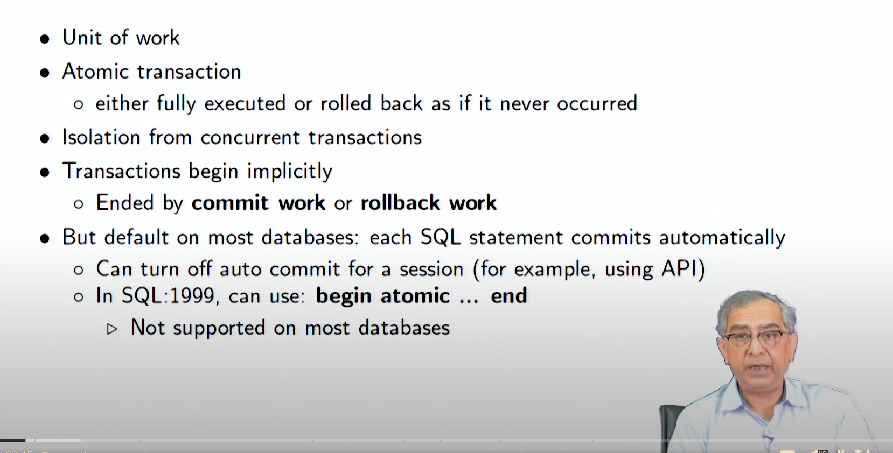
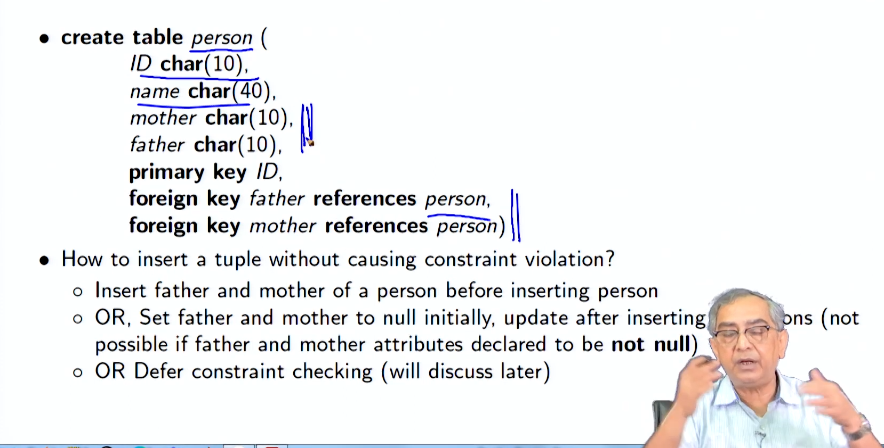
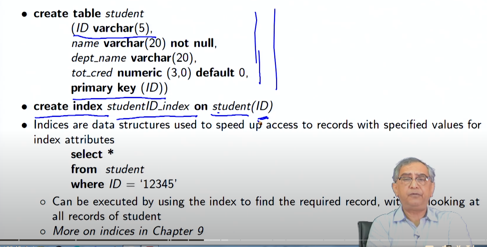
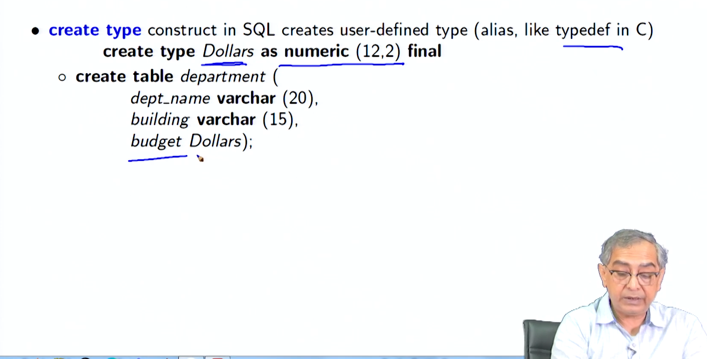
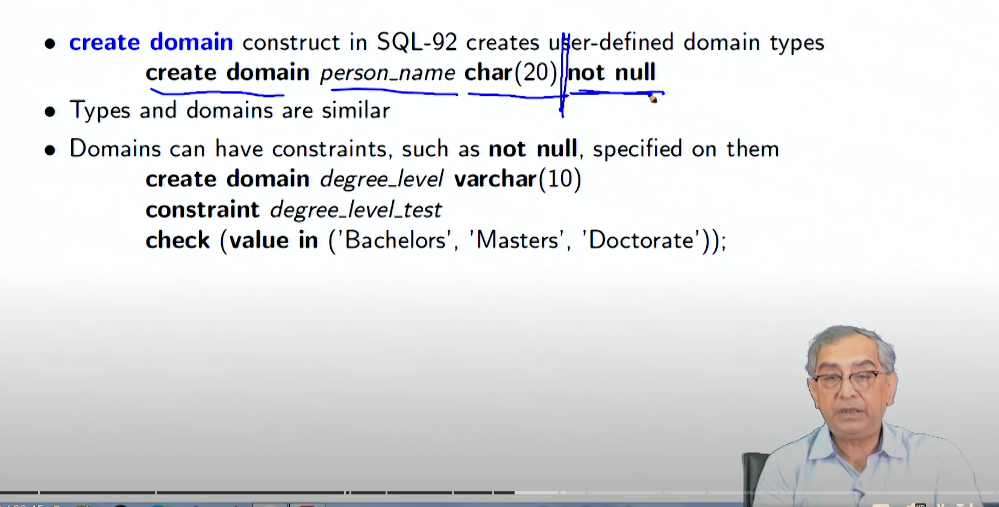
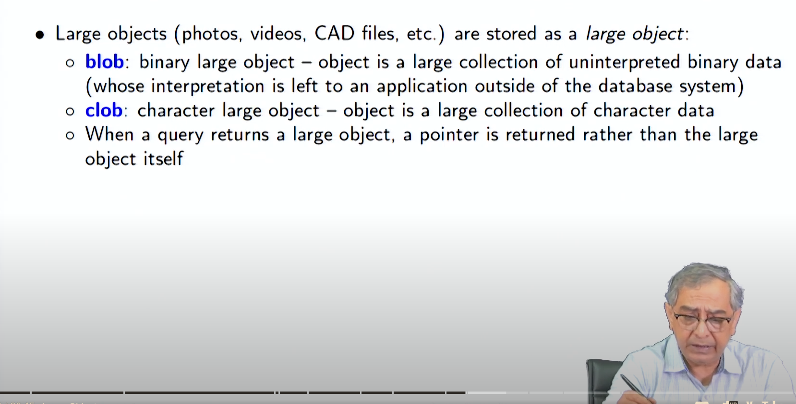
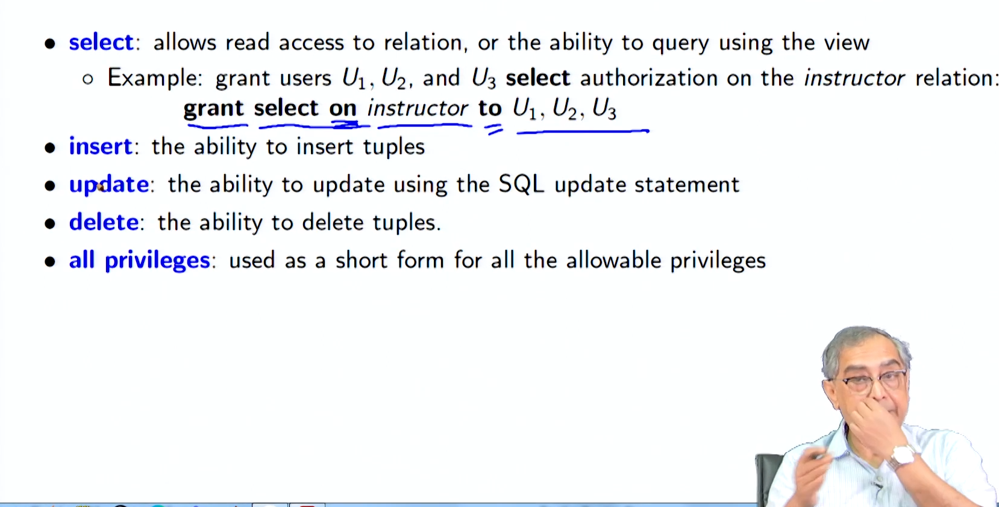
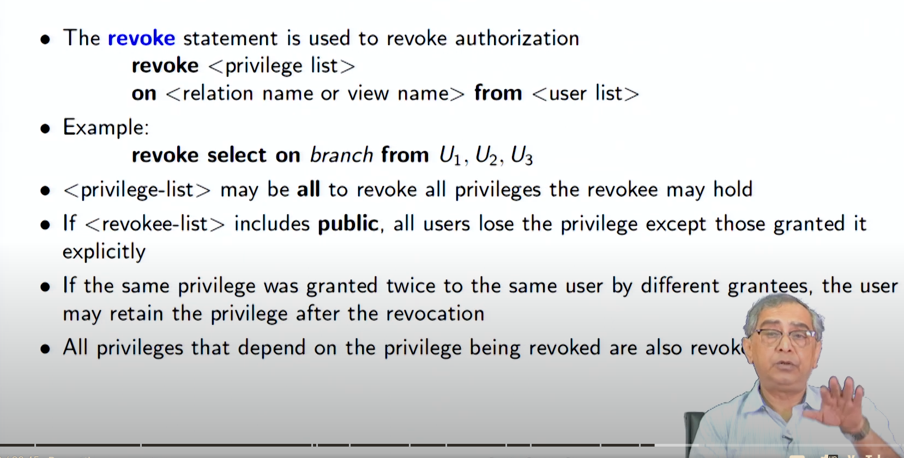
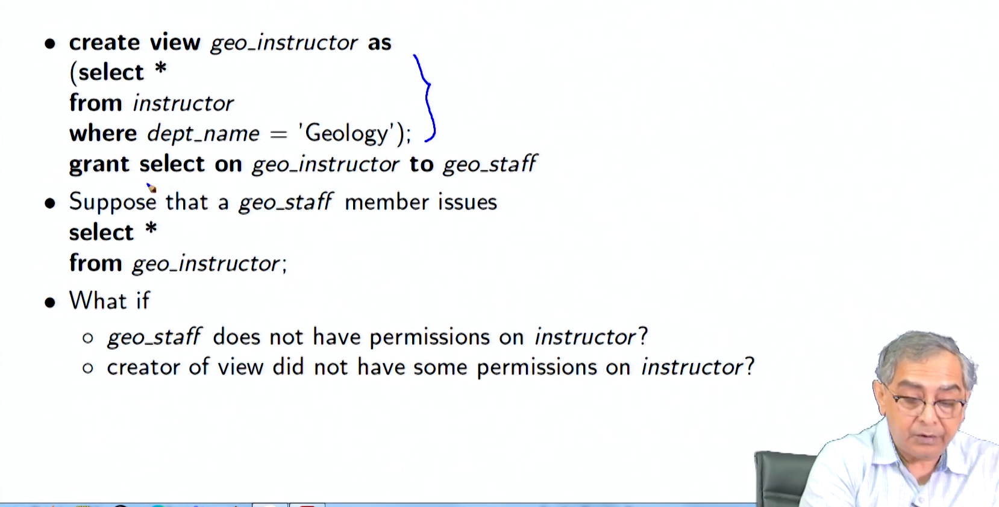

##### Intermediate SQL3

### Transactions

**Definition and Properties**

- A transaction is a unit of work in a database that must be either fully completed or fully rolled back.
- Transactions ensure **atomicity**, meaning they are indivisible and irreducible. If a transaction is partially completed and an error occurs, it must be rolled back entirely as if it never happened.
- Transactions must also maintain isolation from other transactions to prevent concurrency issues.

**Implementation in SQL**

- Transactions begin implicitly and are ended by either a `commit` or `rollback` command.
- In most databases, each SQL statement commits automatically by default. However, auto-commit can be turned off for a session using APIs or specific SQL commands.
- SQL:1999 introduced the `begin atomic ... end` syntax to explicitly define transactions, although this is not widely supported.



### Integrity Constraints

**Purpose and Types**

- Integrity constraints are rules applied to database columns to ensure data accuracy and consistency.
- Common types of constraints include:
  - `NOT NULL`: Ensures that a column cannot have a NULL value.
  - `PRIMARY KEY`: A unique identifier for a row, which cannot be NULL.
  - `UNIQUE`: Ensures all values in a column or a set of columns are unique.
  - `CHECK`: Ensures that the value in a column meets a specific condition.

**Examples and Usage**

- Example of a `NOT NULL` constraint: `name VARCHAR(20) NOT NULL`.
- Example of a `UNIQUE` constraint: `UNIQUE (A1, A2, ..., Am)` where `A1, A2, ..., Am` form a candidate key.
- Example of a `CHECK` constraint to restrict semester values:
  ```sql
  CREATE TABLE section (
      course_id VARCHAR(8),
      sec_id VARCHAR(8),
      semester VARCHAR(6),
      year NUMERIC(4,0),
      building VARCHAR(15),
      room_number VARCHAR(7),
      time_slot_id VARCHAR(4),
      PRIMARY KEY (course_id, sec_id, semester, year),
      CHECK (semester IN ('Fall', 'Winter', 'Spring', 'Summer'))
  );
  ```

### Referential Integrity

**Definition and Enforcement**

- Referential integrity ensures that a foreign key value in one table must match a primary key value in another table, maintaining consistency between related tables.
- Example: If "Biology" is a department name in the `instructor` table, it must exist in the `department` table.

**Cascading Actions**

- Cascading actions define the behavior of the database when a user attempts to delete or update a key referenced by foreign keys.
- Example of cascading actions:

  ```pgsql
  CREATE TABLE course (
      course_id CHAR(5) PRIMARY KEY,
      title VARCHAR(20),
      dept_name VARCHAR(20),
      FOREIGN KEY (dept_name) REFERENCES department
      ON DELETE CASCADE
      ON UPDATE CASCADE
  );
  ```

  
- Alternative actions include `NO ACTION`, `SET NULL`, and `SET DEFAULT`.

### SQL Data Types and Schemas

**Built-in Data Types**

- SQL provides several built-in data types:
  - `DATE`: Stores dates.
  - `TIME`: Stores time of day.
  - `TIMESTAMP`: Combines date and time.
  - `INTERVAL`: Represents a period of time.
- Examples:
  - `DATE '2005-07-27'`
  - `TIME '09:00:30'`
  - `TIMESTAMP '2005-07-27 09:00:30.75'`
  - `INTERVAL '1' DAY`

### Index Creation 



### Alias or User defined Data Type



### Domains




### BLOB and Clob



### Authorization




**Privileges and Roles**

- SQL includes mechanisms to control user access to data and operations.
- Privileges can be granted to users to allow specific actions, such as `SELECT`, `INSERT`, `UPDATE`, and `DELETE`.
- Example of granting select privilege on a view:

  ```sql
  CREATE VIEW geo_instructor AS
  SELECT *
  FROM instructor
  WHERE dept_name = 'Geology';

  GRANT SELECT ON geo_instructor TO geo_staff;
  ```
- References privilege is necessary to create foreign keys:

  ```sql
  GRANT REFERENCES (dept_name) ON department TO Mariano;
  ```

**Transfer and Revocation of Privileges**

- Privileges can be transferred from one user to another using the `GRANT ... WITH GRANT OPTION`.
- Privileges can be revoked using the `REVOKE` command:
  ```sql
  REVOKE SELECT ON department FROM Amit, Satoshi CASCADE;
  ```




### Role




### Module Summary

The lecture summarizes the following key points:

- Introduction to transactions, ensuring atomicity and isolation.
- Detailed exploration of integrity constraints to maintain data consistency.
- Referential integrity to enforce relationships between tables.
- Advanced SQL data types for handling various forms of data.
- Authorization mechanisms to manage user permissions and roles within the database.

Overall, this lecture provides an in-depth look at intermediate SQL concepts essential for maintaining robust and secure databases.
