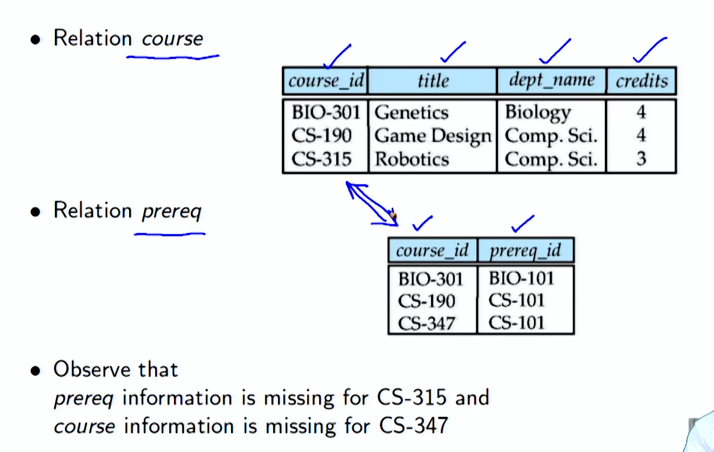
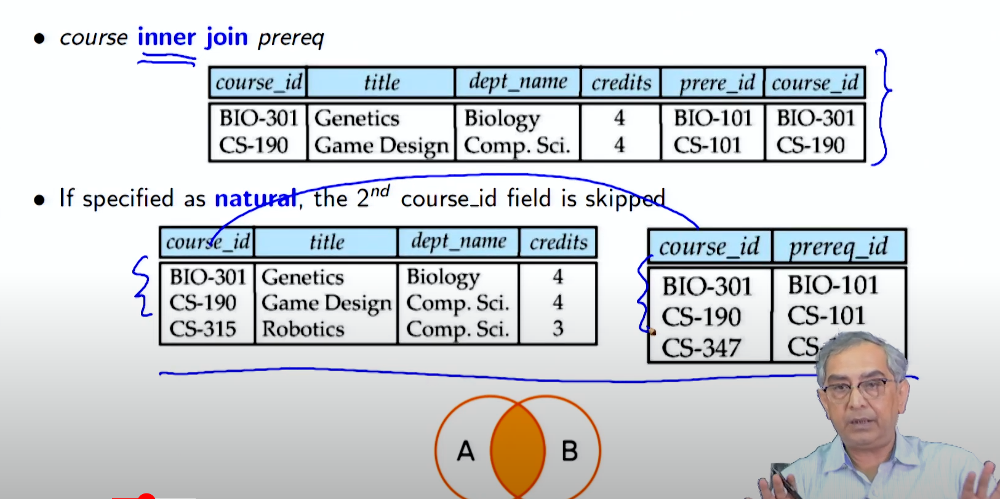
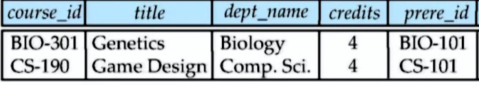
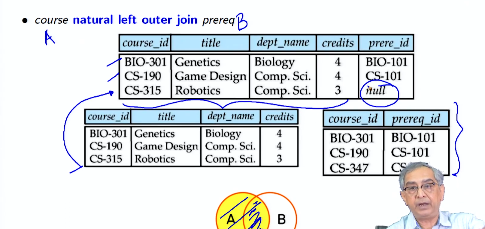
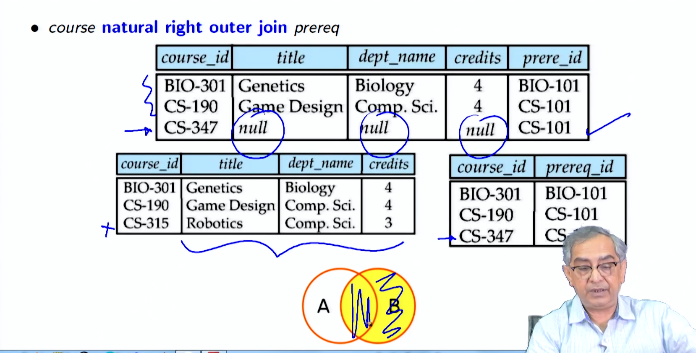
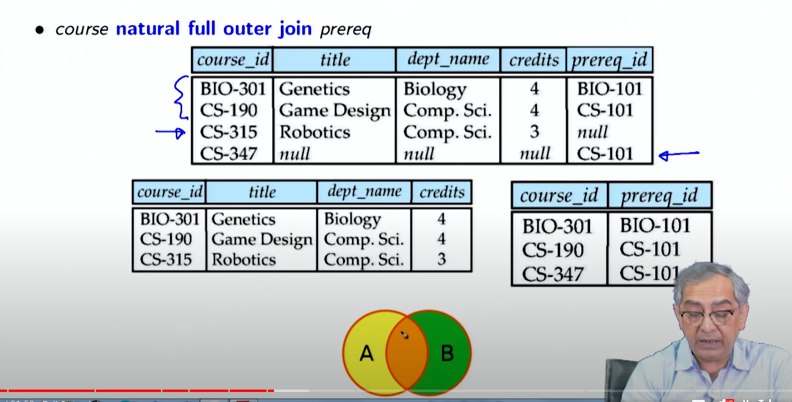
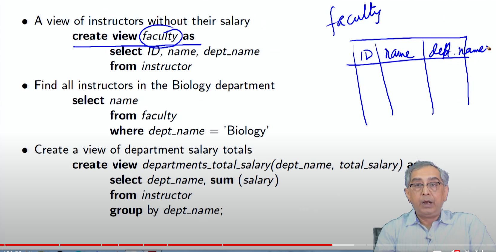

# Lecture 3.3 - Intermediate SQL2.pdf (PDF file)

**Summary**
**Module 13: Intermediate SQL/2**

**Objectives**

* To learn SQL expressions for Join
* To learn SQL expressions for Views

**Outline**

* Join Expressions
* Views

**Join Expressions**

* **Definition:** Join operations take two relations and return as a result another relation.
* **Purpose:** Join operations are used to combine rows from two relations based on a specified condition.

**Types of Join between Relations**

* **Cross join:** Returns the Cartesian product of rows from tables in the join.
* **Inner join:** Returns rows that match on the specified condition.
* **Outer join:** Returns all rows from one relation and rows from the other relation that match on the specified condition.
* **Left outer join:** Returns all rows from the left relation and rows from the right relation that match on the specified condition.
* **Right outer join:** Returns all rows from the right relation and rows from the left relation that match on the specified condition.
* **Full outer join:** Returns all rows from both relations, regardless of whether they match on the specified condition.

#### Cross JOIN

- **Cross join:** Returns the Cartesian product of rows from tables in the join.

```pgsql
select * from employee cross join department; 
```

**is  same** 

```pgsql
select * from employee , department;
```




##### INNER JOIN

Inner join is the intersection of the two table 




if we add natural then the result will ignore the the common attribute in the second table 



##### Outer Join

###### Left Outer join




###### Right outer Join




###### Natural Full outer Join




##### **Views**

* **Definition:** A view is a virtual relation that is defined by a query expression.
* **Purpose:** Views provide a mechanism to hide certain data from users or to create a new relation that is derived from existing relations.

**View Definition**

* A view is defined using the `create view` statement, which has the form:

```sql
create view v as < query expression >
```

* The view name is represented by `v`.
* The query expression specifies the rows and columns that are included in the view.




**View Expansion**

* **Definition:** View expansion is the process of replacing a view reference in a query or another view with the query expression that defines the view.
* **Purpose:** View expansion is used to ensure that queries that use views always return the correct results, even if the underlying relations change.

**Update of a View**

* Updates to views are typically not allowed.
* In some cases, updates to simple views (views that meet certain criteria) may be allowed.

**Materialized Views**

* **Definition:** A materialized view is a physical table that contains the results of a query.
* **Purpose:** Materialized views can improve query performance by avoiding the need to re-execute the query every time it is used.

**Module Summary**

* Join expressions are used to combine rows from two relations based on a specified condition.
* Views provide a mechanism to hide certain data from users or to create a new relation that is derived from existing relations.
* View expansion ensures that queries that use views always return the correct results, even if the underlying relations change.
* Updates to views are typically not allowed, but may be allowed in some cases for simple views.
* Materialized views can improve query performance by avoiding the need to re-execute the query every time it is used.
