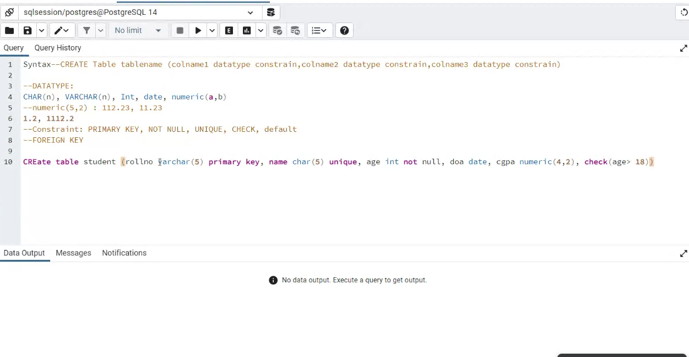
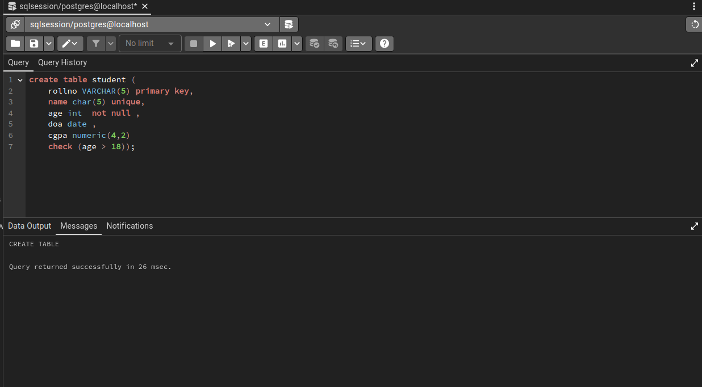
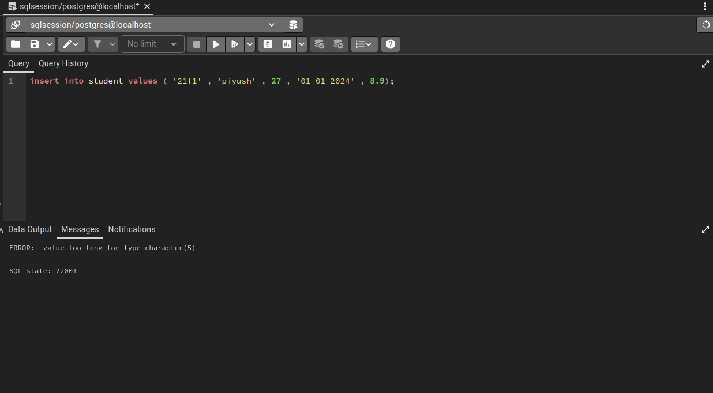
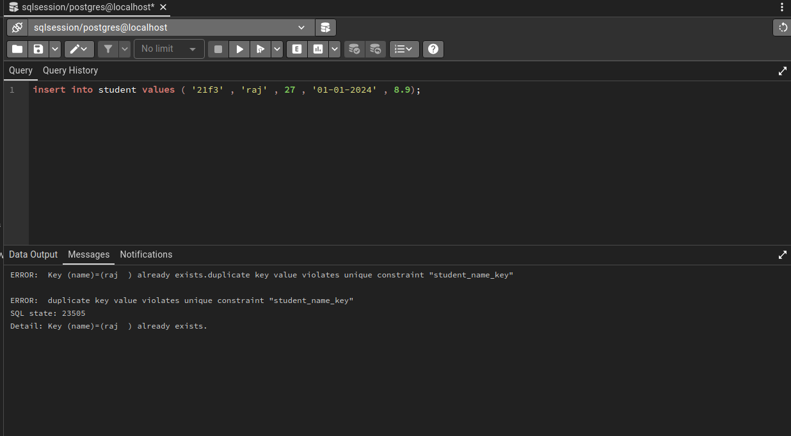
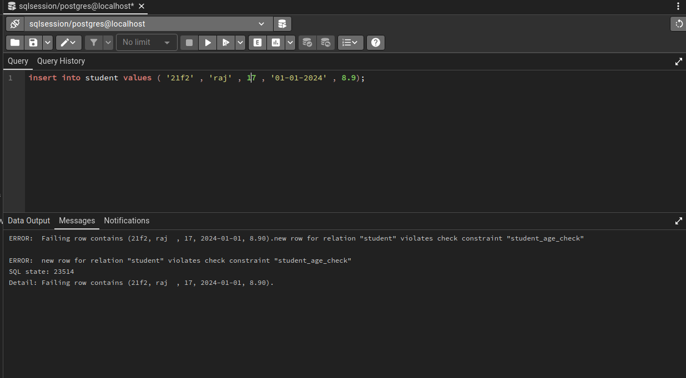
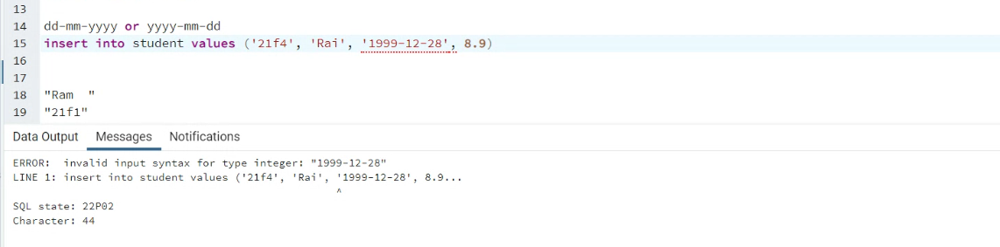
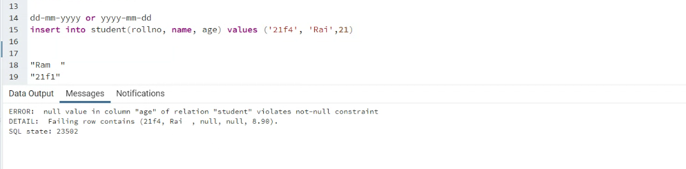

The key differences between the `VARCHAR(5)` and `CHAR(5)` data types in SQL are:

1. **Length**:

   - `VARCHAR(5)` can store variable-length strings up to 5 characters.
   - `CHAR(5)` stores fixed-length strings of exactly 5 characters.
2. **Storage Space**:

   - `VARCHAR(5)` only uses the exact number of bytes required to store the data, plus 1-2 bytes of overhead.
   - `CHAR(5)` always uses 5 bytes of storage, regardless of the actual string length.
3. **Padding**:

   - If a `VARCHAR(5)` column is assigned a string shorter than 5 characters, no padding occurs.
   - If a `CHAR(5)` column is assigned a string shorter than 5 characters, it is right-padded with spaces to reach the full 5 character length.
4. **Performance**:

   - Queries on `CHAR` columns are generally faster than on `VARCHAR` columns, as the fixed length allows more efficient indexing and storage.
   - However, the space efficiency of `VARCHAR` can outweigh the performance difference in many cases.






The key requirements for a foreign key are:1. The data types of the foreign key column(s) and the referenced column(s) must be compatible.

1. The referenced column(s) must have a unique index, either as a primary key or a unique constraint.

This means that the foreign key can reference:* A primary key column

* A column with a unique constraint
* Multiple columns with a composite unique constraint

The `LIKE` operator in SQL is used to search for specific patterns in a column. It is often used with the `WHERE` clause to filter data based on a specified pattern. There are two wildcards commonly used with the `LIKE` operator:

1. **Percent Sign (`%`)**:

   - Represents zero, one, or multiple characters.
   - Used to match strings that start with a specific pattern and can contain any characters after that.
2. **Underscore (`_`)**:

   - Represents one, single character.
   - Used to match strings that start with a specific pattern and have a single character after that.

### Examples

1. **Matching Strings That Start with a Specific Pattern**:

   ```sql
   SELECT * FROM Customers
   WHERE CustomerName LIKE 'a%';
   ```

   This query will return all customers whose names start with the letter "a".
2. **Matching Strings That Contain a Specific Pattern**:

   ```sql
   SELECT * FROM Customers
   WHERE CustomerName LIKE '%L%';
   ```

   This query will return all customers whose names contain the letter "L" anywhere.
3. **Matching Strings That End with a Specific Pattern**:

   ```sql
   SELECT * FROM Customers
   WHERE CustomerName LIKE '%ia';
   ```

   This query will return all customers whose names end with the string "ia".
4. **Matching Strings That Start with a Specific Pattern and Contain a Specific Character**:

   ```sql
   SELECT * FROM Customers
   WHERE CustomerName LIKE 'U_';
   ```

   This query will return all customers whose names start with the letter "U" and have a single character after that.

### Using `NOT LIKE`

The `NOT LIKE` operator is used to negate the results of a `LIKE` query. It returns all records that do not match the specified pattern.

### Example

```sql
SELECT * FROM Customers
WHERE CustomerName NOT LIKE 'USA';
```

This query will return all customers whose names do not contain the string "USA".

### Using `LIKE` with Multiple Values

The `LIKE` operator can be used with multiple string patterns by combining it with the `OR` operator.

### Example

```sql
SELECT * FROM Customers
WHERE last_name LIKE 'R%t' OR last_name LIKE '%e';
```

The "in" and "not in" operators in Python and SQL are used to check if a specified value is present or absent in a sequence or a table. Here are the key points about these operators:

### Python "in" and "not in" Operators

- **"in" Operator:**
  - The "in" operator checks if a specified value is present in a sequence (like a list, tuple, or string).
  - It returns `True` if the value is found and `False` if it is not[1].

### SQL "in" and "not in" Operators

- **"in" Operator:**
  - The "in" operator is used with the `SELECT`, `UPDATE`, and `DELETE` statements to filter records based on a condition.
  - It selects records where the specified column's value is present in a list of values[2][3][4].
- **"not in" Operator:**
  - The "not in" operator is used to filter out records where the specified column's value is not present in a list of values.
  - It is often used with the `SELECT`, `UPDATE`, and `DELETE` statements to exclude specific records[2][3][4].

### Key Points

- Both "in" and "not in" operators can be used in SQL with the `WHERE` clause to filter data.
- The "in" operator returns `True` if the value is found and `False` if it is not.
- The "not in" operator returns `True` if the value is not found and `False` if it is found.
- The "in" operator can be used with both numeric and non-numeric data types, such as strings.
- The "not in" operator can be used with both numeric and non-numeric data types, such as strings.
- The "in" operator can be used in combination with other operators like `AND` and `OR`.
- The "not in" operator can be used in combination with other operators like `AND` and `OR`.

### Examples

- Python:

  ```python
  list1 = [1, 2, 3, 4, 5]
  string1 = "My name is AskPython"
  tuple1 = (11, 22, 33, 44)

  print(5 in list1)  # True
  print("is" in string1)  # True
  print(88 in tuple1)  # False
  print(5 not in list1)  # False
  print("is" not in string1)  # False
  print(88 not in tuple1)  # True
  ```
- SQL:

  ```sql
  SELECT Student_ID, Student_name, City, Age
  FROM student
  WHERE Age IN (25, 29) AND City NOT IN ('Chennai', 'Delhi');

  SELECT Name
  FROM Emp
  WHERE age NOT IN (23, 22, 21);

  SELECT *
  FROM Emp
  WHERE country NOT IN ('Australia', 'Austria');
  ```


SQL joins are used to combine rows from two or more tables based on a related column between them. This allows you to retrieve data from multiple tables by establishing logical relationships between them. Here are the different types of SQL joins:

### INNER JOIN

An INNER JOIN returns all records from both tables where the join condition is satisfied. It is the most commonly used type of join and assumes that there is a match between the tables.

### Syntax:

```sql
SELECT table1.column1, table1.column2, table2.column1, ...
FROM table1 INNER JOIN table2 ON table1.matching_column = table2.matching_column;
```

### Example:

```sql
SELECT StudentCourse.COURSE_ID, Student.NAME, Student.AGE
FROM Student INNER JOIN StudentCourse
ON Student.ROLL_NO = StudentCourse.ROLL_NO;
```

### LEFT JOIN

A LEFT JOIN returns all records from the left table and the matched records from the right table. If there is no match, the result-set will contain null values for the right table.

### Syntax:

```sql
SELECT table1.column1, table1.column2, table2.column1, ...
FROM table1 LEFT JOIN table2 ON table1.matching_column = table2.matching_column;
```

### Example:

```sql
SELECT Student.NAME, StudentCourse.COURSE_ID
FROM Student LEFT JOIN StudentCourse
ON StudentCourse.ROLL_NO = Student.ROLL_NO;
```

### RIGHT JOIN

A RIGHT JOIN returns all records from the right table and the matched records from the left table. If there is no match, the result-set will contain null values for the left table.

### Syntax:

```sql
SELECT table1.column1, table1.column2, table2.column1, ...
FROM table1 RIGHT JOIN table2 ON table1.matching_column = table2.matching_column;
```

### Example:

```sql
SELECT StudentCourse.COURSE_ID, Student.NAME
FROM StudentCourse RIGHT JOIN Student
ON StudentCourse.ROLL_NO = Student.ROLL_NO;
```

### FULL JOIN

A FULL JOIN returns all records when there is a match in either the left or right table.

### Syntax:

```sql
SELECT table1.column1, table1.column2, table2.column1, ...
FROM table1 FULL JOIN table2 ON table1.matching_column = table2.matching_column;
```

### Example:

```sql
SELECT Student.NAME, StudentCourse.COURSE_ID
FROM Student FULL JOIN StudentCourse
ON StudentCourse.ROLL_NO = Student.ROLL_NO;
```

### CROSS JOIN

A CROSS JOIN returns all possible combinations of rows from both tables.

### Syntax:

```sql
SELECT table1.column1, table1.column2, table2.column1, ...
FROM table1 CROSS JOIN table2;
```

### Example:

```sql
SELECT Student.NAME, StudentCourse.COURSE_ID
FROM Student CROSS JOIN StudentCourse;
```

### SELF JOIN

A SELF JOIN is used to join a table to itself. This is useful for comparing rows within the same table.

### Syntax:

```sql
SELECT table1.column1, table1.column2, table2.column1, ...
FROM table1 AS table1_alias JOIN table1 AS table2_alias ON table1_alias.matching_column = table2_alias.matching_column;
```

### Example:

```sql
SELECT Student.NAME, StudentCourse.COURSE_ID
FROM Student AS s JOIN Student AS sc ON s.ROLL_NO = sc.ROLL_NO;
```

### NATURAL JOIN

A NATURAL JOIN is similar to an INNER JOIN but automatically matches columns with the same names.

### Syntax:

```sql
SELECT table1.column1, table1.column2, table2.column1, ...
FROM table1 NATURAL JOIN table2;
```

### Example:

```sql
SELECT Student.NAME, StudentCourse.COURSE_ID
FROM Student NATURAL JOIN StudentCourse;
```


