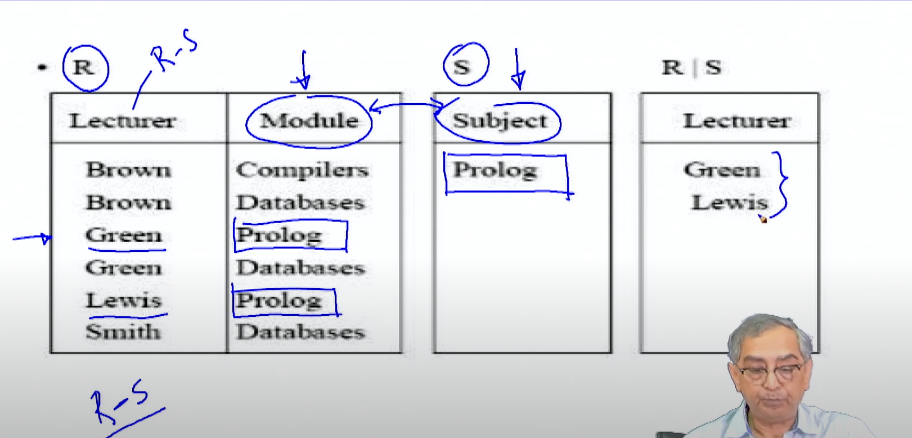
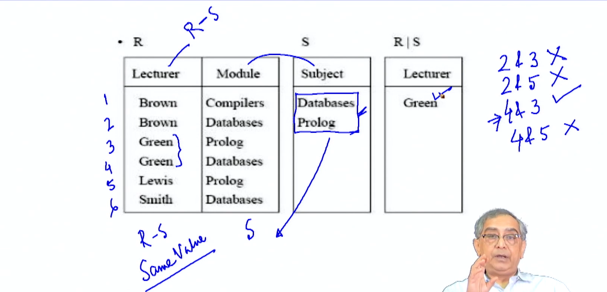
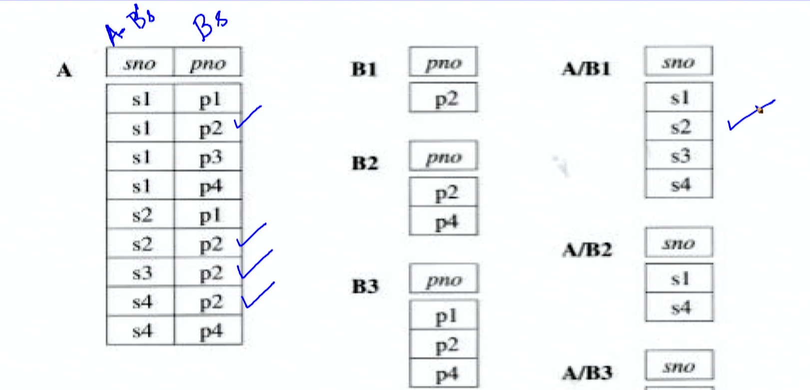
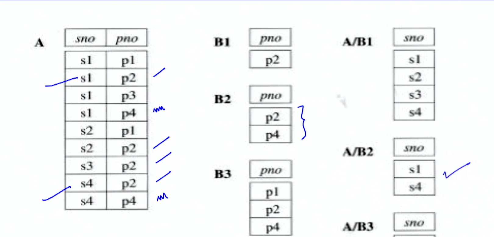
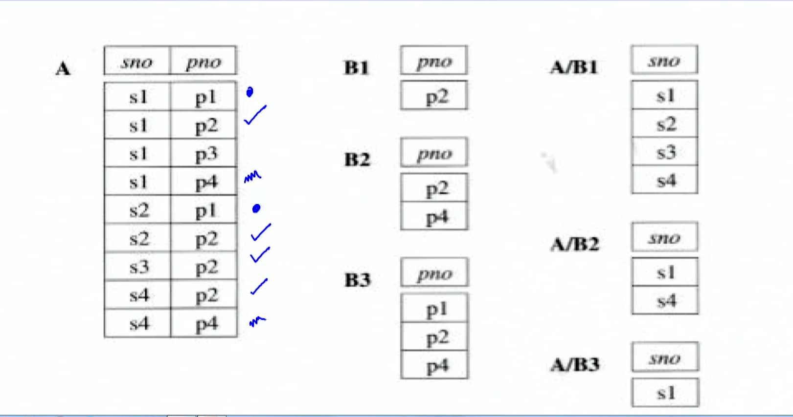
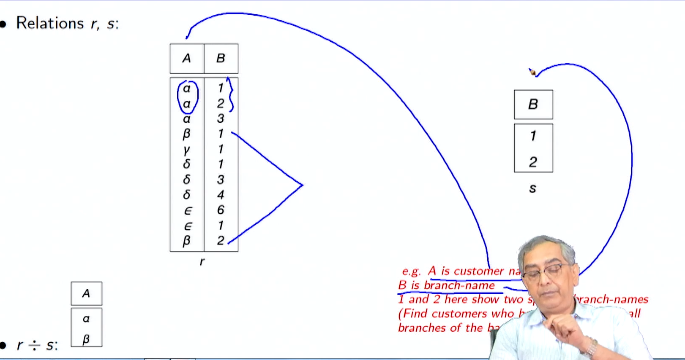
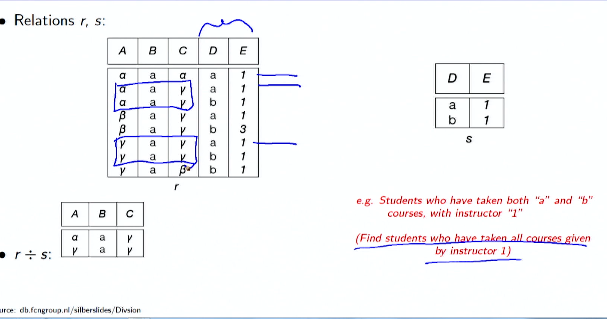

# Formal Relational Query Languages1_annotated

**Summary**
**Module 16: Formal Relational Query Languages/1**

**Week Recap**

This lecture provides an overview of formal query languages in the context of database management systems, with a focus on relational algebra.

**Objectives**

* Understand the concepts of formal query language and relational algebra.

**Outline**

* Formal Relational Query Language
* Relational Algebra
* Select
* Project
* Union
* Difference
* Intersection
* Cartesian Product
* Rename
* Division

**Relational Algebra**

* A procedural language used to manipulate relations (tables).
* Introduced by Edgar F. Codd in 1970.
* Consists of six basic operators:
  * Select (σ)
  * Project (Π)
  * Union (∪)
  * Set Difference (-)
  * Cartesian Product (x)
  * Rename (ρ)

**Select Operation (σ)**

* Selects tuples from a relation based on a predicate condition.
* Notation: $σ_p(r)$, where p is the selection predicate.
* Example: $σ_{dept_name='Physics'}(instructor)$

**Project Operation (Π)**

* Projects a relation onto a subset of its attributes.
* Notation: $Π_{A1,A2,...,Ak}(r)$, where A1, A2,..., Ak are the selected attributes.
* Example: $Π_{ID,name,salary}(instructor)$
* "

**Union Operation (∪)**

* Combines two relations with the same schema.
* Notation: $r ∪ s$
* Requires compatible arities (number of attributes) and attribute domains.
* Example: Find all courses taught in Fall 2009 or Spring 2010:
  * $Π_{course_id}(σ_{semester='Fall'∧year=2009}(section)) ∪ Π_{course_id}(σ_{semester='Spring'∧year=2010}(section))$

**Difference Operation (-)**

* Removes tuples from a relation that are also in another relation.
* Notation: r - s.
* Requires compatible relations (arities and attribute domains).
* Example: Find all courses taught in Fall 2009 but not in Spring 2010:
  * Πcourse_id(σsemester='Fall'∧year=2009(section)) - Πcourse_id(σsemester='Spring'∧year=2010(section))

**Intersection Operation (∩)**

* Retains tuples that are common to both relations.
* Notation: $r ∩ s$.
* Requires compatible relations (arities and attribute domains).
* Note: $r ∩ s = r - (r - s)$

**Cartesian Product Operation (x)**

* Produces all possible combinations of tuples from two relations.
* Notation: $\mathbf{r} \times \mathbf{s}$
* Attributes of r and s must be disjoint (non-overlapping).
* If attributes are not disjoint, renaming must be used.

**Rename Operation (ρ)**

* Allows for the naming of the results of relational algebra expressions.
* Allows for references to relations using different names.
* Notation: $ρ_{x}(E)$ renames the expression E as X.

**Division Operation (÷)**

* Derived operation expressed in terms of other operations.
* Notation: r ÷ s ≡ ΠR-S(r) - ΠR-S(r)((ΠR-S(r) x s) - ΠR-S,S(r))
* Returns tuples from r that appear with every tuple in s.

**Module Summary**

* Introduced the concept of formal relational query languages.
* Focused primarily on relational algebra and its six basic operators.
* Highlighted the practical applications of relational algebra operations.
