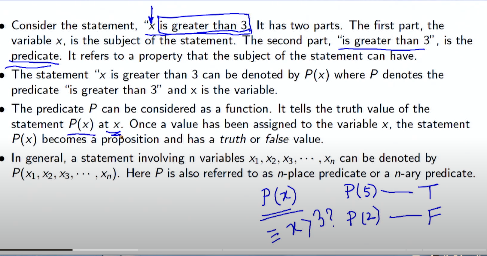
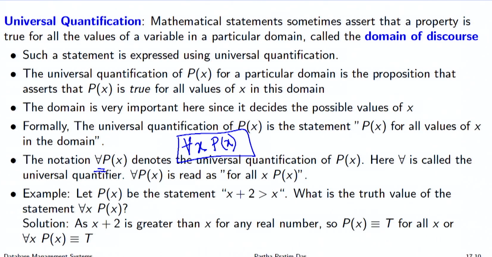
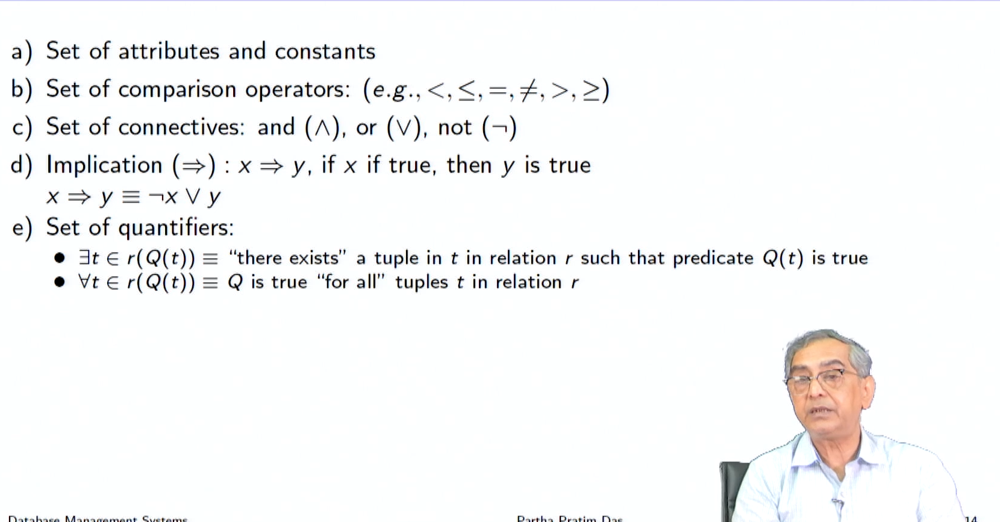
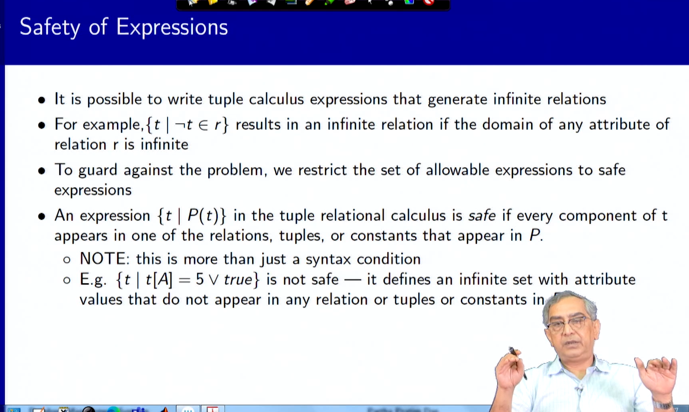
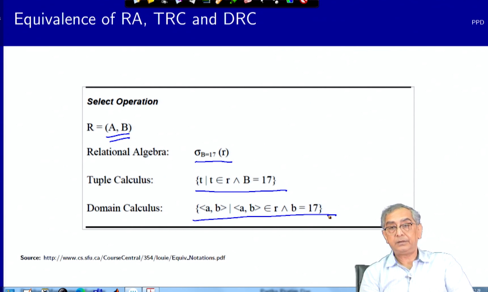
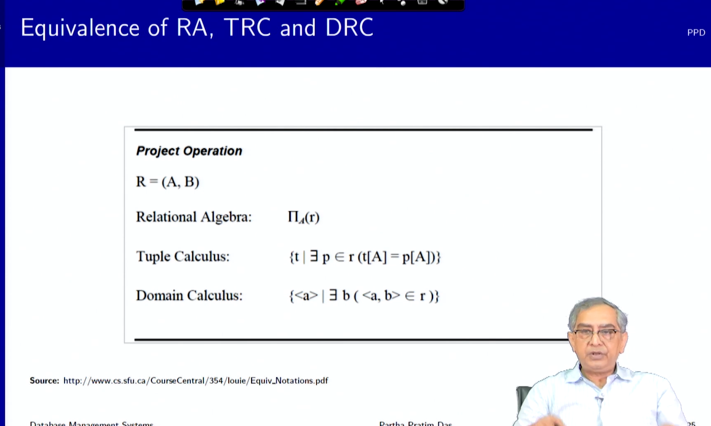

# Formal Relational Query Languages

**Summary**
**Module 17: Formal Relational Query Languages/2**

**Objectives and Outline**

**Objectives**

* To understand formal calculus-based query language through relational algebra

**Outline**

* Overview of Tuple Relational Calculus
* Overview of Domain Relational Calculus
* Equivalence of Algebra and Calculus

**Predicate Logic**

* Predicate Logic is an extension of Propositional Logic or Boolean Algebra.
* It adds the concept of predicates and quantifiers to better capture the meaning of statements that cannot be adequately expressed by propositional logic.
* Tuple Relational Calculus and Domain Relational Calculus are based on Predicate Calculus.

**Predicate**

* A predicate is a property that the subject of a statement can have.
* A statement involving n variables x1, x2, x3, · · · , xn can be denoted by P(x1, x2, x3, · · · , xn).

**Quantifiers**

* Universal Quantifier: Asserts that a property is true for all the values of a variable in a particular domain.
* Existential Quantifier: Asserts that there is an element with a certain property.

**Tuple Relational Calculus**

* A non-procedural query language, where each query is of the form:
  {t | P(t)}
* t = resulting tuples
* P(t) = predicate

**Domain Relational Calculus**

* A non-procedural query language equivalent in power to the tuple relational calculus
* Each query is an expression of the form:
  {< x1, x2, . . . , xn > |P(x1, x2, . . . , xn)}
* x1, x2, . . . , xn represent domain variables
* P represents a formula similar to that of the predicate calculus

**Equivalence of Algebra and Calculus**

* Relational Algebra, Tuple Relational Calculus, and Domain Relational Calculus are equivalent in expressive power.
* This equivalence means that any query that can be expressed in one language can also be expressed in the other two languages.

