* Index file Search Key - Pointer
* if we use primary key to create a index then its called **primary index**
* if the key is in some order its called **ordered index**

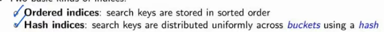

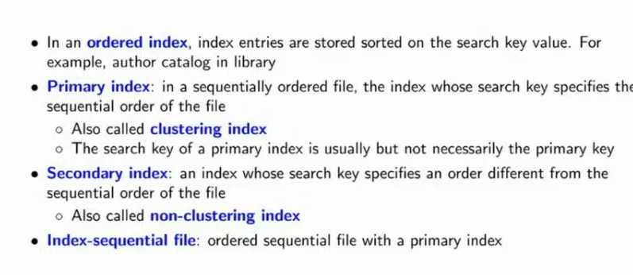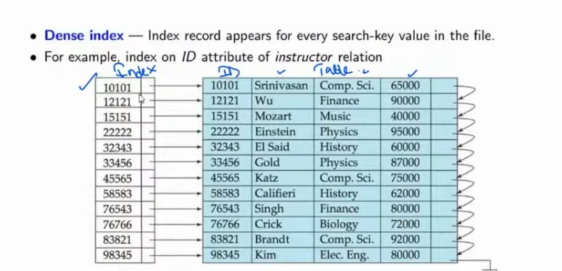

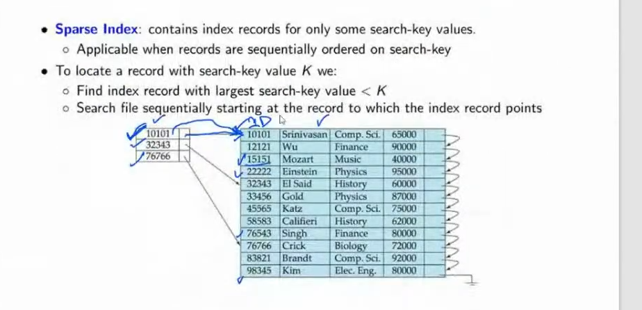

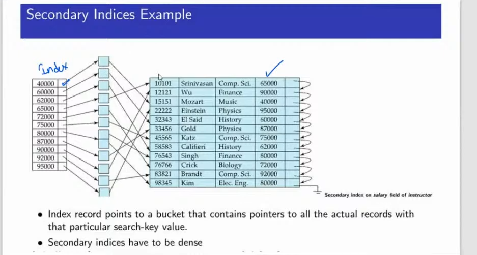

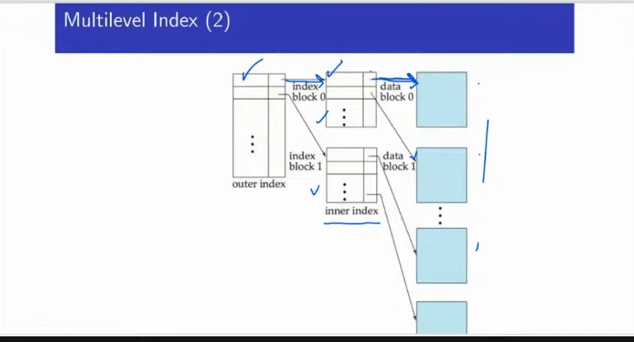

---

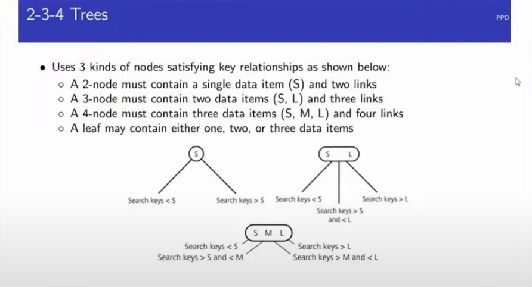

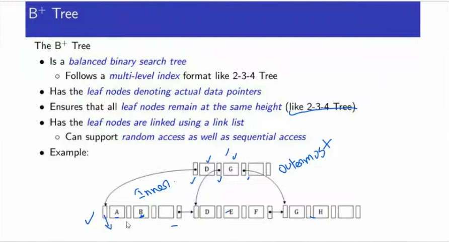

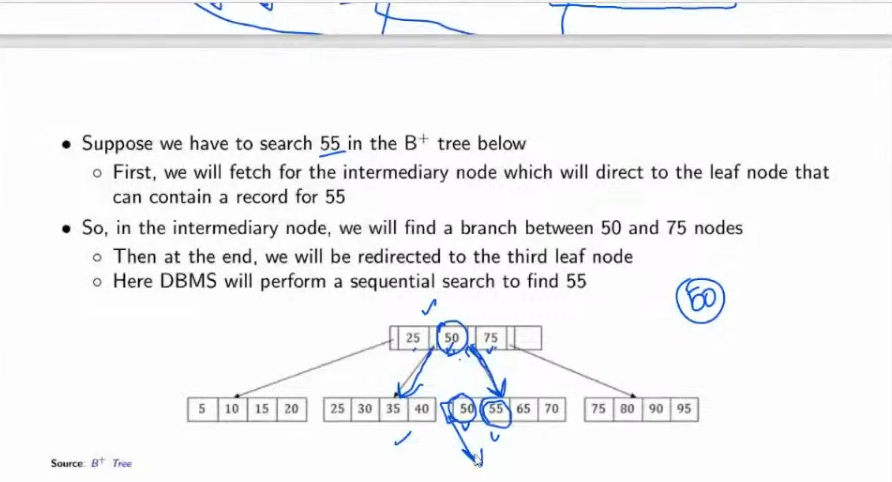

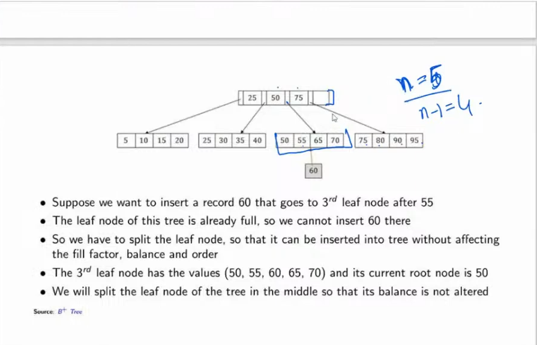

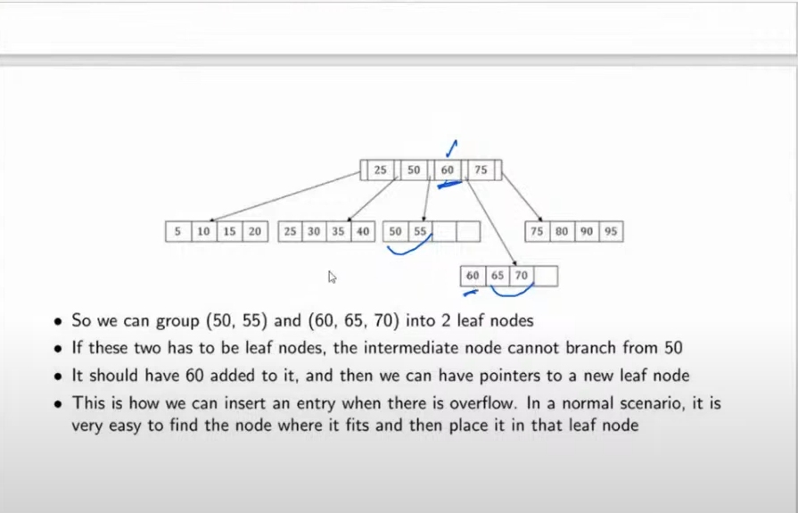

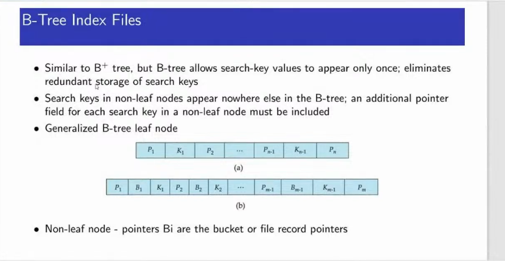

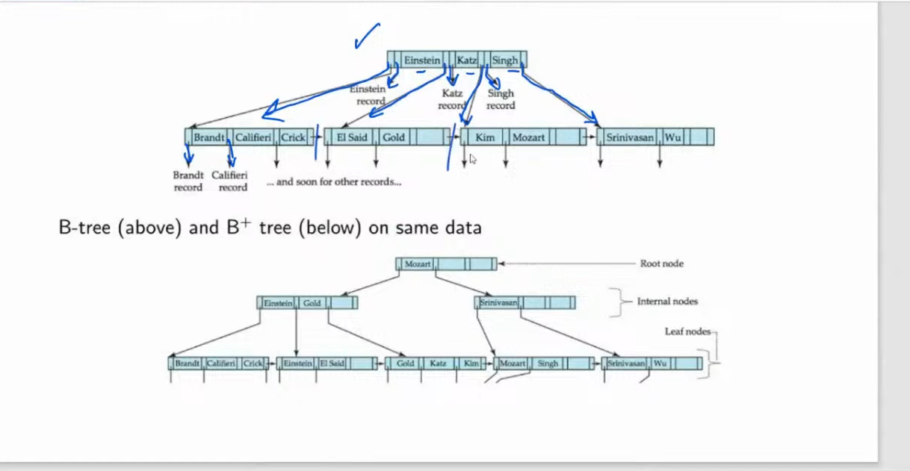

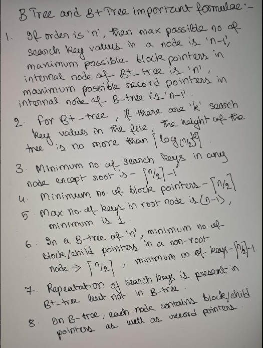

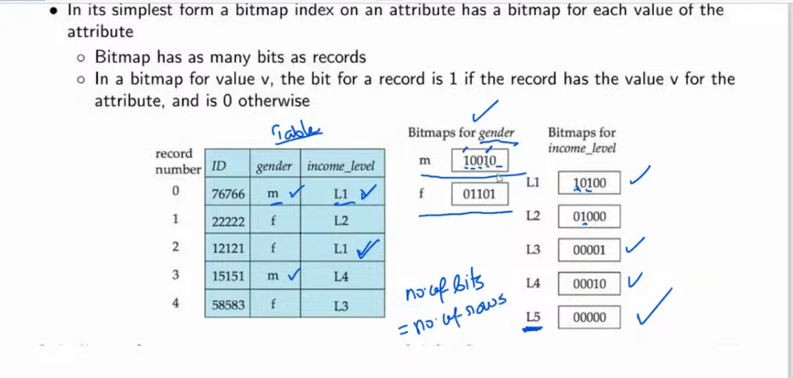
