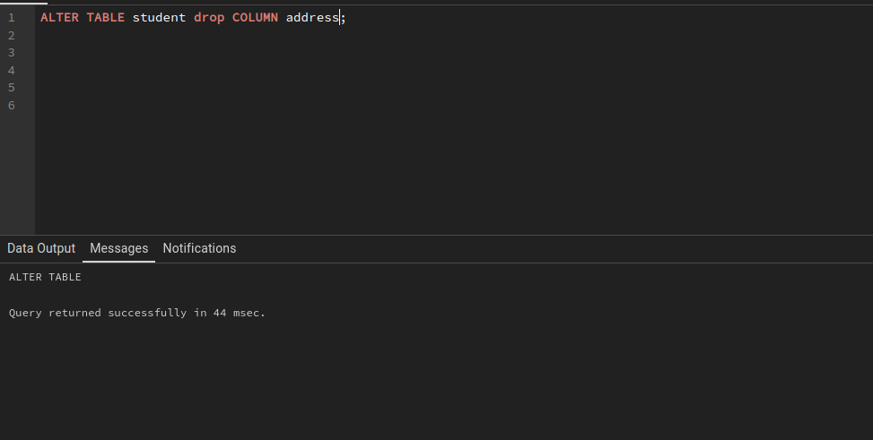
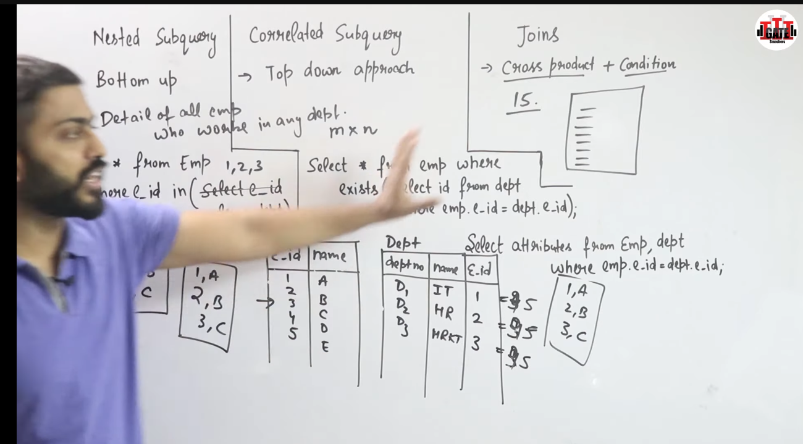

# SQL

#### key

- Candidate Key -> Primary Key
- Candidate key -> keys which are not used as primary key are called alternative key

#### Primary Key

- {Unique + Not Null }

#### Foreign Key

- Refrencing Table

  - insert course violation if FK is not in in refrenced table
- Refrenced Table

  - on delete cascade
  - on delete set null
  - on delete no action
  - on update cascade
  - on update set null
  - on update  no action

**Summary of Relational Algebra Operators**

| Operator    | Description                                      |
| ----------- | ------------------------------------------------ |
| σ          | Select                                           |
| π          | Project                                          |
| ∪          | Union                                            |
| −          | Difference                                       |
| ∩          | Intersection                                     |
| ×          | Cartesian Product                                |
| $ \rho$   | Rename                                           |
| $\bowtie$ | Natural Join                                     |
| SUM         | Computes the sum of a specified column           |
| AVG         | Computes the average of a specified column       |
| MAX         | Computes the maximum value of a specified column |
| MIN         | Computes the minimum value of a specified column |

## DDL- Data Definition Language

- Create
- Alter
- Drop
- Truncate
- Rename

## DML - Data Defination Language

- Select
- Insert
- update
- Delete

## DCL - Data Control Language

- Grant
- Revoke

## TCL - Transaction Control Language

- Commit
- Rollback
- save point

## Constraints

- primary key
- foreign key
- check
- unique
- default
- Not null

## Create Table - DDL

```pgsql
 create table <table name> ( col1name  datattype , 
				col2name  datattype ,
				 col1name  datattype);
```

```pgsql
desc tablename;

```

```pgsql
create table student ( ID varchar(5),name varchar(20) not null,
			dept name varchar(20),tot cred numeric(3, 0),
			primary key (ID),
			foreign key (dept name) references department);
```


## Alter - DDL

- add columns
- remove columns
- modify datatype
- modify datatype length
- add constraints
- remove constraints
- rename constraints





## Alter vs Update

- alter - DDL
- update - DML

## Delete Vs Drop Vs Truncate

- Delete - DML
- Drop - DDL - drop table
- Truncate - DDL -   no back up even in roll back

## Constraints

Condition for columns or attribute

- unique
- not null
- primary -> unique + not null
- check
- forgien key
- default

## Nested subquery Vs correlated sub query vs joins




Instructor = e1=

| id | salary |
| -- | ------ |
| 1  | 10000  |
| 2  | 20000  |
| 3  | 20000  |
| 4  | 30000  |
| 5  | 40000  |
| 6  | 5000   |

Instructor = e2=

| id | salary |
| -- | ------ |
| 1  | 10000  |
| 2  | 20000  |
| 3  | 20000  |
| 4  | 30000  |
| 5  | 40000  |
| 6  | 5000   |

**first row**

| id | e1.salary | id | e2.salary | e2.salary > e1.salary | count       |
| -- | --------- | -- | --------- | ---------------------- | ----------- |
| 1  | 10000     | 1  | 10000     | False                  | 0           |
| 1  | 10000     | 2  | 20000     | True                   | 1           |
| 1  | 10000     | 3  | 20000     | True                   | 2           |
| 1  | 10000     | 4  | 30000     | True                   | **2** |
| 1  | 10000     | 5  | 40000     | True                   | 3           |
| 1  | 10000     | 2  | 50000     | True                   | 4           |

**Second row**

| id | e1.salary | id | e2.salary | e2.salary > e1.salary | count       |
| -- | --------- | -- | --------- | ---------------------- | ----------- |
| 2  | 20000     | 1  | 10000     | False                  | 0           |
| 2  | 20000     | 2  | 20000     | False                  | 0           |
| 2  | 20000     | 3  | 20000     | False                  | 0           |
| 2  | 20000     | 4  | 30000     | True                   | **1** |
| 2  | 20000     | 5  | 40000     | True                   | 2           |
| 2  | 20000     | 2  | 50000     | True                   | 3           |

# Joins

employee=

| PK  |        |         |
| --- | ------ | ------- |
| Eno | E-name | Address |
| 1   | Ram    | delhi   |
| 2   | varun  | chd     |
| 3   | Ravi   | chd     |
| 4   | Amrit  | Delhi   |
| 5   | Nitin  | noida   |

Department =

| PK     |         | FK  |
| ------ | ------- | --- |
| Dep_no | Name    | eno |
| D1     | HR      | 1   |
| D2     | IT      | 2   |
| D3     | MRKT    | 4   |
| D4     | FINANCE | 5   |

# Natural join

cross poduct + condition = join

employee natural join  department = cross poduct + condition $empolyee.eno = department.eno$

cross product =

```pgsql
select * from employee , department
```

|              |        |         |        |         |                 |
| ------------ | ------ | ------- | ------ | ------- | --------------- |
| employee.Eno | E-name | Address | Dep_no | Name    | departmment.eno |
| 1            | Ram    | delhi   | D1     | HR      | 1               |
| 1            | Ram    | delhi   | D2     | IT      | 2               |
| 1            | Ram    | delhi   | D3     | MRKT    | 4               |
| 1            | Ram    | delhi   | D4     | FINANCE | 5               |
| 2            | varun  | chd     | D1     | HR      | 1               |
| 2            | varun  | chd     | D2     | IT      | 2               |
| 2            | varun  | chd     | D3     | MRKT    | 4               |
| 2            | varun  | chd     | D4     | FINANCE | 5               |
| 3            | Ravi   | chd     | D1     | HR      | 1               |
| 3            | Ravi   | chd     | D2     | IT      | 2               |
| 3            | Ravi   | chd     | D3     | MRKT    | 4               |
| 3            | Ravi   | chd     | D4     | FINANCE | 5               |
| 4            | Amrit  | Delhi   | D1     | HR      | 1               |
| 4            | Amrit  | Delhi   | D2     | IT      | 2               |
| 4            | Amrit  | Delhi   | D3     | MRKT    | 4               |
| 4            | Amrit  | Delhi   | D4     | FINANCE | 5               |
| 5            | Nitin  | noida   | D1     | HR      | 1               |
| 5            | Nitin  | noida   | D2     | IT      | 2               |
| 5            | Nitin  | noida   | D3     | MRKT    | 4               |
| 5            | Nitin  | noida   | D4     | FINANCE | 5               |

```pgsql
select * from employee  department empolyee.eno = department.eno
```

|     |        |         |        |         |     |                                   |
| --- | ------ | ------- | ------ | ------- | --- | --------------------------------- |
| Eno | E-name | Address | Dep_no | Name    | eno | `empolyee.eno = department.eno` |
| 1   | Ram    | delhi   | D1     | HR      | 1   | True                              |
| 1   | Ram    | delhi   | D2     | IT      | 2   | False                             |
| 1   | Ram    | delhi   | D3     | MRKT    | 4   | False                             |
| 1   | Ram    | delhi   | D4     | FINANCE | 5   | False                             |
| 2   | varun  | chd     | D1     | HR      | 1   | False                             |
| 2   | varun  | chd     | D2     | IT      | 2   | True                              |
| 2   | varun  | chd     | D3     | MRKT    | 4   | False                             |
| 2   | varun  | chd     | D4     | FINANCE | 5   | False                             |
| 3   | Ravi   | chd     | D1     | HR      | 1   | False                             |
| 3   | Ravi   | chd     | D2     | IT      | 2   | False                             |
| 3   | Ravi   | chd     | D3     | MRKT    | 4   | False                             |
| 3   | Ravi   | chd     | D4     | FINANCE | 5   | False                             |
| 4   | Amrit  | Delhi   | D1     | HR      | 1   | False                             |
| 4   | Amrit  | Delhi   | D2     | IT      | 2   | False                             |
| 4   | Amrit  | Delhi   | D3     | MRKT    | 4   | True                              |
| 4   | Amrit  | Delhi   | D4     | FINANCE | 5   | False                             |
| 5   | Nitin  | noida   | D1     | HR      | 1   | False                             |
| 5   | Nitin  | noida   | D2     | IT      | 2   | False                             |
| 5   | Nitin  | noida   | D3     | MRKT    | 4   | False                             |
| 5   | Nitin  | noida   | D4     | FINANCE | 5   | True                              |

### result=

|     |        |         |        |         |     |
| --- | ------ | ------- | ------ | ------- | --- |
| Eno | E-name | Address | Dep_no | Name    | eno |
| 1   | Ram    | delhi   | D1     | HR      | 1   |
| 2   | varun  | chd     | D2     | IT      | 2   |
| 4   | Amrit  | Delhi   | D3     | MRKT    | 4   |
| 5   | Nitin  | noida   | D4     | FINANCE | 5   |

```pgsql
select E-name from employee  natural join department
```

|        |
| ------ |
| E-name |
| Ram    |
| varun  |
| Amrit  |
| Nitin  |

# self Join

| S_id | course_id | since |
| ---- | --------- | ----- |
| s1   | c1        | 2016  |
| s2   | c2        | 2017  |
| s1   | c2        | 2017  |

find student who is enrolled in two courses ?

cross prduct

| S_id (Left) | course_id (Left) | since (Left) | S_id (Right) | course_id (Right) | since (Right) |
| ----------- | ---------------- | ------------ | ------------ | ----------------- | ------------- |
| s1          | c1               | 2016         | s1           | c1                | 2016          |
| s1          | c1               | 2016         | s2           | c2                | 2017          |
| s1          | c1               | 2016         | s1           | c2                | 2017          |
| s2          | c2               | 2017         | s1           | c1                | 2016          |
| s2          | c2               | 2017         | s2           | c2                | 2017          |
| s2          | c2               | 2017         | s1           | c2                | 2017          |
| s1          | c2               | 2017         | s1           | c1                | 2016          |
| s1          | c2               | 2017         | s2           | c2                | 2017          |
| s1          | c2               | 2017         | s1           | c2                | 2017          |

```pgsql
 select LEFT.s_id from 
study as left study as right 
	where left.s_id = right.s_id 
		and left.course_id < > right.course_id 
```

| S_id (Left) | course_id (Left) | since (Left) | S_id (Right) | course_id (Right) | since (Right) | CONDF |
| ----------- | ---------------- | ------------ | ------------ | ----------------- | ------------- | ----- |
| s1          | c1               | 2016         | s1           | c1                | 2016          | FALSE |
| s1          | c1               | 2016         | s2           | c2                | 2017          | FALSE |
| s1          | c1               | 2016         | s1           | c2                | 2017          | TRUE  |
| s2          | c2               | 2017         | s1           | c1                | 2016          | FALSE |
| s2          | c2               | 2017         | s2           | c2                | 2017          | FALSE |
| s2          | c2               | 2017         | s1           | c2                | 2017          | FALSE |
| s1          | c2               | 2017         | s1           | c1                | 2016          | TRUE  |
| s1          | c2               | 2017         | s2           | c2                | 2017          | FALSE |
| s1          | c2               | 2017         | s1           | c2                | 2017          | FALSE |

| S_id (Left) |
| ----------- |
| s1          |
