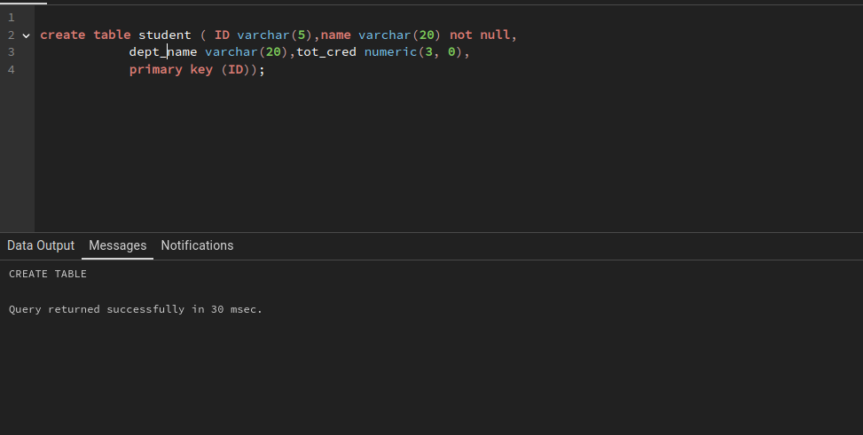
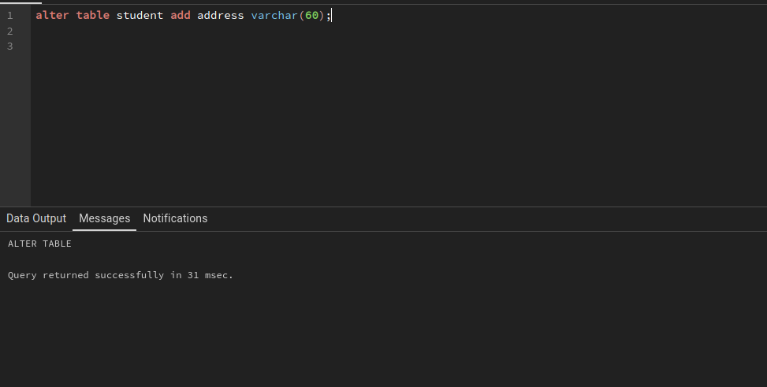
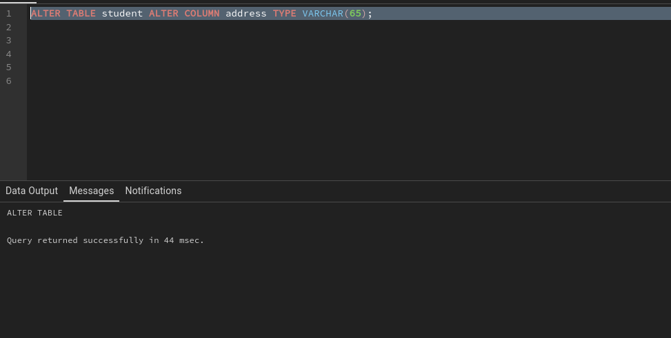

# SQL

## DDL- Data Definition Language

- Create
- Alter
- Drop
- Truncate
- Rename

## DML - Data Defination Language

- Select
- Insert
- update
- Delete

## DCL - Data Control Language

- Grant
- Revoke

## TCL - Transaction Control Language

- Commit
- Rollback
- save point

## Constraints

- primary key
- foreign key
- check
- unique
- default
- Not null


## Create Table - DDL

```pgsql
 create table <table name> ( col1name  datattype , 
				col2name  datattype ,
				 col1name  datattype);
```


```pgsql
desc tablename;

```


```pgsql
create table student ( ID varchar(5),name varchar(20) not null,
			dept name varchar(20),tot cred numeric(3, 0),
			primary key (ID),
			foreign key (dept name) references department);
```





## Alter - DDL

- add columns
- remove columns
- modify datatype
- modify datatype length
- add constraints
- remove constraints
- rename constraints







## Alter vs Update


- alter - DDL
- update - DML

## Delete Vs Drop Vs Truncate

- Delete - DML
- Drop - DDL - drop table
- Truncate - DDL -   no back up even in roll back

## Constraints

Condition for columns or attribute

- unique
- not null
- primary -> unique + not null
- check
- forgien key
- default
