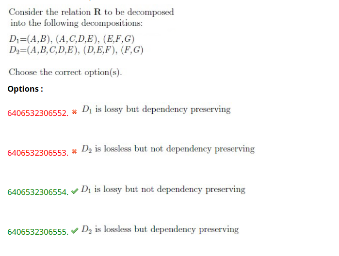

**Decomposition \( D_1 \):**

- \( (A, B) \)
- \( (A, C, D, E) \)
- \( (E, F, G) \)

**Decomposition \( D_2 \):**

- \( (A, B, C, D, E) \)
- \( (D, E, F) \)
- \( (F, G) \)

### Checking Losslessness

A decomposition is lossless if, after the decomposition, we can reconstruct the original relation without loss of information.

- **For \( D_1 \)**:
  The intersection of \( (A, B) \) and \( (A, C, D, E) \) is \( A \). The intersection of \( (A, C, D, E) \) and \( (E, F, G) \) is \( E \). Since the intersections are not sufficient to reconstruct the original relation, \( D_1 \) is a lossy decomposition.
- **For \( D_2 \)**:
  The intersection of \( (A, B, C, D, E) \) and \( (D, E, F) \) is \( (D, E) \), and the intersection of \( (D, E, F) \) and \( (F, G) \) is \( F \). Given that these intersections help maintain the original relation, \( D_2 \) is a lossless decomposition.

### Checking Dependency Preservation

A decomposition is dependency preserving if all functional dependencies are preserved in the decomposed relations.

- **For \( D_1 \)**:
  Due to the distribution of attributes and the inability to capture all dependencies in the individual decompositions, \( D_1 \) does not preserve all dependencies. relation **R** had a functional dependency like **A**→**C**. This cannot be checked in the relation **(**A**,**B**)**. However, it can be verified in **(**A**,**C**,**D**,**E**)**. Similarly, dependencies involving E,F,GE, F, G**E**,**F**,**G** can be checked in the third relation.
- **For \( D_2 \)**:
  Since \( D_2 \) contains a super key in the decomposition and all dependencies can be checked using the decomposed relations, it is dependency preserving.

### Conclusion

- **\( D_1 \) is lossy and not dependency preserving.**
- **\( D_2 \) is lossless and dependency preserving.**

**lossy decomposition and dependency preservation are two distinct properties in the context of database normalization and decomposition:**

1. **Lossy Decomposition: A decomposition is considered lossy (also known as non-lossless or lossy-join) if, after decomposing a relation into smaller relations and then joining them back together, the original relation cannot be perfectly reconstructed. This may result in either losing some data or gaining spurious tuples that were not present in the original relation.**
2. **Dependency Preservation: A decomposition is dependency preserving if the set of functional dependencies in the original relation can be enforced (or checked) using only the decomposed relations, without having to join the relations back together.**

### Key Points:

- **A decomposition can be lossless but not dependency preserving. This means you can reconstruct the original relation perfectly, but you may lose the ability to enforce all the functional dependencies.**
- **A decomposition can be lossy but dependency preserving. This means that you cannot perfectly reconstruct the original relation, but you can enforce all the functional dependencies.**

**Thus, the two properties do not imply each other. A decomposition being lossy does not inherently mean it preserves dependencies, and a dependency-preserving decomposition is not necessarily lossless. These properties must be evaluated independently when assessing the quality of a decomposition.**
