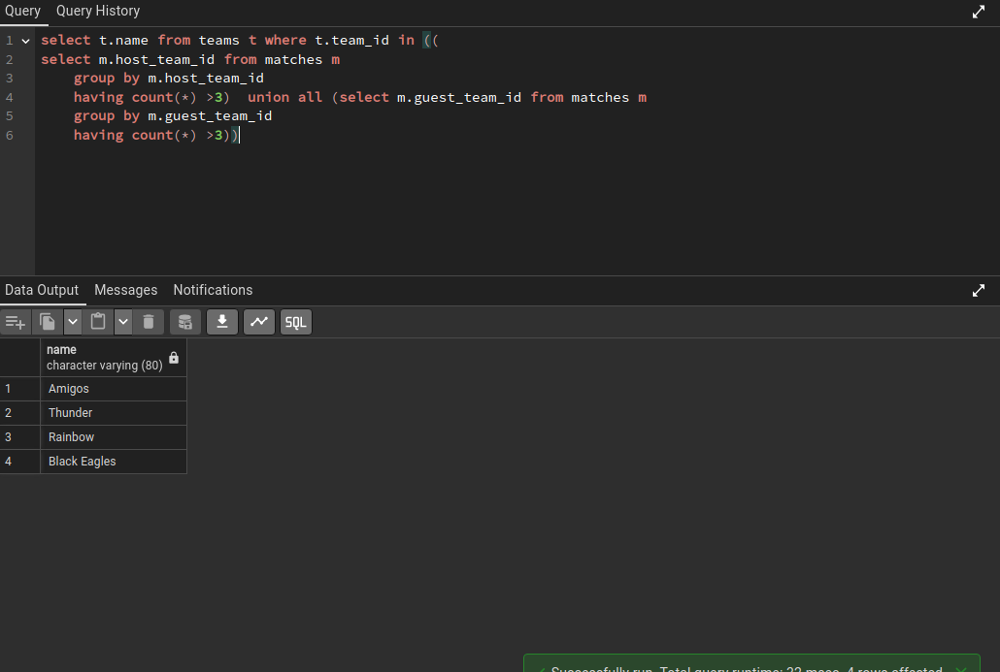

```pgsql
select t.name from teams t where t.team_id in ((
select m.host_team_id from matches m
	group by m.host_team_id 
	having count(*) >3)  union all (select m.guest_team_id from matches m
	group by m.guest_team_id
	having count(*) >3))
```

```pgsql
SELECT f.faculty_fname, f.faculty_lname
FROM faculty f
INNER JOIN members m ON f.id = m.id 
WHERE f.department_code = 'ME' and m.member_no in (select b.member_no from book_issue b) 
```

```pgsql
SELECT f.faculty_fname, f.faculty_lname
FROM faculty f
LEFT JOIN members m ON f.id = m.id
LEFT JOIN book_issue b ON m.member_no = b.member_no
WHERE b.member_no IS NULL;

```

```pgsql
select count(*) from book_issue where book_issue.doi='2021-08-11'
```

```pgsql
select distinct(bc.title) from book_catalogue bc 
	left join book_copies bcop
	on bcop.ISBN_no = bc.ISBN_no
	left join book_issue bi 
	on bi.accession_no = bcop.accession_no
	left join members m 
	on m.member_no= bi.member_no
	where m.member_type = 'PG'
	except 
	select distinct(bc.title) from book_catalogue bc 
	left join book_copies bcop
	on bcop.ISBN_no = bc.ISBN_no
	left join book_issue bi 
	on bi.accession_no = bcop.accession_no
	left join members m 
	on m.member_no= bi.member_no
	where m.member_type = 'UG'

```

______________________________________________________________________

```pgsql
select mr.match_num , r.name from match_referees mr left join referees r 
	on r.referee_id = mr.fourth_referee
	where mr.match_num in (select m.match_num from matches m where m.match_date= '2020-05-21')
```

```pgsql
SELECT p.name
FROM players p
INNER JOIN teams t ON p.team_id = t.team_id
WHERE t.name = 'All Stars'
ORDER BY p.dob DESC
LIMIT 1
```

```pgsql
SELECT p.name , p.dob
FROM players p
INNER JOIN teams t ON p.team_id = t.team_id
WHERE t.name  in ('Amigos' ,'Black Eagles')
```

```pgsql
select s.student_fname , s.student_lname from students s 
	left join members m 
	on m.roll_no = s.roll_no 
	where m.member_no in (select bi.member_no from book_issue bi)
```

```pgsql
SELECT bc.title, COUNT(dc.ISBN_no) AS num_copies
FROM book_catalogue bc
LEFT JOIN book_copies dc ON bc.ISBN_no = dc.ISBN_no
WHERE bc.title LIKE '%Management%'
GROUP BY bc.title

```
